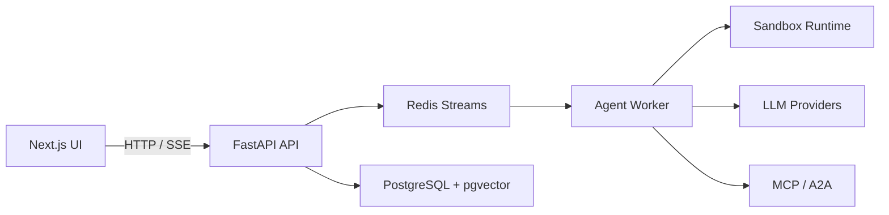

# OpenCitadel — Self-Hosted Enterprise AI Agent Platform

<div align="center">

**Private deployment · Agent + Knowledge + Codebase · MCP / A2A · Sandboxed execution**

[](LICENSE)
[](https://www.python.org/)
[](https://fastapi.tiangolo.com/)
[](https://nextjs.org/)
[](https://docs.docker.com/compose/)

[简体中文](README.zh-CN.md) · [Documentation](docs/README.md) · [GitHub](https://github.com/OceaLong/opencitadel)

</div>

---

OpenCitadel is an open-source, **self-hosted AI agent platform** (not a browser-only SDK). Keep data, model calls, and file storage on your network. Connect internal systems via **MCP** and **A2A**, and run browser, shell, and file tools inside isolated sandboxes.

**Differentiation**: platform-level governance—plan approval, per-tool gates, VNC takeover, checkpoint rollback **including browser profile state**, and API-layer audit—across browser, shell, MCP, and A2A tools.

| | Skyvern | OpenHands | Onyx | OpenCitadel |
|---|---------|-----------|------|-------------|
| Focus | Browser automation SDK (AGPL) | Code agent | Search/RAG | Private agent platform + governance breadth |
| HITL | Browser tasks | Limited | — | Plan + per-tool + takeover + rollback + audit |

> Web Operator targets **enterprise-owned/self-hosted systems**; third-party SaaS requires an ownership declaration and audit trail—not a waiver of legal risk.

## Core modules

| Module | Route | Description |
|--------|-------|-------------|
| **Agent chat** | `/`, `/sessions/[id]` | Supervised autonomy: Planner → ReAct, per-tool approval, VNC, checkpoints (incl. browser state) |
| **Codebase** | `/codebase` | ZIP / Git import, symbol search, architecture views, Ask / Agent coding |
| **Knowledge base** | `/knowledge` | Document upload & connectors, RAG Q&A, GraphRAG, reindex |
| **Marketplace** | `/marketplace` | LLM mini-apps (nutrition, translation, tools, etc.) |
| **Automation** | `/automation` | Scheduled jobs, webhooks, notifications |
| **Integrations** | `/settings/integrations` | MCP (stdio / SSE / streamable HTTP) and A2A remote agents |
| **Admin** | `/admin/*` | Users, quotas, audit, usage, **compliance evidence** |

## Quick start

**10-minute BYO API key path**

```bash
git clone https://github.com/OceaLong/opencitadel.git
cd opencitadel
make quickstart
```

Open **http://localhost:8088**, sign in, add an LLM API key in Settings, and run your first agent task.

- Step-by-step: [Self-host in 10 minutes](docs/tutorials/01-self-host-10-minutes.md)
- Production: [Deployment guide](docs/operations/deployment.md)
- HTTPS & domain: [HTTPS setup](docs/operations/https-domain-setup.md)

## Architecture at a glance



- **API / Worker split**: stateless API for SSE and event replay; workers consume Redis Streams
- **Sandbox isolation**: on-demand Docker or Kubernetes sandboxes with browser automation and VNC
- **Deployment**: Docker Compose (single node) or Helm / Kubernetes (horizontal scale)

Full design: [Architecture overview](docs/architecture/overview.md).

## Documentation map

| Audience | Start here |
|----------|------------|
| First run | [Self-host in 10 minutes](docs/tutorials/01-self-host-10-minutes.md) |
| Ops / DevOps | [Deployment](docs/operations/deployment.md) · [HTTPS](docs/operations/https-domain-setup.md) · [Helm](deploy/helm/opencitadel/README.md) |
| Enterprise use cases | [Internal knowledge base](docs/tutorials/02-internal-knowledge-base.md) · [MCP integrations](docs/tutorials/03-mcp-integrations.md) · [Governed Web Operator](docs/tutorials/04-governed-web-operator.md) |
| Platform engineers | [Docs index](docs/README.md) · [Security model](docs/architecture/security-model.md) · [Checkpoints & HITL](docs/architecture/checkpoints-and-hitl.md) · [Events](docs/architecture/events.md) |
| Contributors | [Contributing](.github/CONTRIBUTING.md) · [Security](.github/SECURITY.md) |

## Local development

```bash
cp .env.example .env
# Set BOOTSTRAP_ADMIN_PASSWORD and LLM API keys

docker compose --profile local up --build

# Or run API / UI tests separately
cd api && uv sync && uv run pytest
cd ui && npm install && npm run test
```

Module guides: [api/README.md](api/README.md) · [ui/README.md](ui/README.md) · [sandbox/README.md](sandbox/README.md)

## License

Licensed under the [Apache License 2.0](LICENSE).
