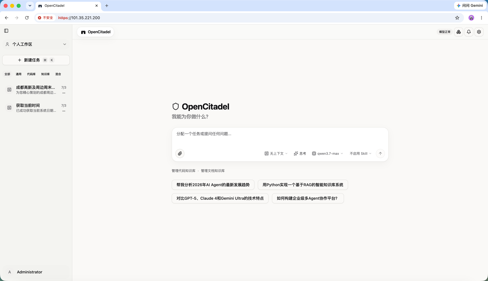
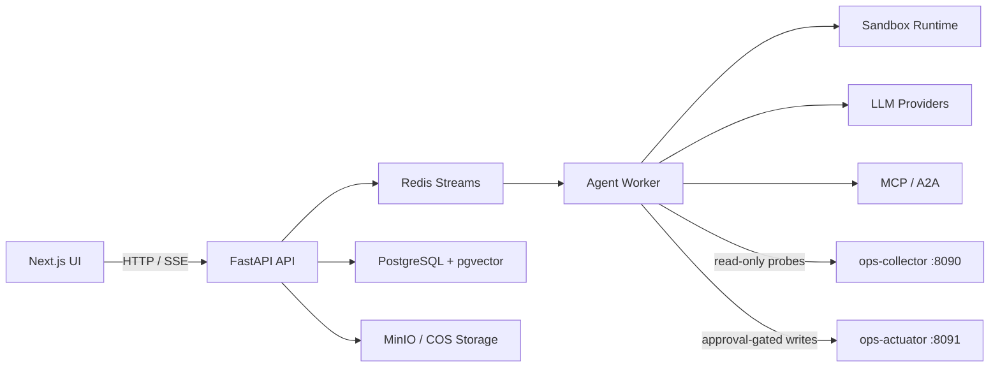

# OpenCitadel — Self-Hosted Enterprise AI Agent Platform

<div align="center">

**Private deployment · Every tool call declarable, approvable, reversible, and provable · MCP / A2A · Sandboxed execution**

[](LICENSE)
[](https://www.python.org/)
[](https://fastapi.tiangolo.com/)
[](https://nextjs.org/)
[](https://docs.docker.com/compose/)

[简体中文](README.zh-CN.md) · [Documentation](docs/README.md) · [GitHub](https://github.com/OceaLong/opencitadel)

</div>

---

OpenCitadel is a **governed, self-hosted AI agent platform**. Keep data, model calls, and file storage on your network; agents run browser, shell, and file tools inside isolated sandboxes and reach internal systems via MCP and A2A. Unlike agent frameworks that bolt on audit later, OpenCitadel treats governance as a runtime first-class citizen: **every tool call is declarable (effect contracts), approvable (HITL queue), reversible (checkpoints incl. browser state), and provable (hash-chained audit and signed evidence packages)**.

Most agent-governance offerings are point solutions; OpenCitadel is an integrated platform:

| Capability | MCP gateways | Agent firewalls / guardrails | Read-only diagnostics (k8sgpt, etc.) | OpenCitadel |
|-----------|--------------|------------------------------|--------------------------------------|-------------|
| Coverage | MCP traffic only | Single policy-interception point | Read-only, no execution | Browser / shell / file / MCP / A2A — the full tool chain |
| Human-in-the-loop | — | Approval point | — | Plan approval + per-tool gates + VNC takeover + checkpoint rollback |
| Evidence | Access logs | Logs | — | API-layer hash-chained audit + verifiable evidence packages |
| Deployment | Gateway | Sidecar/SDK | CLI | Full self-hosted platform (Compose / Helm) |

> Web Operator targets **enterprise-owned/self-hosted systems**; third-party SaaS requires an ownership declaration and audit trail—not a waiver of legal risk.

## Demo video

Due to the large size of the video file, please click on the image or link below to watch the complete demonstration:

[](https://www.bilibili.com/video/BV1QGNi6BERh/?vd_source=4ce3545913066879813a27e759a60c52)

> Video link: [Click here to watch the complete demonstration](https://www.bilibili.com/video/BV1QGNi6BERh/?vd_source=4ce3545913066879813a27e759a60c52)

## Core modules

| Module | Route | Description |
|--------|-------|-------------|
| **Agent chat** | `/`, `/sessions/[id]` | Supervised autonomy: Planner → ReAct, per-tool approval, VNC takeover, checkpoints (incl. browser state) |
| **Ops Patrol** | `/patrols` | Read-only infrastructure checks with approval-gated remediation: closed-world collector, server-side assertion engine, signed evidence packages |
| **Automation** | `/automation` | Scheduled jobs, webhooks, notifications |
| **Governed context sources** | `/knowledge`, `/codebase` | Document & code knowledge bases: versioning, atomic publish, session version binding, retrieval Q&A |
| **Integrations** | Settings modal → Integrations | MCP (stdio / SSE / streamable HTTP) and A2A remote agents |
| **Admin** | `/admin/*` | Users, quotas, audit, usage, compliance evidence |

## Quick start

**10-minute BYO API key path**

```bash
git clone https://github.com/OceaLong/opencitadel.git
cd opencitadel
make quickstart
```

Open **http://localhost:8088**, sign in, add an LLM **endpoint** and **model** in Settings → Models, and run your first agent task.

`make quickstart` also builds the sandbox image and defaults to local MinIO storage — see the guides below for cloud storage and full configuration.

- Step-by-step: [Self-host in 10 minutes](docs/tutorials/01-self-host-10-minutes.md)
- Production: [Deployment guide](docs/operations/deployment.md)
- HTTPS & domain: [HTTPS setup](docs/operations/https-domain-setup.md)

## Architecture at a glance


```mermaid
flowchart LR
  UI["Next.js UI"] -->|"HTTP / SSE"| API["FastAPI API"]
  API --> Redis["Redis Streams"]
  API --> PG["PostgreSQL + pgvector"]
  API --> Storage["MinIO / COS Storage"]
  Redis --> Worker["Agent Worker"]
  Worker --> Sandbox["Sandbox Runtime"]
  Worker --> LLM["LLM Providers"]
  Worker --> MCP["MCP / A2A"]
  Worker -->|"read-only probes"| Collector["ops-collector :8090"]
  Worker -->|"approval-gated writes"| Actuator["ops-actuator :8091"]
```

- **API / Worker split**: stateless API for SSE and event replay; workers consume Redis Streams
- **Sandbox isolation**: on-demand Docker or Kubernetes sandboxes with browser automation and VNC
- **Governed write plane**: `ops-collector` (8090) is read-only; `ops-actuator` (8091) accepts exactly three registered write actions, reachable only after human approval — see [Governance plane](docs/architecture/governance-plane.md)
- **Deployment**: Docker Compose (single node) or Helm / Kubernetes (horizontal scale)

Full design: [Architecture overview](docs/architecture/overview.md).

## Documentation map

| Audience | Start here |
|----------|------------|
| First run | [Self-host in 10 minutes](docs/tutorials/01-self-host-10-minutes.md) · [10-minute governance demo loop](docs/tutorials/08-ten-minute-governance-demo.md) |
| Ops / DevOps | [Deployment](docs/operations/deployment.md) · [Ops Patrol](docs/tutorials/06-ops-patrol.md) · [Approved remediation](docs/tutorials/07-approved-remediation.md) · [Patrol operations](docs/operations/ops-patrol.md) · [HTTPS](docs/operations/https-domain-setup.md) · [Helm](deploy/helm/opencitadel/README.md) |
| Enterprise use cases | [Internal knowledge base](docs/tutorials/02-internal-knowledge-base.md) · [MCP integrations](docs/tutorials/03-mcp-integrations.md) · [Governed Web Operator](docs/tutorials/04-governed-web-operator.md) · [Refund reconciliation & compliance](docs/tutorials/05-refund-reconciliation-compliance.md) |
| Platform engineers | [Docs index](docs/README.md) · [Security model](docs/architecture/security-model.md) · [Ops Patrol architecture](docs/architecture/ops-patrol.md) · [Checkpoints & HITL](docs/architecture/checkpoints-and-hitl.md) · [Events](docs/architecture/events.md) |
| Contributors | [Contributing](.github/CONTRIBUTING.md) · [Security](.github/SECURITY.md) |

## Local development

```bash
cp .env.example .env
# Set BOOTSTRAP_ADMIN_PASSWORD; configure LLM endpoint + model in Settings after first login

docker compose --profile local up --build

# Or run API / UI tests separately
cd api && uv sync && uv run pytest
cd ui && npm install && npm run test
```

Module guides: [api/README.md](api/README.md) · [ui/README.md](ui/README.md) · [sandbox/README.md](sandbox/README.md)

## License

Licensed under the [Apache License 2.0](LICENSE).
