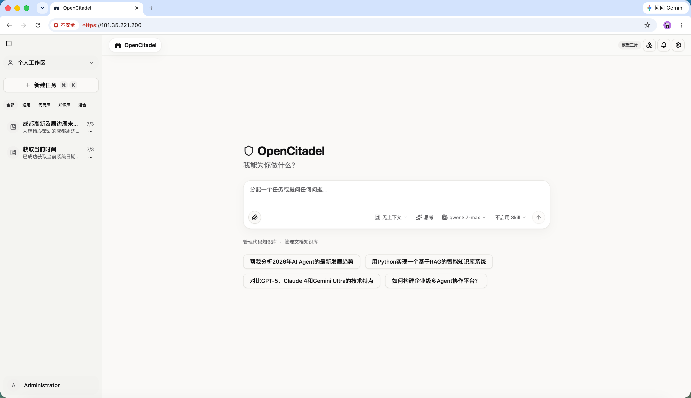
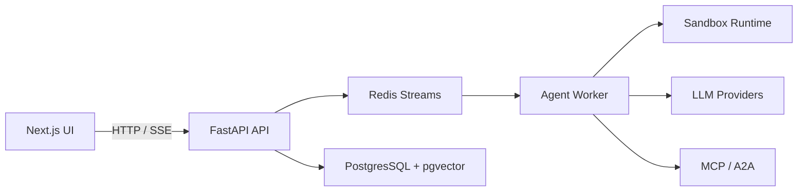

# OpenCitadel — 企业级私有化 AI Agent 平台

<div align="center">

**完全私有化部署 · Agent + 知识库 + 代码库 · MCP / A2A 集成 · 沙箱隔离执行**

[](LICENSE)
[](https://www.python.org/)
[](https://fastapi.tiangolo.com/)
[](https://nextjs.org/)
[](https://docs.docker.com/compose/)

[English](README.md) · [文档中心](docs/README.zh-CN.md) · [GitHub](https://github.com/OceaLong/opencitadel)

</div>

---

OpenCitadel 是面向**企业私有化部署**的开源 AI Agent **平台**（非单一浏览器 SDK）。数据、模型调用与文件存储均可留在自有网络内，通过 **MCP** 与 **A2A** 连接内部系统，在隔离沙箱中执行浏览器、Shell 与文件操作。

**差异化**：平台级治理层——Plan 审批、逐工具门控、VNC 接管、含浏览器 Profile 的检查点回滚、API 层审计——覆盖浏览器/Shell/MCP/A2A 全工具链。

| 对比 | Skyvern | OpenHands | Onyx | OpenCitadel |
|------|---------|-----------|------|-------------|
| 定位 | 浏览器自动化 SDK (AGPL) | 代码 Agent | 检索/RAG | 私有化 Agent 平台 + 全链路治理 |
| HITL | 浏览器任务 | 有限 | — | Plan + 逐工具 + 接管 + 回滚 + 审计 |

> Web Operator 场景限定于**企业自有/自建系统**；第三方 SaaS 需声明归属并留痕，不构成法律风险消除。

## 演示视频

由于视频文件较大，请点击下方图片或链接前往观看完整演示：

[](https://www.bilibili.com/video/BV1QGNi6BERh/?vd_source=4ce3545913066879813a27e759a60c52)

> 视频链接：[点击这里观看完整演示](https://www.bilibili.com/video/BV1QGNi6BERh/?vd_source=4ce3545913066879813a27e759a60c52)

## 核心模块

| 模块 | 入口 | 说明 |
|------|------|------|
| **Agent 对话** | `/`、`/sessions/[id]` | 监管级自主执行：Planner → ReAct、逐工具审批、VNC、检查点（含浏览器状态） |
| **代码知识库** | `/codebase` | ZIP / Git 导入、符号检索、架构图、Ask / Agent 改码 |
| **文档知识库** | `/knowledge` | 企业文档上传与连接器导入、检索问答、GraphRAG 与 reindex |
| **应用市场** | `/marketplace` | LLM 小应用（营养分析、翻译、工具箱等） |
| **自动化** | `/automation` | 定时任务、Webhook、通知 |
| **协议集成** | 设置弹窗 → 集成 | MCP（stdio / SSE / streamable HTTP）与 A2A 远程 Agent |
| **管理后台** | `/admin/*` | 用户、配额、审计、用量、**合规证据** |

## 快速开始

**10 分钟体验（推荐）**

```bash
git clone https://github.com/OceaLong/opencitadel.git
cd opencitadel
make quickstart
```

打开 **http://localhost:8088**，登录后在 **设置 → 模型** 中添加 LLM **端点**与**模型**，即可运行第一个 Agent 任务。

`make quickstart` 会构建 `opencitadel-sandbox` 镜像（Agent 工具必需）、启动内置 MinIO（`COMPOSE_PROFILES=local`），并在新建 `.env` 时设置 `STORAGE_PROVIDER=minio`。如需腾讯云 COS，请在 `.env` 中自行覆盖。

- 详细步骤：[10 分钟自托管教程（中文）](docs/tutorials/01-self-host-10-minutes.zh-CN.md)
- 生产部署：[部署指南](docs/operations/deployment.zh-CN.md)
- 域名与 HTTPS：[HTTPS 配置](docs/operations/https-domain-setup.zh-CN.md)

## 架构概览



- **API / Worker 分离**：API 无状态处理 SSE 与事件重放，Worker 消费任务队列执行 Agent
- **沙箱隔离**：Docker 或 Kubernetes 中按需创建沙箱，支持浏览器自动化与 VNC
- **部署形态**：Docker Compose（单节点）或 Helm / Kubernetes（水平扩展）

完整设计说明见 [系统架构（中文）](docs/architecture/overview.zh-CN.md)。

## 文档地图

| 受众 | 推荐阅读 |
|------|----------|
| 首次体验 | [10 分钟自托管](docs/tutorials/01-self-host-10-minutes.zh-CN.md) |
| 运维 / DevOps | [生产部署](docs/operations/deployment.zh-CN.md) · [HTTPS](docs/operations/https-domain-setup.zh-CN.md) · [Helm](deploy/helm/opencitadel/README.zh-CN.md) |
| 企业场景 | [内部知识库](docs/tutorials/02-internal-knowledge-base.zh-CN.md) · [MCP 集成](docs/tutorials/03-mcp-integrations.zh-CN.md) · [受治理 Web Operator](docs/tutorials/04-governed-web-operator.zh-CN.md) · [退款对账与合规](docs/tutorials/05-refund-reconciliation-compliance.zh-CN.md) |
| 平台 / 后端 | [文档中心](docs/README.zh-CN.md) · [安全模型](docs/architecture/security-model.zh-CN.md) · [检查点与 HITL](docs/architecture/checkpoints-and-hitl.zh-CN.md) · [事件系统](docs/architecture/events.zh-CN.md) |
| 开源贡献 | [贡献指南](.github/CONTRIBUTING.zh-CN.md) · [安全政策](.github/SECURITY.zh-CN.md) |

## 本地开发

```bash
cp .env.example .env
# 编辑 .env：设置 BOOTSTRAP_ADMIN_PASSWORD；首次登录后在设置中配置 LLM 端点与模型

# 全栈（Compose）
docker compose --profile local up --build

# 或分别启动 API / Worker
cd api && uv sync && uv run pytest
cd ui && npm install && npm run test
```

模块说明：[api/README.zh-CN.md](api/README.zh-CN.md) · [ui/README.zh-CN.md](ui/README.zh-CN.md) · [sandbox/README.zh-CN.md](sandbox/README.zh-CN.md)

## 许可证

本项目采用 [Apache License 2.0](LICENSE) 开源。
