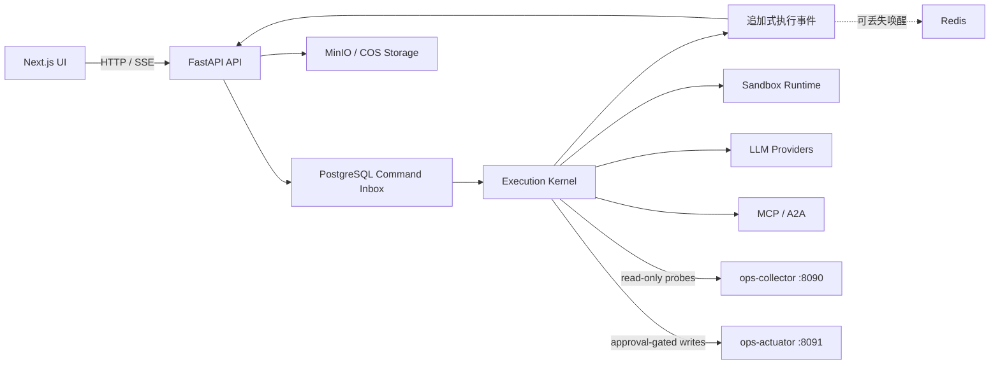

# OpenCitadel — 企业级私有化 AI Agent 平台

<div align="center">

**完全私有化部署 · 每个工具调用可声明、可审批、可追踪、可举证 · MCP / A2A · 沙箱隔离执行**

[](LICENSE)
[](https://www.python.org/)
[](https://fastapi.tiangolo.com/)
[](https://nextjs.org/)
[](https://docs.docker.com/compose/)

[English](README.md) · [文档中心](docs/README.zh-CN.md) · [GitHub](https://github.com/OceaLong/opencitadel)

</div>

---

OpenCitadel 是**受治理的私有化 AI Agent 平台**。数据、模型调用与文件存储留在自有网络内；Agent 在隔离沙箱中执行浏览器、Shell 与文件操作，通过 MCP 与 A2A 连接内部系统。治理直接进入执行协议：**每个外部调用都有明确效果、持久 Invocation 身份、策略快照、可选人工审批和可验证审计证据**。

现有 Agent 治理方案多为单点工具，OpenCitadel 提供一体化平台：

| 能力 | MCP 网关类 | Agent 防火墙/Guardrails | 只读诊断类（k8sgpt 等） | OpenCitadel |
|------|-----------|------------------------|------------------------|-------------|
| 治理范围 | 仅 MCP 流量 | 策略拦截单点 | 只读、无执行 | 浏览器 / Shell / 文件 / MCP / A2A 全工具链 |
| 人工介入 | — | 审批单点 | — | 持久化逐 Invocation 审批 + VNC 接管 |
| 证据 | 访问日志 | 日志 | — | API 层哈希链审计 + 可验签证据包 |
| 部署形态 | 网关 | Sidecar/SDK | CLI | 完整私有化平台（Compose / Helm） |

> Web Operator 场景限定于**企业自有/自建系统**；第三方 SaaS 需声明归属并留痕，不构成法律风险消除。

## 演示视频

由于视频文件较大，请点击下方图片或链接前往观看完整演示：

[](https://www.bilibili.com/video/BV1QGNi6BERh/?vd_source=4ce3545913066879813a27e759a60c52)

> 视频链接：[点击这里观看完整演示](https://www.bilibili.com/video/BV1QGNi6BERh/?vd_source=4ce3545913066879813a27e759a60c52)

## 核心模块

| 模块 | 入口 | 说明 |
|------|------|------|
| **Agent 对话** | `/`、`/sessions/[id]` | 事件溯源 Agent/Ask Run、逐 Invocation 审批、VNC 接管、持久回放 |
| **Ops Patrol 巡检** | `/patrols` | 只读基础设施巡检，含审批制修复闭环：闭世界采集器、服务端断言引擎、签名证据包 |
| **自动化** | `/automation` | 定时任务、Webhook、通知 |
| **受治理的上下文源** | `/knowledge`、`/codebase` | 文档与代码知识库：版本化、原子发布、会话版本绑定、检索问答 |
| **协议集成** | 设置弹窗 → 集成 | MCP（stdio / SSE / streamable HTTP）与 A2A 远程 Agent |
| **管理后台** | `/admin/*` | 用户、配额、审计、用量、合规证据 |

## 快速开始

**10 分钟体验（推荐）**

```bash
git clone https://github.com/OceaLong/opencitadel.git
cd opencitadel
make quickstart
```

打开 **http://localhost:8088**，登录后在 **设置 → 推理** 中配置 **Endpoint**、**Model**
与 **Chat Binding**，即可运行第一个 Agent 任务。

`make quickstart` 还会构建沙箱镜像，并默认使用内置 MinIO 存储——如需云存储或生产配置，见下方指南。

- 详细步骤：[10 分钟自托管教程（中文）](docs/tutorials/01-self-host-10-minutes.zh-CN.md)
- 生产部署：[部署指南](docs/operations/deployment.zh-CN.md)
- 域名与 HTTPS：[HTTPS 配置](docs/operations/https-domain-setup.zh-CN.md)

## 架构概览


```mermaid
flowchart LR
  UI["Next.js UI"] -->|"HTTP / SSE"| API["FastAPI API"]
  API --> Inbox["PostgreSQL Command Inbox"]
  Inbox --> Kernel["Execution Kernel"]
  Kernel --> Events["追加式执行事件"]
  Events --> API
  Events -.->|"可丢失唤醒"| Redis["Redis"]
  API --> Storage["MinIO / COS Storage"]
  Kernel --> Sandbox["Sandbox Runtime"]
  Kernel --> LLM["LLM Providers"]
  Kernel --> MCP["MCP / A2A"]
  Kernel -->|"read-only probes"| Collector["ops-collector :8090"]
  Kernel -->|"approval-gated writes"| Actuator["ops-actuator :8091"]
```

- **单一执行事实**：所有 Run 都由 PostgreSQL 事件驱动；Redis 只提供可恢复的唤醒提示
- **显式装配**：独立强类型 `ApiRuntime` / `KernelRuntime` 对象图持有资源、受监管任务与有界关闭
- **身份安全客户端数据**：认证缓存按 `userId + workspaceId` 隔离，并在身份变化前失效
- **沙箱隔离**：Docker 或 Kubernetes 中按需创建沙箱，支持浏览器自动化与 VNC
- **受治理写平面**：`ops-collector`（8090）只读；`ops-actuator`（8091）仅接受三个注册制写动作，且必须经人工审批后才可达——见[治理平面](docs/architecture/governance-plane.zh-CN.md)
- **部署形态**：Docker Compose（单节点）或 Helm / Kubernetes（水平扩展）

完整设计说明见 [系统架构（中文）](docs/architecture/overview.zh-CN.md)。

## 文档地图

| 受众 | 推荐阅读 |
|------|----------|
| 首次体验 | [10 分钟自托管](docs/tutorials/01-self-host-10-minutes.zh-CN.md) · [10 分钟治理演示闭环](docs/tutorials/08-ten-minute-governance-demo.zh-CN.md) |
| 运维 / DevOps | [生产部署](docs/operations/deployment.zh-CN.md) · [Ops Patrol 教程](docs/tutorials/06-ops-patrol.zh-CN.md) · [已批准的修复教程](docs/tutorials/07-approved-remediation.zh-CN.md) · [Patrol 运维](docs/operations/ops-patrol.zh-CN.md) · [HTTPS](docs/operations/https-domain-setup.zh-CN.md) · [Helm](deploy/helm/opencitadel/README.zh-CN.md) |
| 企业场景 | [内部知识库](docs/tutorials/02-internal-knowledge-base.zh-CN.md) · [MCP 集成](docs/tutorials/03-mcp-integrations.zh-CN.md) · [受治理 Web Operator](docs/tutorials/04-governed-web-operator.zh-CN.md) · [退款对账与合规](docs/tutorials/05-refund-reconciliation-compliance.zh-CN.md) |
| 平台 / 后端 | [文档中心](docs/README.zh-CN.md) · [执行内核](docs/architecture/execution-kernel.zh-CN.md) · [安全模型](docs/architecture/security-model.zh-CN.md) · [Ops Patrol 架构](docs/architecture/ops-patrol.zh-CN.md) |
| 开源贡献 | [贡献指南](.github/CONTRIBUTING.zh-CN.md) · [安全政策](.github/SECURITY.zh-CN.md) |

## 本地开发

```bash
cp .env.example .env
# 编辑 .env：设置 BOOTSTRAP_ADMIN_PASSWORD；首次登录后在设置 → 推理中配置 Endpoint/Model/Binding

# 全栈（Compose）
docker compose --profile local up --build

# 或分别运行 API / UI 测试
cd api && uv sync && uv run pytest
cd ui && npm install && npm run test
```

模块说明：[api/README.zh-CN.md](api/README.zh-CN.md) · [ui/README.zh-CN.md](ui/README.zh-CN.md) · [sandbox/README.zh-CN.md](sandbox/README.zh-CN.md)

## 许可证

本项目采用 [Apache License 2.0](LICENSE) 开源。
