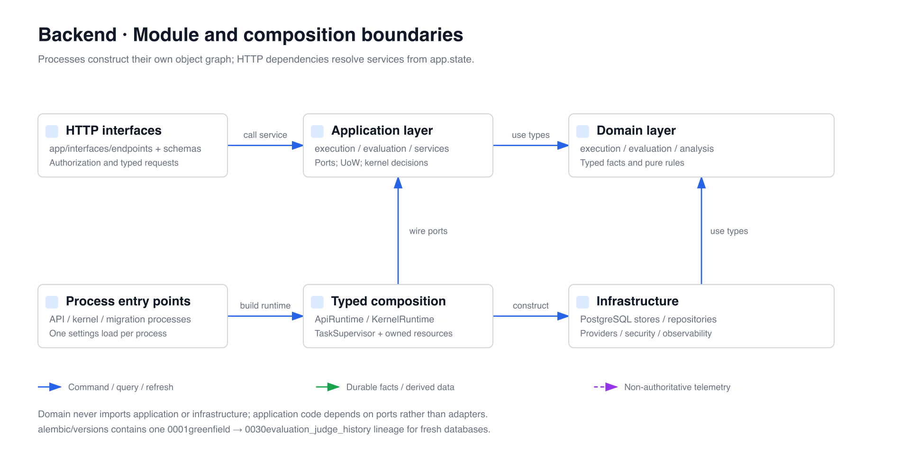

# OpenCitadel API 与执行内核

[English](README.md)

Python 后端包含三个明确进程角色。PostgreSQL 执行事件是唯一工作流事实，
Redis 仅是可丢失的唤醒通道。

| 角色     | 入口                                                | 职责                                                                          |
| -------- | --------------------------------------------------- | ----------------------------------------------------------------------------- |
| API      | `app.main` / `run.sh`                               | 认证、授权、Command 准入、投影查询、SSE                                       |
| 执行内核 | `app.execution_kernel_main` / `execution-kernel.sh` | Inbox、决策、Activity、Timer、Outbox、投影、Scheduler、评测与比较/导出 Worker |
| Migrate  | `app.migrate` / `migrate.sh`                        | 全新 Alembic Schema 与类型化 Runtime Policy Seed                              |

API 不执行 Agent 或摄取步骤。执行内核轮询 PostgreSQL 中的持久工作，也可等待
Redis 提示。删除 Redis 不会删除已接受的 Command、Activity、Timer、Event 或结果。

## 技术栈

- Python 3.12、FastAPI、Pydantic 2
- SQLAlchemy 2 async、Alembic、PostgreSQL 16、pgvector
- Redis 7（只用于唤醒提示和缓存）
- OpenAI、Anthropic、Gemini 模型适配器
- MCP、A2A、Playwright、Docker/Kubernetes 沙箱
- OpenTelemetry 与 Prometheus

## 源码地图



所有非确定 Provider 工作都建模为 Activity。外部调用前必须提交 Invocation 身份、
输入摘要、超时、策略快照和 call-start 状态；完成结果通过强类型 Command 回写。
Run、Activity、审批、资源构建和公开事件表都是可重建投影，不是第二状态机。

## 装配与事务

`app.main:create_app --factory` 只加载一次部署配置，并把 Lifespan 所有的 `ApiRuntime`
安装到 `app.state`。`app.execution_kernel_main` 构建独立 `KernelRuntime`。
`TaskSupervisor` 持有全部后台协程并执行有界排空；两个角色不共享资源实例。

Application Mutation 显式调用 `uow.commit()`。Context 未提交即退出时一律 rollback，
包括正常 return。Repository 永不 commit；Redis 发布只能在 PostgreSQL 成功后的
post-commit 阶段作为提示发生。

`/api/health/live` 用于进程 Liveness，`/api/health/ready` 用于完整 Runtime Readiness。
`/api/status` 是依赖诊断，不是生命周期探针。

## 安全边界

认证请求解析为不可变 `AuthorizationContext` 与 `OwnerScope`。事务级 PostgreSQL
设置驱动强制 RLS。全新部署分别创建应用、执行内核和迁移角色；运行时角色不拥有 schema。

- 用户资源属于个人或单一团队工作区。
- Auditor 只读。
- Admin 管理全局资源与平台配置。
- 跨 scope 查询关闭失败，通常返回未找到。
- LLM 与集成 Secret 只使用版本化 `fernet_v2` 信封。

## 核心 HTTP 契约

应用路由统一位于 `/api`：

- `/auth/*`、`/teams/*`、`/service-keys/*`：身份与工作区
- `/sessions/*`：会话 CRUD、消息 Command 准入、公开事件回放、VNC 与文件；`?q=`
  标题/消息搜索，以及软删除回收站（`GET /sessions/deleted`、
  `POST /sessions/{id}/delete|restore|purge`）
- `/execution-runs/*`、`/execution-artifacts/*`、`/execution-sources/*`：执行工作台、固定 `at`、有界 Step/Timeline/Body、事件与 SSE
- `/execution-analysis/*`、`/execution-comparisons/*`：固定源分析、时区偏好、比较 Revision、差异 Job 与私有 CSV/JSON 导出
- `/evaluation/*`：Dataset、Configuration/Rubric/Suite、预检与 Batch、Recorded/Isolated Environment、Score/Review 和受保护归档
- `/runs/*`、`/approval-batches/*`：正式执行与审批 Command
- `/approvals`：审阅者收件箱——跨 Run 的 `GET /approvals?status=pending`（也可选
  `approved`/`rejected`/`cancelled`/`expired`）
- `/knowledge-bases/*`：不可变候选构建与已发布版本绑定，以及软删除回收站
  （`GET /knowledge-bases/deleted`、`DELETE /knowledge-bases/{id}`、
  `POST /{id}/restore`、`DELETE /{id}/purge`）
- `/scheduled-jobs/*`、`/patrol-*`：自动化、巡检、证据、修复；
  `GET /scheduled-jobs/{id}/runs` 返回分页触发历史
- `/artifacts/*`：工作区 Artifact，带脱敏分享字段（`is_shared`、
  `share_expires_at`、`share_token_preview`）；完整分享 Token 仅在创建/轮换时返回一次
- `/a2a`（入站，`X-Api-Key`）：A2A JSON-RPC——`message/send`、`message/stream`、
  `tasks/get`、`tasks/cancel`
- `/capabilities`：平台能力报告，含 `report_pdf`
- `/inference/endpoints/*`、`/inference/models/*`、`/inference/bindings/*`、
  `/skills/*`、`/runtime-policies/*`：运行资源、策略版本与推理绑定
- `/admin/*`：用户、用量、审计、治理、合规；团队删除
  （`cascade` | `transfer_to_owner`）与用户删除
  （`anonymize` | `cascade` | `transfer_to_team`）均为显式且带审计的策略

路由级事实以 `/openapi.json` 为准；A2A 发现还包含根路径的 Well-known 入口。SSE Feed Cursor 使用公开 Feed 序列，不是正式事件位置；工作台历史读取使用单独的 `PlaybackBoundary`。

数据库测试需要全新 schema 的独立角色与 PostgreSQL/Redis。缺失依赖时普通测试可跳过部分集成项；`make test-api-strict` 强制验证依赖，不能用跳过结果证明集成通过。部署步骤见[部署指南](../docs/operations/deployment.zh-CN.md)。

CI 与这两个 Make 入口只排除 `test_execution_visualization_closed_loop.py`；它的六项当次验收消费者由[验收 Runner](../e2e/README.zh-CN.md)在原生 strict 报告与恢复回执校验后执行，要求零跳过。

## 本地开发

```bash
uv sync --all-groups
uv run pytest -q --ignore=tests/app/integration/test_execution_visualization_closed_loop.py
uv run lint-imports
uv run ruff check --config ../ruff.toml . ../ops-actuator ../ops-collector ../sandbox ../scripts ../demo
```

配置 `.env` 与 PostgreSQL 后，在不同终端运行：

```bash
uv run ./migrate.sh
uv run ./run.sh
uv run ./execution-kernel.sh
```

Alembic 使用从 `0001greenfield` 到 `0030evaluation_judge_history` 的单一线性谱系，新库执行完整 `upgrade head`。这不是旧生产版本的数据升级契约；不存在历史数据转换命令或备用执行 schema。

## 容器

Dockerfile 提供 `api` 与 `execution-kernel` target。Compose 服务名是
`opencitadel-api`、`opencitadel-execution-kernel` 和 `opencitadel-migrate`。
Helm 使用相同的 API/Kernel 分离与独立凭据。

参见[架构概览](../docs/architecture/overview.zh-CN.md)、
[执行内核](../docs/architecture/execution-kernel.zh-CN.md)与
[部署指南](../docs/operations/deployment.zh-CN.md)。

- [执行分析、比较与导出](../docs/architecture/execution-analysis.zh-CN.md)
- [评测控制面](../docs/architecture/evaluation-control-plane.zh-CN.md)
