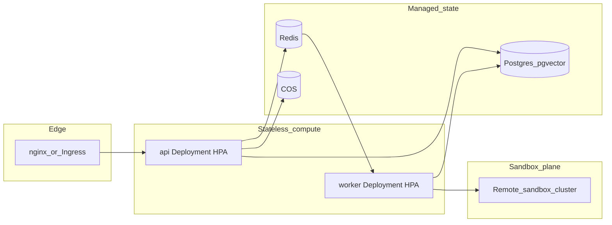
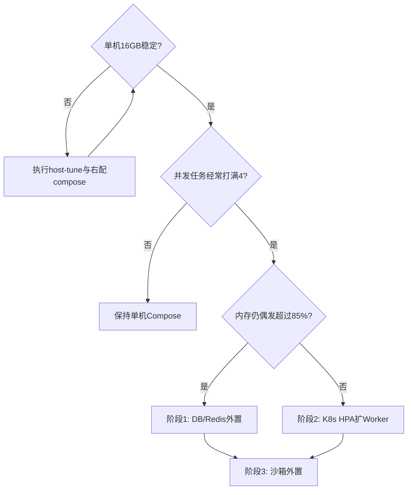

# MyManus 架构演进指南

本文档是 MyManus 从单机 Docker Compose 演进到可水平扩展生产架构的权威说明，与 [DEPLOYMENT.md](../DEPLOYMENT.md) 单机稳定化方案配套使用。

## 现状与瓶颈

单机 16GB 部署时，主要压力来自：

| 组件 | 特性 | 演进方向 |
|------|------|----------|
| **Agent Worker + 沙箱** | 内存峰值不可控（并发沙箱 × 单沙箱配额） | 外置沙箱执行面 |
| **API** | 无状态，SSE 长连接 | 水平扩展 + Ingress |
| **PostgreSQL / Redis** | 有状态 | 托管服务或独立节点 |
| **任务队列** | Redis Streams 已存在 | 作为 HPA 背压信号 |

单机稳定化（右配 `mem_limit`、默认无预热 + 按需创建、`max_concurrent_tasks` 封顶）可消除 swap 抖动；当并发或租户数增长时，按本文档分阶段演进。`pool_enabled=false` 是当前默认值；如需降低首个工具调用延迟，可在内存预算明确时启用 1 个预热沙箱。

## 目标架构



## 阶段 0：单机稳定（当前）

- 使用 [docker-compose.yml](../docker-compose.yml) 右配内存与 [api/config.yaml](../api/config.yaml) 沙箱策略
- 宿主机执行 [deploy/scripts/host-tune.sh](../deploy/scripts/host-tune.sh)
- 用 [deploy/scripts/verify-host-health.sh](../deploy/scripts/verify-host-health.sh) 对比调优前后指标

**内存预算参考（16GB 主机）**

| 层级 | 配额 |
|------|------|
| 宿主机 + Docker 预留 | ~2GB |
| 核心服务 mem_limit 合计 | ~3.7GB |
| 沙箱（默认 0 预热 + 最多 3 按需） | 0~3GB |
| 峰值合计 | ≤ ~11GB（留足余量） |

## 阶段 1：计算层拆分（推荐第一步）

**目标**：API/Worker 与数据库、Redis 分离，主节点不再跑 Postgres。

1. 将 PostgreSQL 迁至腾讯云 PostgreSQL（或独立 VM + pgvector）
2. 将 Redis 迁至腾讯云 Redis 或独立实例
3. 单机仅保留：`manus-api`、`manus-worker`、`manus-ui`、`manus-nginx` + 动态沙箱
4. 更新 `.env` 中 `POSTGRES_HOST`、`REDIS_HOST` 指向托管地址

**收益**：主节点释放 ~2GB+ 常驻内存，DB 可独立扩缩与备份。

## 阶段 2：Kubernetes + HPA（无状态扩缩）

仓库已提供 Helm Chart：[deploy/helm/my-manus/](../deploy/helm/my-manus/)。

```bash
helm upgrade --install my-manus ./deploy/helm/my-manus \
  --namespace manus --create-namespace \
  --set image.api.repository=your-registry/manus-api \
  --set image.worker.repository=your-registry/manus-worker \
  --set replicaCount.api=2 \
  --set replicaCount.worker=2 \
  --set autoscaling.api.enabled=true \
  --set autoscaling.worker.enabled=true \
  --set migrate.enabled=true
```

**关键配置项**

| Values | 建议 |
|--------|------|
| `autoscaling.api` | CPU 70% 或自定义 SSE 连接数指标 |
| `autoscaling.worker` | CPU 75% 或 **Redis 队列深度**（推荐） |
| `resources.worker.limits.memory` | 与单机 worker 1.5Gi 对齐，避免 K8s 侧再次超配 |
| `migrate.enabled` | 保持 true，与 `manus-migrate` 等价 |

**背压**：Worker 消费 `task:dispatch`（见 [api/config.yaml](../api/config.yaml) `streams`）。扩容时应以队列积压长度为 HPA 自定义指标，而非仅 CPU——Agent 任务常 IO 等待，CPU 可能偏低但队列已堆积。

生产前需补全：Secret（`API_KEY_SECRET`、DB/Redis/COS）、`config.yaml` ConfigMap、Ingress TLS。

## 阶段 3：沙箱外置（最大内存隔离）

**目标**：Worker 不再通过本地 Docker Socket 创建沙箱，内存压力转移到专用节点。

配置方式（已支持，无需改业务代码）：

```yaml
# api/config.yaml
sandbox:
  address: http://sandbox-gateway.internal:8080   # 远程沙箱服务地址
  pool_enabled: false   # 远程模式下关闭本地预热池
  pool_size: 0
```

当 `sandbox.address` 非空时，Worker 直连远程沙箱，不再调用本地 `docker.sock`（见 `DockerSandbox.create()`）。

**沙箱执行面选型**

| 方案 | 隔离 | 内存开销 | 适用 |
|------|------|----------|------|
| 独立 VM + Docker | 中 | 中 | 最快落地 |
| **gVisor** | 高 | 中 | K8s 多租户 Agent |
| **Kata Containers** | 很高 | 较高 | 强隔离合规场景 |
| **Firecracker microVM** | 很高 | 可控 | 高密度短生命周期沙箱 |

推荐路径：先 **独立沙箱节点池**（多台 8C16G 仅跑沙箱），再视多租户需求引入 gVisor/Kata。

## 阶段 4：全托管与可观测

- **对象存储**：已使用 COS，保持不变
- **可观测**：启用 `observability.otel_enabled` + Langfuse（可选）
- **指标**：`GET /api/metrics`（Prometheus）+ 云监控告警（内存 <85%、swap si/so > 0）

## 演进决策树



## 相关文档

- [docker-compose.yml](../docker-compose.yml) — 单机资源配额
- [api/config.yaml](../api/config.yaml) — 沙箱与 Worker 并发
- [deploy/scripts/host-tune.sh](../deploy/scripts/host-tune.sh) — 宿主机 Swap/日志轮转
- [deploy/scripts/verify-host-health.sh](../deploy/scripts/verify-host-health.sh) — 调优验证
- [deploy/helm/my-manus/](../deploy/helm/my-manus/) — K8s 部署骨架
- [系统架构](architecture.md)
