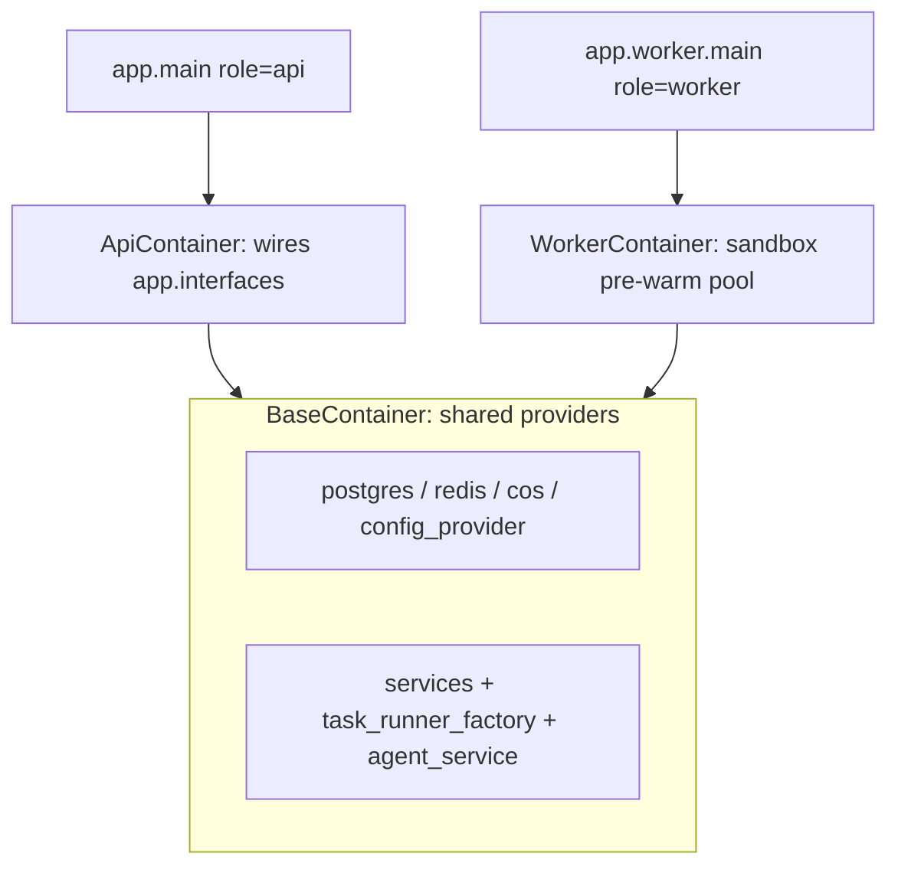

# MyManus 架构说明

本文档是 API / Worker 职责划分、依赖注入、打包部署的单一事实来源。

## 进程角色

| 角色 | 入口 | 镜像 target | 职责 |
|------|------|-------------|------|
| **API** | `app.main` → `uvicorn` | `api` | HTTP/SSE、任务 dispatch、事件流读取、配置管理 |
| **Worker** | `app.worker.main` | `worker` | 消费 `task:dispatch`、执行 Agent / 代码库摄取 |
| **Migrate** | `app.migrate` | `api`（一次性 job） | `alembic upgrade head` |

进程角色通过 `app/runtime_role.py` 的 `ProcessRole` 枚举显式设置，并写入环境变量 `MANUS_PROCESS_ROLE`。

## 运行时数据流

```
Client ──SSE──► FastAPI API（无状态）
                  │ 写入 task:input / dispatch
                  ▼
              Redis Streams + 消费组
                  │
                  ▼
           Agent Worker 池
                  │ Planner → ReAct 循环
                  ▼
              写入 task:output ──► API SSE 直读
                  │
                  ▼
             session_events 追加表
```

### API 职责

- 接收 HTTP/WebSocket 请求，返回 SSE 事件流
- 创建任务、写入用户消息到 Redis `task:input`
- 通过 `task.invoke()` dispatch 到 `task:dispatch` 消费组
- 从 `task:output` stream 读取事件并推送给客户端
- `stop` 通过 Redis cancel 通道通知 Worker
- 校验 DB schema 版本（拒绝未迁移启动）
- 维护 MCP/A2A 连接池空闲回收（`_connection_pool_cleanup_loop`）

### Worker 职责

- 从 Redis `task:dispatch` 消费组领取任务
- 运行 `AgentTaskRunner`（Planner → ReAct）或 `CodebaseIngestionTaskRunner`
- 写入事件到 `task:output` stream
- 将可持久化事件追加到 `session_events` 表
- 沙箱预热门户（`SandboxPool`）与孤儿容器清理
- 任务结束后释放 MCP/A2A 陈旧连接

## 依赖注入容器



| 容器 | 文件 | HTTP wiring | Sandbox 预热门户 | 配置热更新监听 |
|------|------|-------------|------------------|----------------|
| `BaseContainer` | `app/container.py` | 否 | 否 | 否 |
| `ApiContainer` | 继承 Base | 是 | 否 | 是 |
| `WorkerContainer` | 继承 Base | 否 | 是 | 是 |

初始化入口：

- API：`init_api_container()` / `shutdown_api_container()`
- Worker：`init_worker_container()` / `shutdown_worker_container()`

FastAPI 依赖注入通过 `ApiContainer`（`AppContainer` 为其别名）解析。

## 后台循环归属

| 循环 | 归属 | 说明 |
|------|------|------|
| MCP/A2A 连接池回收 | API | 每 5 分钟释放陈旧连接 |
| 沙箱孤儿容器清理 | Worker | 按 `cleanup_interval_seconds` 清理 |
| 沙箱预热门户 | Worker | `SandboxPool` 仅在 `ProcessRole.WORKER` 时启动 |

## 依赖管理规范

| 模块 | 工具 | 锁文件 | 安装命令 |
|------|------|--------|----------|
| `api/` | uv | `uv.lock` | `uv sync --frozen` |
| `sandbox/` | uv | `uv.lock` | `uv sync --frozen` |
| `ui/` | npm | `package-lock.json` | `npm ci` |

Python 项目统一使用 `pyproject.toml` + `uv.lock`，不再维护 `requirements.txt`。

## 打包与部署

### Docker 镜像

`api/Dockerfile` 为多阶段构建：

| target | 镜像名 | CMD | `MANUS_PROCESS_ROLE` |
|--------|--------|-----|----------------------|
| `api` | `manus-api` | `./run.sh` | `api` |
| `worker` | `manus-worker` | `./worker.sh` | `worker` |

`manus-migrate` 使用 `api` target，命令覆盖为 `python -m app.migrate`。

### Docker Compose 启动顺序

```
postgres/redis → manus-migrate → manus-api + manus-worker → ui → nginx
```

### Kubernetes / Helm

Chart 位于 `deploy/helm/my-manus/`：

- API Deployment：`image.api.repository: manus-api`
- Worker Deployment：`image.worker.repository: manus-worker`
- migrate initContainer 使用 API 镜像

## 相关文档

- [事件模型](events.md)
- [API 服务](../api/README.md)
- [沙箱服务](../sandbox/README.md)
- [生产部署](../DEPLOYMENT.md)
