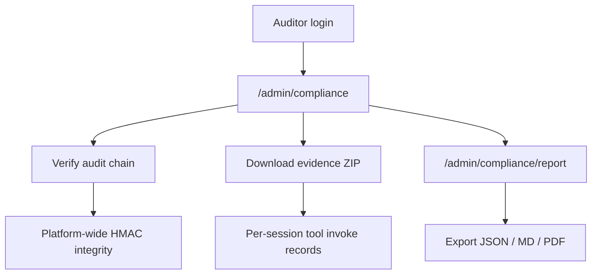

[English](admin-auditor-compliance.md) · [简体中文](admin-auditor-compliance.zh-CN.md)

# Admin, Auditor & Compliance

Platform administration, read-only auditor role, and compliance evidence workflows.

## Global roles

| Role | `global_role` | Write access | Read access |
|------|---------------|--------------|-------------|
| Admin | `admin` | Full platform admin + user operations | All admin/audit/compliance routes |
| User | `user` | Sessions, KB, codebases, teams (non-auditor guard) | Own and team-scoped resources |
| Auditor | `auditor` | **None** — `require_non_auditor` blocks writes | Audit, usage, compliance, evidence |

Auditors can review governance data but cannot create sessions, upload files, or modify configurations.

## Admin UI routes

| Route | Description |
|-------|-------------|
| `/admin` | Overview dashboard |
| `/admin/users` | User list, quotas, role assignment |
| `/admin/teams` | Team management |
| `/admin/invitations` | Platform invitation tokens |
| `/admin/audit` | Audit log viewer |
| `/admin/compliance` | Evidence center, chain verification, compliance reports |
| `/admin/compliance/report` | Full-page compliance report export (JSON / MD / PDF) |

Usage charts and token statistics appear on the **`/admin` overview dashboard** (not a separate `/admin/usage` page). Backend usage APIs remain under `/api/admin/usage/*`.

Bootstrap admin is created from `BOOTSTRAP_ADMIN_EMAIL` / `BOOTSTRAP_ADMIN_PASSWORD` on first migrate.

## Compliance API

All routes require `require_auditor_or_admin` (prefix `/api/admin`):

| Method | Path | Description |
|--------|------|-------------|
| GET | `/api/admin/audit/verify-chain` | Verify global audit HMAC chain |
| GET | `/api/admin/audit/verify-chain/sessions/{id}` | Verify session tool-invoke chain |
| GET | `/api/admin/evidence/sessions` | List sessions with evidence packages |
| GET | `/api/admin/evidence/sessions/{id}/package` | Download ZIP evidence package |
| GET | `/api/admin/compliance/report` | Compliance report (`json` / `md` / `pdf`) |

Compliance mapping covers **等保2.0** and **ISO27001** control items. Web Operator sessions with `gate_profile` produce `agent_tool_invoke` rows with HMAC evidence chain fields.

## Evidence package contents

Per-session ZIP from the Evidence center typically includes:

- `audit-report.md` / `audit-report.json` (session artifacts)
- Tool invocation records with redacted args
- `evidence-summary.pdf` when PDF rendering is available

## Typical auditor workflow

1. Log in as auditor (admin assigns `global_role=auditor`)
2. Open **Admin → Compliance** (`/admin/compliance`)
3. Run **Verify audit chain** for platform-wide integrity
4. Filter Web Operator sessions and download evidence ZIP
5. Export compliance report (`framework=djbh2.0` or ISO) for audit period

## Related documentation

- [Web Operator architecture](web-operator.md) — gate profiles and evidence chain
- [Refund reconciliation tutorial](../tutorials/05-refund-reconciliation-compliance.md)
- [Security model](security-model.md) — RBAC details
