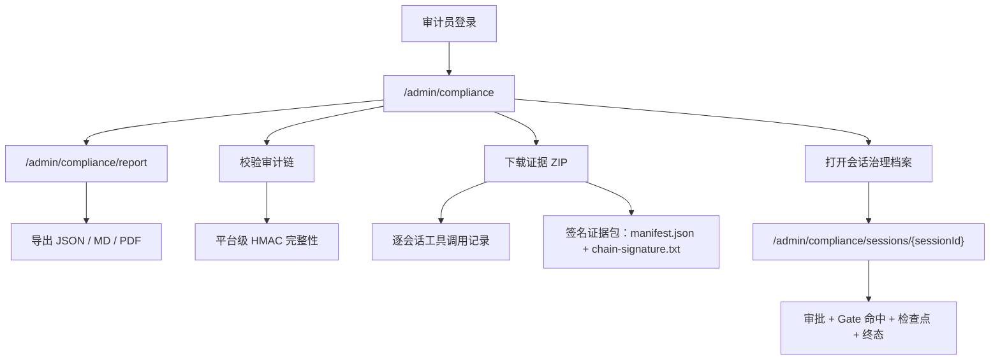
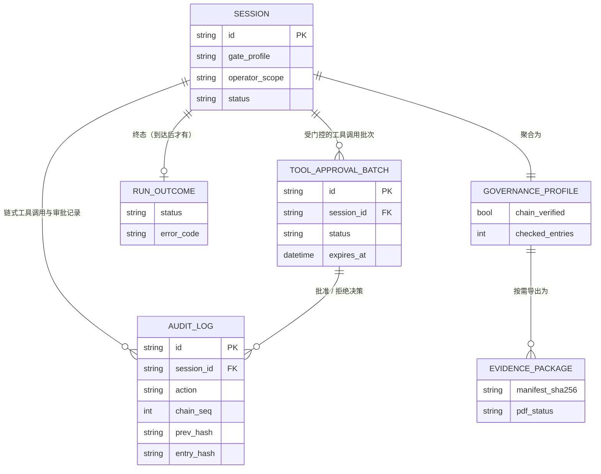

[English](admin-auditor-compliance.md) · [简体中文](admin-auditor-compliance.zh-CN.md)

# 管理、审计员与合规

平台管理、只读审计员角色，以及合规证据工作流。

## 全局角色

| 角色 | `global_role` | 写权限 | 读权限 |
|------|---------------|--------|--------|
| 管理员 | `admin` | 完整平台管理与用户操作 | 所有 admin/audit/compliance 路由 |
| 用户 | `user` | 会话、KB、代码库、团队（受 non-auditor 保护） | 个人与团队作用域资源 |
| 审计员 | `auditor` | **无** — `require_non_auditor` 拦截写操作 | 审计、用量、合规、证据 |

审计员可审阅治理数据，但无法创建会话、上传文件或修改配置。

## 管理后台路由

| 路由 | 说明 |
|------|------|
| `/admin` | 概览仪表盘 |
| `/admin/users` | 用户列表、配额、角色分配 |
| `/admin/teams` | 团队管理 |
| `/admin/invitations` | 平台邀请令牌 |
| `/admin/audit` | 审计日志查看 |
| `/admin/compliance` | 证据中心、链校验、合规报告 |
| `/admin/compliance/sessions/[sessionId]` | 单会话治理档案：审批、Gate 命中、检查点、终态 |
| `/admin/compliance/report` | 全页合规报告导出（JSON / MD / PDF） |

Token 用量图表在 **`/admin` 概览页**展示（无独立 `/admin/usage` 页面）。后端用量 API 仍在 `/api/admin/usage/*`。

首次 migrate 时根据 `BOOTSTRAP_ADMIN_EMAIL` / `BOOTSTRAP_ADMIN_PASSWORD` 创建引导管理员。

## 合规 API

以下路由均需 `require_auditor_or_admin`（前缀 `/api/admin`）：

| 方法 | 路径 | 说明 |
|------|------|------|
| GET | `/api/admin/audit/verify-chain` | 校验全局审计 HMAC 链 |
| GET | `/api/admin/audit/verify-chain/sessions/{id}` | 校验会话工具调用链 |
| GET | `/api/admin/evidence/sessions` | 列出可导出证据的会话 |
| GET | `/api/admin/evidence/sessions/{id}/package` | 下载 ZIP 证据包 |
| GET | `/api/admin/compliance/report` | 合规报告（`json` / `md` / `pdf`） |
| GET | `/api/admin/governance/sessions/{id}/profile` | 单会话治理档案只读聚合（审批、Gate 命中、检查点、链校验、终态） |

合规映射覆盖**等保2.0**与 **ISO27001** 控制项。设置 `gate_profile` 的 Web Operator 会话会写入带 HMAC 证据链字段的 `agent_tool_invoke` 记录。

## 证据包内容

证据中心按会话导出的 ZIP 包含：

- `audit.json`、`audit-report.md` —— 结构化 JSON 与渲染后 Markdown 形式的审计轨迹
- `checkpoints.json` —— 会话检查点索引
- `governance-profile.json`、`governance-profile.md` —— 与上方 API 返回的同一份治理档案，经脱敏并确定性渲染
- 可用时包含 `evidence-summary.pdf`
- `manifest.json` —— 每个文件的 SHA-256 哈希与链校验结果
- `chain-signature.txt` —— `HMAC-SHA256(AUDIT_SIGNING_KEY, manifest.json 字节)`

会话产生浏览器截图或制品时会额外包含 `screenshots/*.png` 与 `reconciliation/*.md`/`.html`。

## 治理档案

治理档案是对治理执行链已记录数据——审计哈希链、检查点、会话状态——的只读聚合，汇总为一份面向审计员的文档。不新增表，也不新增写操作。

## 典型审计员工作流

1. 以审计员身份登录（管理员分配 `global_role=auditor`）
2. 打开 **管理 → 合规**（`/admin/compliance`）
3. 执行**校验审计链**确认平台完整性
4. 筛选 Web Operator 会话并下载证据 ZIP
5. 打开某会话的治理档案（`/admin/compliance/sessions/{sessionId}`）查看审批/Gate/检查点细节
6. 按审计周期导出合规报告（`framework=djbh2.0` 或 ISO）

## 相关文档

- [Web Operator 架构](web-operator.zh-CN.md) — 门控档位与证据链
- [退款对账与合规教程](../tutorials/05-refund-reconciliation-compliance.zh-CN.md)
- [安全模型](security-model.zh-CN.md) — RBAC 细节
