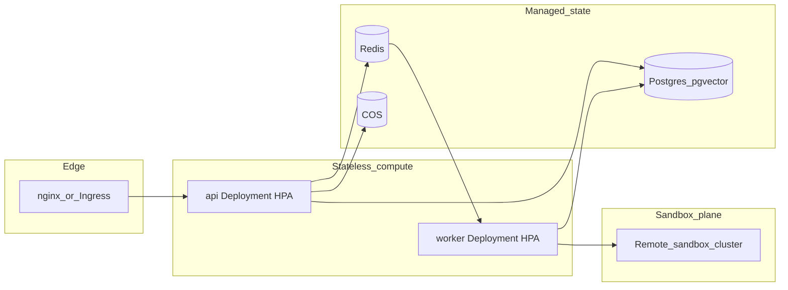
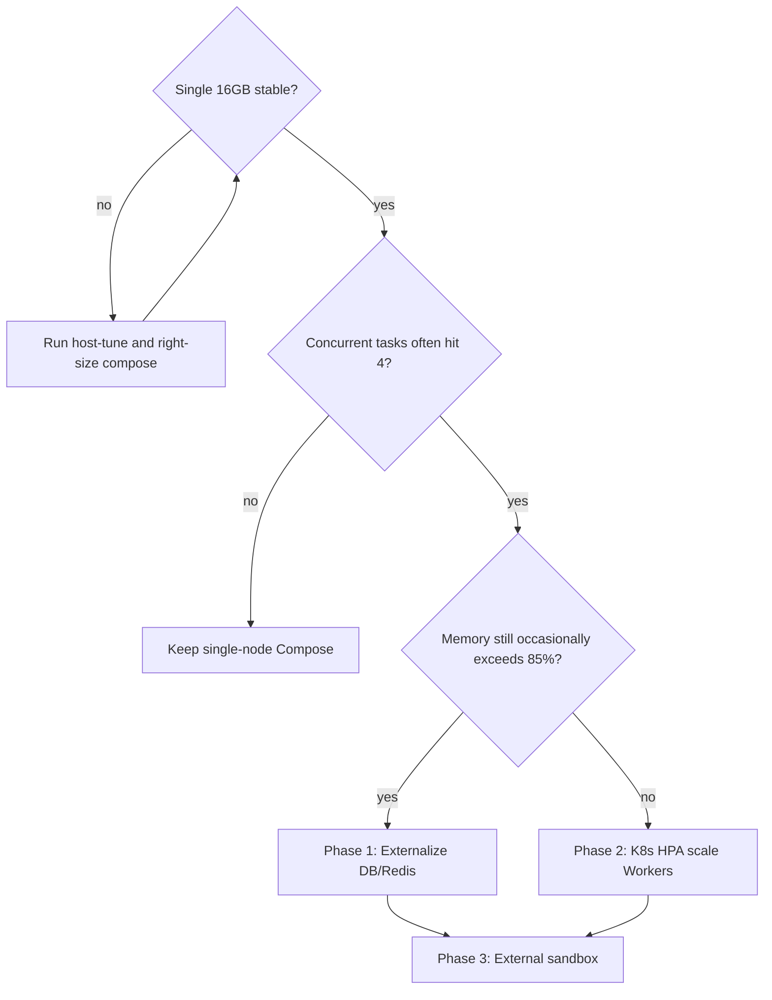

# OpenCitadel Architecture Evolution Guide

[简体中文](architecture-evolution.zh-CN.md)

This document is the authoritative guide for evolving OpenCitadel from single-node Docker Compose to a horizontally scalable production architecture. Use it alongside the single-node stabilization plan in [Production deployment](../operations/deployment.md).

## Current State and Bottlenecks

On a single 16GB deployment, primary pressure comes from:

| Component | Characteristics | Evolution direction |
|-----------|-----------------|---------------------|
| **Agent Worker + Sandbox** | Unpredictable memory peaks (concurrent sandboxes × per-sandbox quota) | External sandbox execution plane |
| **API** | Stateless, SSE long connections | Horizontal scaling + Ingress |
| **PostgreSQL / Redis** | Stateful | Managed services or dedicated nodes |
| **Task queue** | Redis Streams already in place | Use as HPA backpressure signal |

Single-node stabilization (right-sized `mem_limit`, default no warm pool + on-demand creation, `max_concurrent_tasks` cap) eliminates swap jitter; as concurrency or tenant count grows, evolve in phases per this document. `pool_enabled=false` is the current default; enable 1 warm sandbox when memory budget is clear and first tool-call latency needs reduction.

## Target Architecture



## Phase 0: Single-Node Stability (Current)

- Right-size memory in [docker-compose.yml](../../docker-compose.yml) and sandbox policy in [api/config.yaml](../../api/config.yaml)
- Run [deploy/scripts/host-tune.sh](../../deploy/scripts/host-tune.sh) on the host
- Compare before/after metrics with [deploy/scripts/verify-host-health.sh](../../deploy/scripts/verify-host-health.sh)

**Memory Budget Reference (16GB Host)**

| Layer | Quota |
|-------|-------|
| Host + Docker reserve | ~2GB |
| Core services mem_limit total | ~3.7GB |
| Sandboxes (default 0 warm + up to 3 on-demand) | 0~3GB |
| Peak total | ≤ ~11GB (headroom reserved) |

## Phase 1: Compute Layer Split (Recommended First Step)

**Goal**: Separate API/Worker from database and Redis; primary node no longer runs Postgres.

1. Migrate PostgreSQL to Tencent Cloud PostgreSQL (or dedicated VM + pgvector)
2. Migrate Redis to Tencent Cloud Redis or a dedicated instance
3. Single node retains only: `opencitadel-api`, `opencitadel-worker`, `opencitadel-ui`, `opencitadel-nginx` + dynamic sandboxes
4. Update `.env` `POSTGRES_HOST`, `REDIS_HOST` to point to managed addresses

**Benefit**: Primary node frees ~2GB+ resident memory; DB can scale and backup independently.

## Phase 2: Kubernetes + HPA (Stateless Scaling)

The repository provides a Helm Chart: [deploy/helm/opencitadel/](../../deploy/helm/opencitadel/).

```bash
helm upgrade --install opencitadel ./deploy/helm/opencitadel \
  --namespace opencitadel --create-namespace \
  --set image.api.repository=your-registry/opencitadel-api \
  --set image.worker.repository=your-registry/opencitadel-worker \
  --set replicaCount.api=2 \
  --set replicaCount.worker=2 \
  --set autoscaling.api.enabled=true \
  --set autoscaling.worker.enabled=true \
  --set migrate.enabled=true
```

**Key Configuration**

| Values | Recommendation |
|--------|----------------|
| `autoscaling.api` | CPU 70% or custom SSE connection count metric |
| `autoscaling.worker` | CPU 75% or **Redis queue depth** (recommended) |
| `resources.worker.limits.memory` | Align with single-node worker 1.5Gi to avoid K8s over-provisioning |
| `migrate.enabled` | Keep true, equivalent to `opencitadel-migrate` |

**Backpressure**: Workers consume `task:dispatch` (see [api/config.yaml](../../api/config.yaml) `streams`). When scaling, use queue backlog length as HPA custom metric, not CPU alone—Agent tasks often IO-wait; CPU may stay low while the queue piles up.

Before production: complete Secrets (`API_KEY_SECRET`, DB/Redis/COS), `config.yaml` ConfigMap, Ingress TLS.

## Phase 3: External Sandbox (Maximum Memory Isolation)

**Goal**: Workers no longer create sandboxes via local Docker Socket; memory pressure moves to dedicated nodes.

Configuration (already supported, no business code changes):

```yaml
# api/config.yaml
sandbox:
  address: http://sandbox-gateway.internal:8080   # Remote sandbox service address
  pool_enabled: false   # Disable local warm pool in remote mode
  pool_size: 0
```

When `sandbox.address` is non-empty, Workers connect directly to remote sandboxes and no longer call local `docker.sock` (see `DockerSandbox.create()`).

**Sandbox Execution Plane Options**

| Option | Isolation | Memory overhead | Use case |
|--------|-----------|-----------------|----------|
| Dedicated VM + Docker | Medium | Medium | Fastest to deploy |
| **gVisor** | High | Medium | K8s multi-tenant Agent |
| **Kata Containers** | Very high | Higher | Strong isolation compliance |
| **Firecracker microVM** | Very high | Controllable | High-density short-lived sandboxes |

Recommended path: start with a **dedicated sandbox node pool** (multiple 8C16G nodes running sandboxes only), then introduce gVisor/Kata based on multi-tenant needs.

## Phase 4: Fully Managed and Observable

- **Object storage**: Already using COS; keep as-is
- **Observability**: Enable `observability.otel_enabled` + Langfuse (optional)
- **Metrics**: `GET /api/metrics` (Prometheus) + cloud monitoring alerts (memory <85%, swap si/so > 0)

## Evolution Decision Tree



## Related Documentation

- [docker-compose.yml](../../docker-compose.yml) — Single-node resource quotas
- [api/config.yaml](../../api/config.yaml) — Sandbox and Worker concurrency
- [deploy/scripts/host-tune.sh](../../deploy/scripts/host-tune.sh) — Host Swap / log rotation
- [deploy/scripts/verify-host-health.sh](../../deploy/scripts/verify-host-health.sh) — Tuning verification
- [deploy/helm/opencitadel/](../../deploy/helm/opencitadel/) — K8s deployment skeleton
- [Architecture Overview](overview.md)
