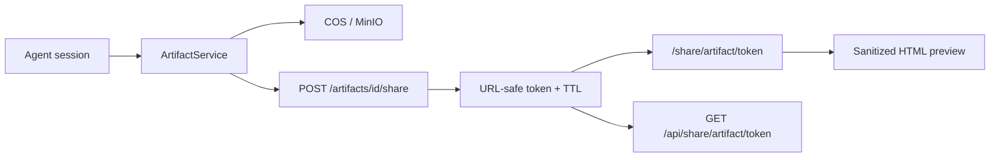

[English](artifacts-sharing.md) · [简体中文](artifacts-sharing.zh-CN.md)

# Artifacts & Public Sharing

Session artifacts (reports, HTML previews) and time-limited public share links.

## What are artifacts?

Artifacts are versioned outputs produced during Agent sessions:

- **doc** — Markdown reports (`.md`)
- **html** — HTML previews (sanitized before render)

Storage keys live in object storage (COS/MinIO) under `artifacts/{session_id}/{artifact_id}/v{n}.{ext}`.

## UI and API

| Action | API | UI |
|--------|-----|-----|
| List session artifacts | `GET /api/sessions/{id}/artifacts` | Session artifact panel |
| Get artifact metadata | `GET /api/artifacts/{id}` | Artifact workbench |
| Get content | `GET /api/artifacts/{id}/content` | Preview / download |
| Create share link | `POST /api/artifacts/{id}/share` | Share button |
| Public view | `GET /api/share/artifact/{token}` | `/share/artifact/[token]` |

Private routes require authenticated session with `WorkspaceContext` scope (personal or team).

## Share link behavior

- Default TTL: **168 hours** (7 days) — `create_share_link(ttl_hours=168)`
- Token: URL-safe random string stored on the artifact row
- Expired or missing tokens return 404 on public route
- Re-sharing generates a new token and expiry
- Revocation: create a new share or wait for expiry (no separate revoke endpoint)

Public URL format: `https://your-domain/share/artifact/{token}` (UI route; API is `/api/share/artifact/{token}`).

## HTML safety

`ArtifactService.sanitize_html_for_preview()` strips `<script>` tags and inline event handlers before preview rendering. UI iframe uses `sandbox="allow-scripts"` without `allow-same-origin`.

## Related documentation

- [Security model](security-model.md) — artifact scope and iframe policy
- [Teams and workspaces](teams-and-workspaces.md) — team-scoped artifact access
