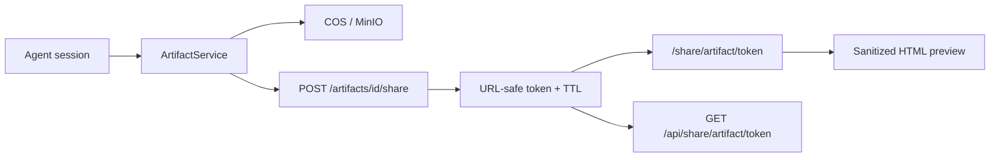

[English](artifacts-sharing.md) · [简体中文](artifacts-sharing.zh-CN.md)

# 交付物与公开分享

会话交付物（报告、HTML 预览）与时效性公开分享链接。

## 什么是交付物？

Agent 会话产生的版本化输出：

- **doc** — Markdown 报告（`.md`）
- **html** — HTML 预览（渲染前消毒）

存储 Key 位于对象存储（COS/MinIO）：`artifacts/{session_id}/{artifact_id}/v{n}.{ext}`。

## UI 与 API

| 操作 | API | UI |
|------|-----|-----|
| 列出会话交付物 | `GET /api/sessions/{id}/artifacts` | 会话交付物面板 |
| 获取元数据 | `GET /api/artifacts/{id}` | 交付物工作台 |
| 获取内容 | `GET /api/artifacts/{id}/content` | 预览 / 下载 |
| 创建分享链接 | `POST /api/artifacts/{id}/share` | 分享按钮 |
| 公开访问 | `GET /api/share/artifact/{token}` | `/share/artifact/[token]` |

私有路由需已认证会话，并遵守 `WorkspaceContext` 作用域（个人或团队）。

## 分享链接行为

- 默认有效期：**168 小时**（7 天）— `create_share_link(ttl_hours=168)`
- Token：URL 安全随机串，存于 artifact 行
- 过期或无效 Token 在公开路由返回 404
- 重新分享会生成新 Token 与过期时间
- 吊销：等待过期或重新分享（无独立吊销端点）

公开 URL 格式：`https://your-domain/share/artifact/{token}`（UI 路由；API 为 `/api/share/artifact/{token}`）。

## HTML 安全

`ArtifactService.sanitize_html_for_preview()` 在预览前移除 `<script>` 与内联事件处理器。UI iframe 使用 `sandbox="allow-scripts"`，不含 `allow-same-origin`。

## 相关文档

- [安全模型](security-model.zh-CN.md) — 交付物作用域与 iframe 策略
- [团队与工作区](teams-and-workspaces.zh-CN.md) — 团队作用域交付物访问
