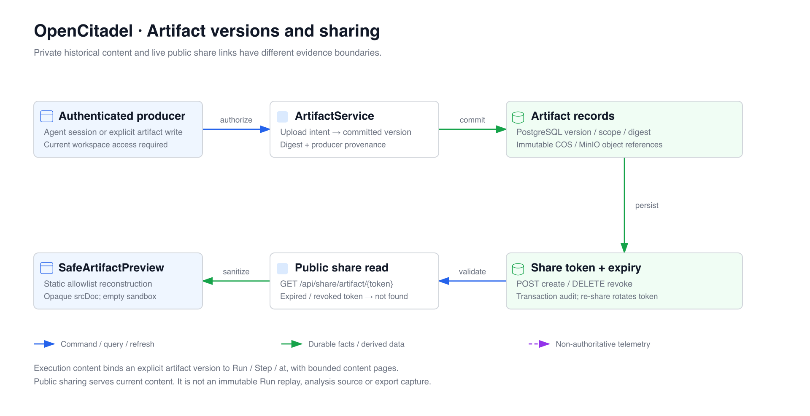

[English](artifacts-sharing.md) · [简体中文](artifacts-sharing.zh-CN.md)

# 交付物与公开分享

会话交付物（报告、HTML 预览）与时效性公开分享链接。

## 什么是交付物？

Agent 会话产生的版本化输出：

- **doc** — Markdown 报告（`.md`）
- **web** — HTML 预览（渲染前消毒）

对象存储（COS/MinIO）使用唯一上传 Key：
`artifacts/{session_id}/{artifact_id}/uploads/{upload_id}`。已提交 `version_refs`
把交付物版本号映射到不可变对象 Key；持久 Upload Intent 使清理能够区分未完成上传与已引用版本。

## UI 与 API

| 操作           | API                                | UI                        |
| -------------- | ---------------------------------- | ------------------------- |
| 列出会话交付物 | `GET /api/sessions/{id}/artifacts` | 会话交付物面板            |
| 获取元数据     | `GET /api/artifacts/{id}`          | 交付物工作台              |
| 获取内容       | `GET /api/artifacts/{id}/content`  | 预览 / 下载               |
| 创建分享链接   | `POST /api/artifacts/{id}/share`   | 分享按钮                  |
| 吊销分享链接   | `DELETE /api/artifacts/{id}/share` | 撤销操作                  |
| 公开访问       | `GET /api/share/artifact/{token}`  | `/share/artifact/[token]` |

私有路由需已认证会话，并遵守 `WorkspaceContext` 作用域（个人或团队）。

每个存储版本记录已提交的 Provenance Receipt 与内容 Digest。没有 Producer 的写入明确记录
Unknown/Unavailable Provenance，不伪造 Run 或 Step Binding。执行详情请求显式选定
Artifact Version，并绑定 `run_id`、`step_id` 与历史 `at` 截点。内容读取有界，返回
`truncated` / `next_cursor`；Provenance 不可用或所有权撤销时不能静默回退到更新版本。

## 分享链接行为

- 默认有效期：**168 小时**（7 天）— `create_share_link(ttl_hours=168)`
- Token：URL 安全随机串，存于 artifact 行
- 过期或无效 Token 在公开路由返回 404
- 重新分享会生成新 Token 与过期时间
- 吊销：`DELETE /api/artifacts/{id}/share` 立即清除 Token 与过期时间
- 创建分享与吊销在同一事务内写入审计记录

公开分享路径提供交付物当前存储内容，不是不可变 Run 回放或历史分析/导出 Capture。

公开 URL 格式：`https://your-domain/share/artifact/{token}`（UI 路由；API 为 `/api/share/artifact/{token}`）。

## HTML 安全

服务端 `sanitize_html_for_preview()` 在返回前移除 Script Tag 与带引号的内联事件处理器。共享组件
`SafeArtifactPreview` 再按 Element Allowlist 重建静态文档，删除 Attribute、外部资源、
Style、Form、Script、SVG/MathML 与导航。`srcDoc` iframe 使用 `sandbox=""`、
`referrerPolicy="no-referrer"` 和 `default-src 'none'` CSP。执行详情、交付物工作台与公开
分享页面复用同一预览边界。

## 相关文档

- [安全模型](security-model.zh-CN.md) — 交付物作用域与 iframe 策略
- [团队与工作区](teams-and-workspaces.zh-CN.md) — 团队作用域交付物访问
