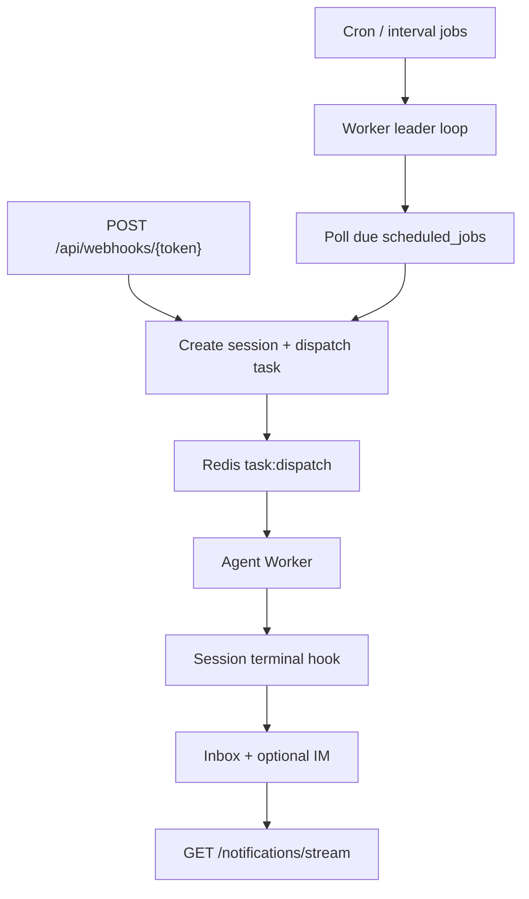

# Automation and Scheduler

[简体中文](automation-scheduler.zh-CN.md)

This document describes scheduled jobs, webhook triggers, leader election, and notification delivery.

## Overview

- **Scheduler loop** runs on Worker processes; only the Redis lease holder polls cron/interval jobs.
- **Webhook jobs** are triggered via HTTP and skip the poll loop.
- **Notifications** persist to PostgreSQL and publish on Redis channel `notify:{user_id}`.

## Leader election

- Redis key: `scheduler:leader`
- Each worker uses a unique ID (`hostname-uuid`).
- `SET scheduler:leader <worker_id> NX EX <lease>` acquires leadership.
- Non-leaders **must not** extend the lease.
- The current leader renews with `EXPIRE` only when `GET scheduler:leader == worker_id`.

Implementation: `run_scheduler_loop` in the Worker process.

## Due job polling

- Polls `scheduled_jobs` where `enabled`, `next_run_at <= now()`, and `last_run_status != running`.
- Skips webhook-triggered jobs in the poll loop (webhooks use the HTTP endpoint).
- On trigger failure, sets `last_run_status=failed` and backs off `next_run_at`.

## Run lifecycle

| Phase | `last_run_status` | Notes |
|-------|-------------------|-------|
| Trigger | `running` | Creates session, dispatches Redis Stream task |
| Session completed | `completed` | Updated via `ScheduledJobService.on_session_terminal` |
| Session failed/cancelled | `failed` / `cancelled` | Same hook |

## Webhook security

- `POST /api/webhooks/{token}` requires header `X-Webhook-Signature`.
- Signature = `HMAC-SHA256(raw_body, webhook_secret)` hex digest.
- Secret stored encrypted (Fernet via `API_KEY_SECRET`); shown once on create/rotate.
- Idempotency Redis key: `webhook:idem:{token}:{sha256(body)}` — scoped per job token.
- Duplicate payload returns existing `session_id` with `{ duplicate: true }`.
- Missing/invalid signature → HTTP 401.

See also [Security model — Webhook automation](security-model.md#webhook-automation).

## Notifications

| Channel | Mechanism |
|---------|-----------|
| **Inbox** | Rows in `notifications` table; UI lists and marks read |
| **SSE** | `GET /api/notifications/stream` subscribes to Redis `notify:{user_id}` |
| **IM fallback** | Optional MCP `notify_channels` on scheduled jobs (fail-silent) |

Event types include `job_started` and `job_complete` when automation runs.

## UI entry

- Route: `/automation`
- Create jobs with cron, interval, or webhook trigger; bind skill, model, codebase, or knowledge base.

## Configuration

See `SchedulerConfig` in `AppConfig` (`api/config.yaml` or DB when `USE_DB_APP_CONFIG=true`).

## Related docs

- [Security model](security-model.md)
- [Events](events.md)
