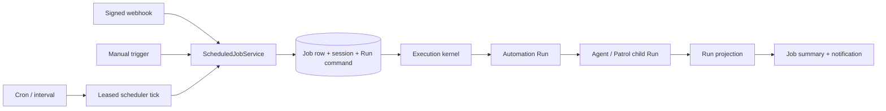

# Automation and Scheduler

[简体中文](automation-scheduler.zh-CN.md)

Scheduled definitions are product records; each firing is a formal Automation
Run that admits a linked Agent or Patrol Run.

```mermaid
flowchart LR
  Cron[Cron / interval] --> Leader[Leased scheduler tick]
  Webhook[Signed webhook] --> Service[ScheduledJobService]
  Manual[Manual trigger] --> Service
  Leader --> Service
  Service --> DB[(Job row + session + Run command)]
  DB --> Kernel[Execution kernel]
  Kernel --> Automation[Automation Run]
  Automation --> Child[Agent / Patrol child Run]
  Child --> Projection[Run projection]
  Projection --> Reconcile[Job summary + notification]
```

The scheduler loop runs inside execution-kernel replicas. A short Redis leader
lease reduces duplicate polling, but it is not correctness state. Database row
locking, deterministic firing ids, command idempotency, and the active-Run
projection prevent duplicate admission. Losing Redis only causes another
replica to poll.

## Triggers

- Cron and interval ticks use the scheduled `next_run_at` in the firing id.
- Manual triggers use a new explicit firing id.
- Webhooks verify `HMAC-SHA256(raw_body, secret)` and derive a body/time-window
  firing id. The secret is stored in a versioned encrypted envelope and shown
  only at creation/rotation.
- Patrol-bound jobs admit a Patrol Run; generic jobs create a session and an
  Automation Run linked to an Agent child Run.

Resource access and concrete active versions are validated/bound before the
command transaction commits. A job that already has an active formal Run is
not admitted again.

## Status and recovery

`last_run_*` fields are query summaries. `last_execution_run_id` links the job
to the authoritative Run projection. Reconciliation copies terminal Run state
to the summary and sends durable inbox notifications plus optional MCP IM.
Process death cannot manufacture a terminal state.

The same leased loop runs bounded knowledge-base version GC and patrol
retention. These operations use their own database leases and never delete
active/bound versions or audit rows.

Live scheduler admission, polling, lease, concurrency, and webhook idempotency
are under `scheduler` in the Operations Policy. Job definitions live at `/automation`.
