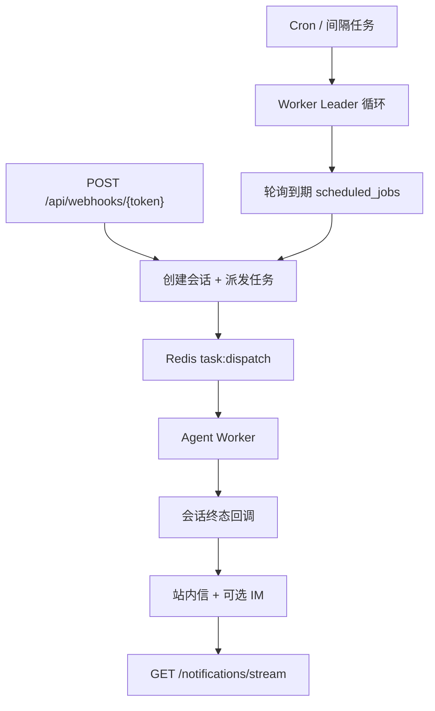

# 自动化与调度

[English](automation-scheduler.md)

本文档说明定时任务、Webhook 触发、Leader 选举与通知投递。

## 概览

- **调度循环**在 Worker 进程中运行；仅 Redis 租约持有者轮询 cron/interval 任务。
- **Webhook 任务**通过 HTTP 触发，不参与轮询。
- **通知**持久化到 PostgreSQL，并通过 Redis 频道 `notify:{user_id}` 推送。

## Leader 选举

- Redis 键：`scheduler:leader`
- 每个 Worker 使用唯一 ID（`hostname-uuid`）。
- `SET scheduler:leader <worker_id> NX EX <lease>` 获取领导权。
- 非 Leader **不得**续租。
- 当前 Leader 仅在 `GET scheduler:leader == worker_id` 时用 `EXPIRE` 续期。

实现：`Worker` 进程中的 `run_scheduler_loop`。

## 到期任务轮询

- 查询 `enabled`、`next_run_at <= now()` 且 `last_run_status != running` 的 `scheduled_jobs`。
- Webhook 触发任务在轮询中跳过（走 HTTP 端点）。
- 触发失败时设置 `last_run_status=failed` 并退避 `next_run_at`。

## 运行生命周期

| 阶段 | `last_run_status` | 说明 |
|------|-------------------|------|
| 触发 | `running` | 创建会话，派发 Redis Stream 任务 |
| 会话完成 | `completed` | 由 `ScheduledJobService.on_session_terminal` 更新 |
| 会话失败/取消 | `failed` / `cancelled` | 同上 |

## Webhook 安全

- `POST /api/webhooks/{token}` 需要请求头 `X-Webhook-Signature`。
- 签名 = `HMAC-SHA256(raw_body, webhook_secret)` 十六进制摘要。
- 密钥 Fernet 加密存储（`API_KEY_SECRET`）；创建/轮换时仅展示一次明文。
- 幂等 Redis 键：`webhook:idem:{token}:{sha256(body)}`，按 job token 隔离。
- 重复 payload 返回已有 `session_id` 及 `{ duplicate: true }`。
- 缺失/无效签名 → HTTP 401。

另见 [安全模型 — Webhook 自动化](security-model.zh-CN.md#webhook-自动化)。

## 通知

| 通道 | 机制 |
|------|------|
| **站内信** | `notifications` 表；UI 列表与已读 |
| **SSE** | `GET /api/notifications/stream` 订阅 Redis `notify:{user_id}` |
| **IM 回退** | 定时任务可选 MCP `notify_channels`（失败静默） |

自动化运行时会发送 `job_started`、`job_complete` 等事件类型。

## UI 入口

- 路由：`/automation`
- 支持 cron、间隔或 Webhook 触发；可绑定 Skill、模型、代码库或知识库。

## 配置

见 `AppConfig` 中的 `SchedulerConfig`（`api/config.yaml` 或 `USE_DB_APP_CONFIG=true` 时的数据库）。

## 相关文档

- [安全模型](security-model.zh-CN.md)
- [事件系统](events.zh-CN.md)
