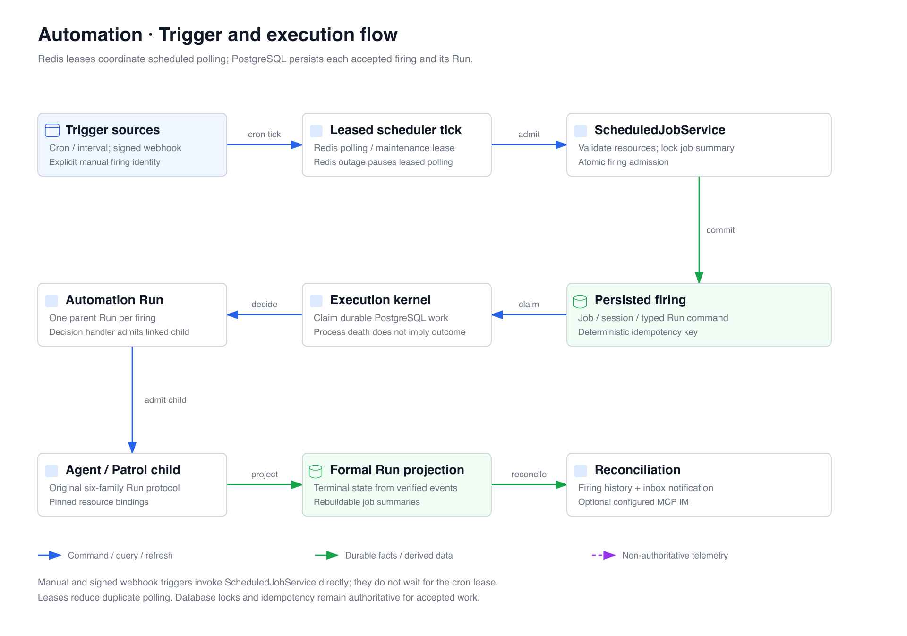

# 自动化与 Scheduler

[English](automation-scheduler.md)

Scheduled Definition 是产品记录；每次 Firing 都是正式 Automation Run，并准入关联 Agent
或 Patrol Run。

Scheduler Loop 位于执行内核副本。短 Redis Leader Lease 只减少重复 Poll，不是正确性状态。
Database Row Lock、确定性 Firing ID、Command Idempotency 与 Active-Run Projection 共同防止重复
Admission。Redis 不可用时 Lease 获取/续约失败，Scheduler Poll 与 Maintenance 暂停；
Lease 过期且 Redis 恢复可达后，健康副本可接管。

## Trigger

- Cron/Interval Tick 使用计划 `next_run_at` 生成 Firing ID。
- Manual Trigger 使用新的显式 Firing ID。
- Webhook 校验 `HMAC-SHA256(raw_body, secret)`，并由 Body/时间窗口生成 Firing ID。
  Secret 以版本化加密信封存储，仅在创建/轮换时显示。
- 每次 Firing 均准入 Automation Run：Patrol 绑定 Job 关联 Patrol Child，通用 Job
  关联 Agent Child；两者都创建 Session。

Command Transaction 提交前验证 Resource Access 并绑定具体 Active Version。Job 已有活动正式 Run
时不再次准入；Service 使用加锁的 `last_run_status=running` Summary 作快速准入
Guard，再从正式 Run 对其 Reconcile。

## 状态与恢复

`last_run_*` 只是查询 Summary；`last_execution_run_id` 关联权威 Run Projection。Reconciliation
把 Terminal Run State 投影到 Summary，并发送持久 Inbox Notification 与可选 MCP IM。进程死亡
不会制造 Terminal State。

`GET /api/scheduled-jobs/{job_id}/runs` 返回该 Job 的分页触发历史（每次触发的 id、关联执行
Run ID、Family、Status、创建/终止时间与 Failure Code），运维可审计每一次过往触发，而不仅是最新 Summary。Leader Lease 在副本持有期间
持续续约，健康的 Leader 持续轮询而无需反复重新获取；丢失 Lease 只会让另一个副本接管。

同一个 Leased Loop 还运行有界 Knowledge Version GC 与 Patrol Retention。它们使用独立
续约 Redis Lease 与事务数据库检查，不会删除 Active/Bound Version 或 Audit Row。Leader
Tick 还执行 Recycle-bin 与 Execution-queue Retention；这些维护限制位于 Deployment
Settings。尚未创建 Run 的 Admission Failure 可写入 `last_run_status=failed` 并发触发失败通知。

调度准入、轮询、Lease、并发与 Webhook 幂等配置位于 Operations Policy `scheduler`；Job Definition 的 UI 入口为 `/automation`。
