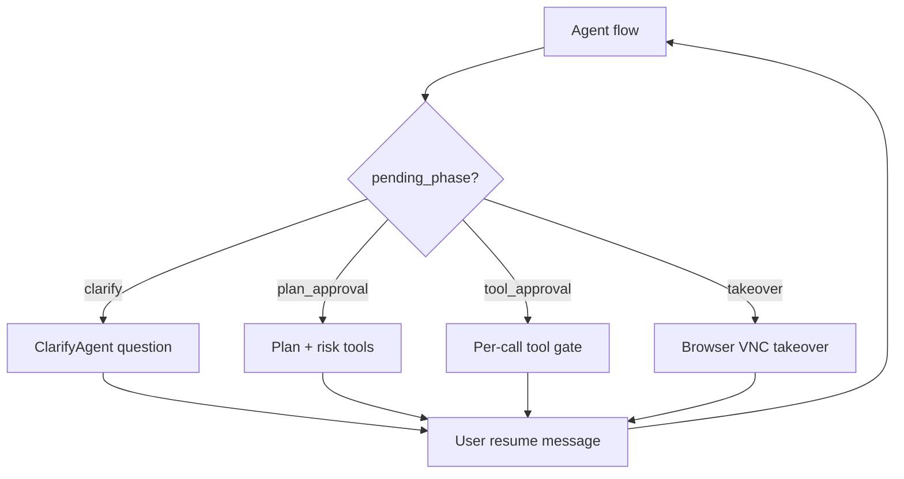
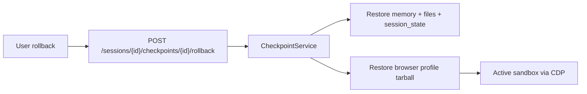

# Checkpoints, HITL Gates, and Web Operator

[简体中文](checkpoints-and-hitl.zh-CN.md)

This document covers human-in-the-loop (HITL) gate contracts, session checkpoints (including browser profile snapshots), and Web Operator ownership (`operator_scope`).

## HITL overview

Sessions store gate state in `pending_metadata` (JSONB) alongside `pending_phase`.

### Phases

| `pending_phase` | Purpose |
|-----------------|---------|
| `clarify` | Pre-plan clarification |
| `plan_approval` | Plan + task-level tool authorization |
| `tool_approval` | Call-by-call tool gate |
| `takeover` | Browser user takeover |

### Metadata shapes

- **plan_approval**: `{ plan, edited_plan?, risk_tools, approved_tools }`
- **tool_approval**: `{ pending_tool_call: { tool_call_id, tool_name, args }, approved_tools? }`
- **takeover**: `{ takeover: { started_at, timeout_minutes } }`

### Resume prefixes

User resume messages use prefixes: `approve`, `approve_with_edits`, `approve_same`, `reject: feedback`, `takeover`, `skip`.

Unknown or empty resume input resolves to action `unknown` and keeps the gate waiting (returns `WaitEvent`).

### Plan approval resume

After approval, the flow restores `plan` / `edited_plan` from `pending_metadata` and **does not** overwrite it with `session.get_latest_plan()`.

### Tool approval resume

On approve/reject, the agent injects the tool result into memory and continues the ReAct loop via `continue_tool_iteration_loop`.

### Takeover resume

User sends `takeover` or `skip`; pending phase is cleared, `roll_back` injects the user message into the pending `message_ask_user` tool call, then the ReAct loop continues.

Configure defaults in `AppConfig.hitl` (`tool_gate_call_level_enabled`, `tool_gate_risk_list`, etc.).

## Checkpoints

Each checkpoint captures:

| Component | Storage |
|-----------|---------|
| Agent memory snapshot | PostgreSQL / session state |
| Workspace files | Object storage keys under session scope |
| Session state | DB row metadata |
| Browser profile | Optional `browser_snapshot_key` → object storage (`checkpoints/{session_id}/{checkpoint_id}_browser.tgz`) |

Browser snapshots are captured only when:

1. The session has `operator_scope` set (Web Operator flow), and
2. An active sandbox exists at checkpoint creation time.

Rollback restores file and memory state, then re-imports the browser profile tarball into the sandbox when `browser_snapshot_key` is present.

## Web Operator and operator_scope

Web Operator is a **built-in Skill** (`web-operator`) for browser automation inside sandboxes—not a Marketplace app.

| `operator_scope` | Meaning |
|------------------|---------|
| `owned` | Target is enterprise-owned or self-hosted system |
| `third_party_saas` | Target is third-party SaaS; requires explicit user declaration |

Flow:

1. User starts a Web Operator session or selects scope at session creation.
2. UI shows ownership declaration dialog for third-party targets.
3. API persists `sessions.operator_scope` and writes an audit log (`operator_scope_declared`).
4. Checkpoints may include browser profile snapshots for rollback within the same scope.

> Third-party scope declaration creates an audit trail; it does **not** waive legal or contractual obligations with external services.

## Artifact delivery (related)

Agent-delivered artifacts follow a separate lifecycle:

1. `artifact_write` uploads content to object storage (`artifacts/{session_id}/{artifact_id}/v{n}.ext`); DB stores metadata only.
2. `ArtifactEvent` streams to the session workbench.
3. `artifact_finalize` marks `status=final`.
4. `POST /artifacts/{id}/share` creates a token → public `/share/artifact/{token}`.

HTML artifacts are sanitized server-side; cross-scope access returns 404. See [Security model — Artifacts](security-model.md#artifacts-and-trusted-delivery).

## API routes

| Route | Purpose |
|-------|---------|
| `POST /api/sessions` | Optional `operator_scope` on create |
| `POST /api/sessions/{id}/checkpoints` | Create checkpoint |
| `POST /api/sessions/{id}/checkpoints/{id}/rollback` | Roll back |
| `GET /api/sessions/{id}/vnc` | WebSocket VNC proxy |

## Related docs

- [Security model](security-model.md)
- [Events — wait / plan / tool](events.md)
