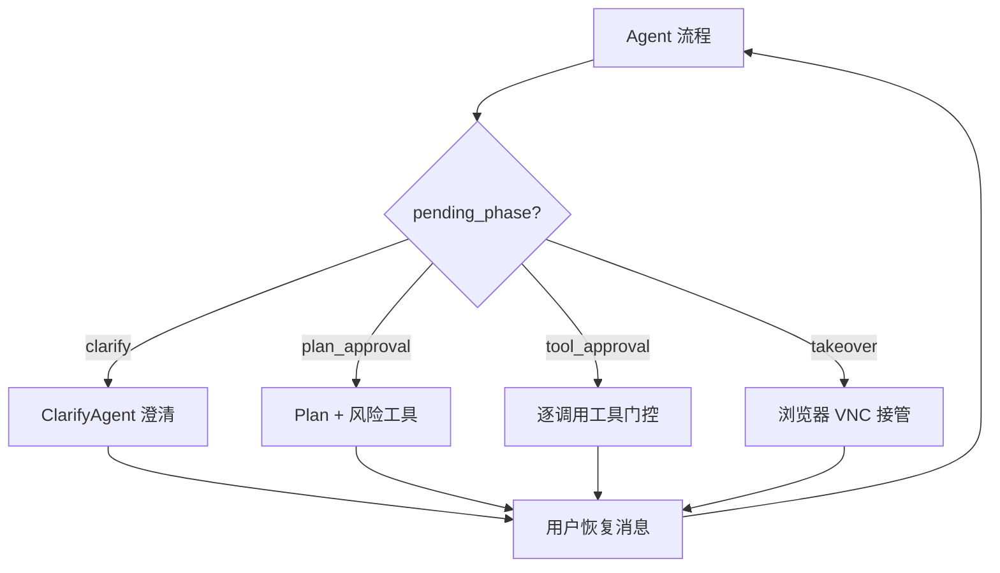
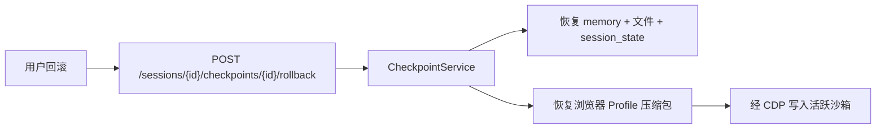

# 检查点、HITL 门控与 Web Operator

[English](checkpoints-and-hitl.md)

本文档说明人机协同（HITL）门控契约、会话检查点（含浏览器 Profile 快照）以及 Web Operator 归属声明（`operator_scope`）。

## HITL 概览

门控状态保存在 `pending_metadata`（JSONB）与 `pending_phase` 字段中。

### 阶段

| `pending_phase` | 用途 |
|-----------------|------|
| `clarify` | Plan 前澄清 |
| `plan_approval` | Plan + 任务级工具授权 |
| `tool_approval` | 逐调用工具门控 |
| `takeover` | 浏览器用户接管 |

### Metadata 结构

- **plan_approval**：`{ plan, edited_plan?, risk_tools, approved_tools }`
- **tool_approval**：`{ pending_tool_call: { tool_call_id, tool_name, args }, approved_tools? }`
- **takeover**：`{ takeover: { started_at, timeout_minutes } }`

### 恢复消息前缀

用户使用前缀：`approve`、`approve_with_edits`、`approve_same`、`reject: feedback`、`takeover`、`skip`。

未知或空输入解析为 `unknown`，门控保持等待（返回 `WaitEvent`）。

### Plan 审批恢复

审批后从 `pending_metadata` 恢复 `plan` / `edited_plan`，**不会**用 `session.get_latest_plan()` 覆盖。

### 工具审批恢复

批准/拒绝后，Agent 将工具结果注入 memory，经 `continue_tool_iteration_loop` 继续 ReAct 循环。

### 接管恢复

用户发送 `takeover` 或 `skip`；清除 pending 阶段，`roll_back` 将用户消息注入待处理的 `message_ask_user` 工具调用后继续循环。

默认策略见 `AppConfig.hitl`（`tool_gate_call_level_enabled`、`tool_gate_risk_list` 等）。

## 检查点

每个检查点包含：

| 组件 | 存储 |
|------|------|
| Agent memory 快照 | PostgreSQL / 会话状态 |
| 工作区文件 | 对象存储（会话 scope 下） |
| 会话状态 | DB 元数据 |
| 浏览器 Profile | 可选 `browser_snapshot_key` → 对象存储（`checkpoints/{session_id}/{checkpoint_id}_browser.tgz`） |

浏览器快照仅在以下条件同时满足时捕获：

1. 会话已设置 `operator_scope`（Web Operator 流程），且
2. 创建检查点时存在活跃沙箱。

回滚时恢复文件与 memory，若存在 `browser_snapshot_key` 则将 Profile 压缩包重新导入沙箱。

## Web Operator 与 operator_scope

Web Operator 是**内置 Skill**（`web-operator`），在沙箱内执行浏览器自动化——不是 Marketplace 应用。

| `operator_scope` | 含义 |
|------------------|------|
| `owned` | 目标为企业自有或自建系统 |
| `third_party_saas` | 目标为第三方 SaaS；需用户明确声明 |

流程：

1. 用户启动 Web Operator 会话或在创建时选择 scope。
2. 第三方目标时 UI 展示归属声明对话框。
3. API 持久化 `sessions.operator_scope` 并写入审计日志（`operator_scope_declared`）。
4. 检查点可在同一 scope 内包含浏览器 Profile 快照以供回滚。

> 第三方 scope 声明仅形成审计留痕，**不构成**对外部服务法律或合同义务的豁免。

## 交付物（相关）

Agent 交付物有独立生命周期：

1. `artifact_write` 上传至对象存储（`artifacts/{session_id}/{artifact_id}/v{n}.ext`）；DB 仅存元数据。
2. `ArtifactEvent` 流式推送至会话工作台。
3. `artifact_finalize` 标记 `status=final`。
4. `POST /artifacts/{id}/share` 生成 token → 公开 `/share/artifact/{token}`。

HTML 交付物经服务端消毒；跨 scope 访问返回 404。见 [安全模型 — 交付物](security-model.zh-CN.md#交付物与可信分发)。

## API 路由

| 路由 | 用途 |
|------|------|
| `POST /api/sessions` | 创建时可选 `operator_scope` |
| `POST /api/sessions/{id}/checkpoints` | 创建检查点 |
| `POST /api/sessions/{id}/checkpoints/{id}/rollback` | 回滚 |
| `GET /api/sessions/{id}/vnc` | WebSocket VNC 代理 |

## 相关文档

- [安全模型](security-model.zh-CN.md)
- [事件系统 — wait / plan / tool](events.zh-CN.md)
