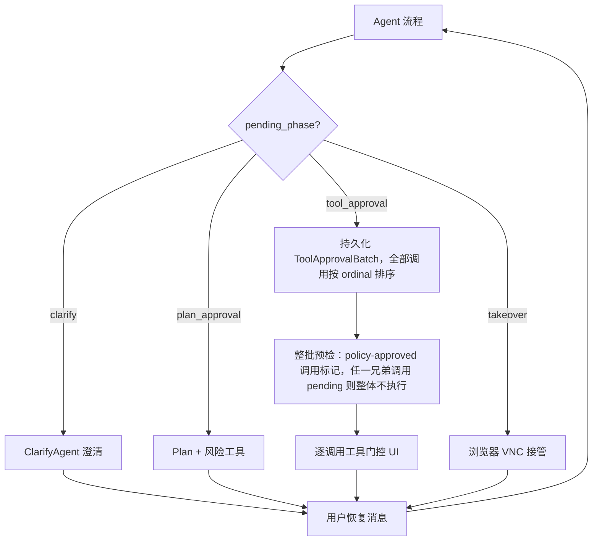
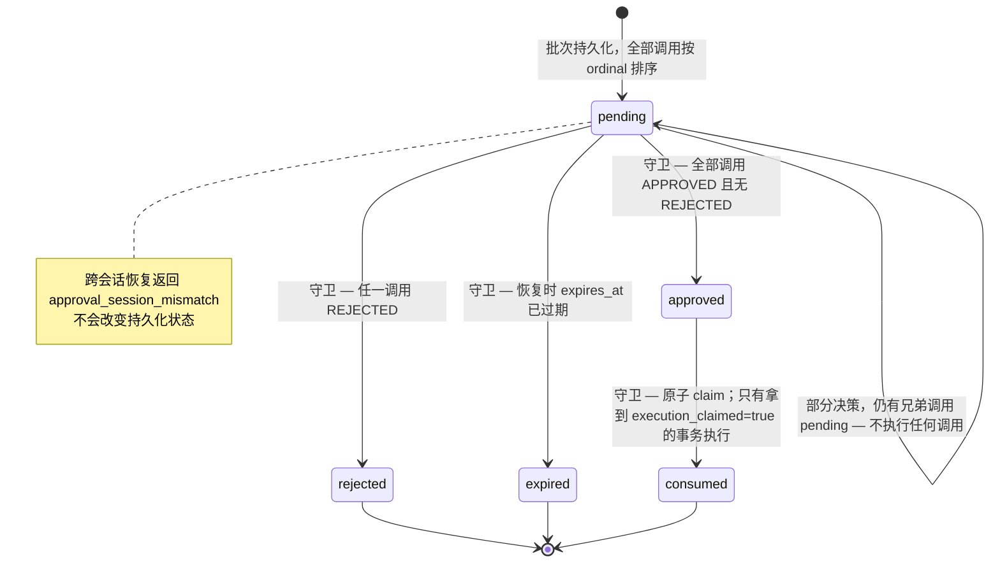
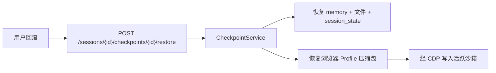

# 检查点、HITL 门控与 Web Operator

[English](checkpoints-and-hitl.md)

本文档说明人机协同（HITL）门控契约、会话检查点（含浏览器 Profile 快照）以及 Web Operator 归属声明（`operator_scope`）。

## HITL 概览


```mermaid
flowchart TD
  Agent["Agent 流程"] --> Gate{"pending_phase?"}
  Gate -->|clarify| Clarify["ClarifyAgent 澄清"]
  Gate -->|plan_approval| Plan["Plan + 风险工具"]
  Gate -->|tool_approval| Batch["持久化 ToolApprovalBatch，全部调用按 ordinal 排序"]
  Batch --> Preflight["整批预检：policy-approved 调用标记，任一兄弟调用 pending 则整体不执行"]
  Preflight --> Tool["逐调用工具门控 UI"]
  Gate -->|takeover| VNC["浏览器 VNC 接管"]
  Clarify --> Resume["用户恢复消息"]
  Plan --> Resume
  Tool --> Resume
  VNC --> Resume
  Resume --> Agent
```

门控状态保存在 `pending_metadata`（JSONB）与 `pending_phase` 字段中。

### 阶段

| `pending_phase` | 用途 |
|-----------------|------|
| `clarify` | Plan 前澄清 |
| `plan_approval` | Plan + 任务级工具授权 |
| `tool_approval` | 逐调用工具门控 |
| `takeover` | 浏览器用户接管 |

### Metadata 结构

- **plan_approval**：`{ plan, edited_plan?, risk_tools, approved_tools }`
- **tool_approval**：`{ pending_tool_call: { tool_call_id, tool_name, args }, approved_tools? }`
- **takeover**：`{ takeover: { started_at, timeout_minutes } }`

### 恢复消息前缀

用户使用前缀：`approve`、`approve_with_edits`、`approve_same`、`reject: feedback`、`takeover`、`skip`。

未知或空输入解析为 `unknown`，门控保持等待（返回 `WaitEvent`）。

### Plan 审批恢复

审批后从 `pending_metadata` 恢复 `plan` / `edited_plan`，**不会**用 `session.get_latest_plan()` 覆盖。

### 工具审批恢复

批准/拒绝后，Agent 将工具结果注入 memory，经 `continue_tool_iteration_loop` 继续 ReAct 循环。

## 共享工具治理契约

每个已注册工具都暴露 `ToolExecutionPolicy`；治理层在向模型展示 schema
和真正执行前都会检查同一份 descriptor。

| 字段 | 取值 | 含义 |
|------|------|------|
| `capability` | `message`、`knowledge_read`、`code_read`、`integration_read`、`web_read`、`generation`、`execution`、`unknown` | 按模式限制的能力 |
| `effect` | `read_only`、`workspace_write`、`external_write`、`interactive` | 副作用类别 |
| `idempotency` | `safe`、`idempotent_with_key`、`non_idempotent`、`unknown` | 自动重试边界 |
| `approval` | `never`、`policy`、`always` | 审批来源 |
| `concurrency_group` | 字符串，默认 `none` | 串行执行 lane |

缺失或非法声明一律回落到最保守策略：
`capability=unknown`、`effect=interactive`、`idempotency=unknown`、
`approval=always`、`concurrency_group=unknown`。

Ask 模式只允许只读的 `message`、`knowledge_read`、`code_read`，以及经管理员
明确分类为 `integration_read` 的集成 descriptor。MCP/A2A 在真正调用时仍会
重复校验同一策略。子 Agent 继承父策略且只能收窄。对于创建、修改、删除、
执行、外部写入或委派请求，Ask 以零副作用完成问答，明确引导用户切换到
Agent 模式。

### 持久化审批批次

权威工具门控是持久化批次，不是旧的单值 `pending_tool_call`。标准 API
`data` 包装内的 JSON 结构如下：

```json
{
  "id": "batch-id",
  "session_id": "session-id",
  "status": "pending",
  "expires_at": "2026-07-29T10:15:00Z",
  "created_at": "2026-07-29T10:00:00Z",
  "decided_at": null,
  "calls": [
    {
      "id": "approval-call-id",
      "batch_id": "batch-id",
      "tool_call_id": "model-call-id",
      "ordinal": 0,
      "tool_name": "browser_click",
      "normalized_args": {"target": "submit"},
      "args_hash": "sha256",
      "capability": "execution",
      "effect": "interactive",
      "idempotency": "non_idempotent",
      "approval": "always",
      "concurrency_group": "browser",
      "status": "pending",
      "decided_by": null,
      "decided_at": null
    }
  ]
}
```

批次状态为 `pending`、`approved`、`rejected`、`expired` 或 `consumed`。
仅首个消费事务可见的临时标志 `execution_claimed` 不进入 JSON，也不持久化。


```mermaid
stateDiagram-v2
  [*] --> pending: 批次持久化，全部调用按 ordinal 排序
  pending --> pending: 部分决策，仍有兄弟调用 pending — 不执行任何调用
  pending --> approved: 守卫 — 全部调用 APPROVED 且无 REJECTED
  pending --> rejected: 守卫 — 任一调用 REJECTED
  pending --> expired: 守卫 — 恢复时 expires_at 已过期
  approved --> consumed: 守卫 — 原子 claim；只有拿到 execution_claimed=true 的事务执行
  rejected --> [*]
  expired --> [*]
  consumed --> [*]
  note right of pending
    跨会话恢复返回 approval_session_mismatch
    不会改变持久化状态
  end note
```

模型生成的完整调用列表会先按 ordinal 完成规范化、授权并持久化。无需人工
审批的调用记录为 policy-approved；但只要任一兄弟调用仍为 pending，执行器
不会执行任何调用（包括只读调用），因此审批前不可能发生副作用。

| 路由 | 契约 |
|------|------|
| `GET /api/sessions/{session_id}/tool-approval-batch` | 返回当前 owner scope 下的待审批批次 |

> **审批只有一条写路径**：不存在用于提交审批决策的 REST 端点。人工审批决策
> 唯一经由 chat 续跑消息（`approve` / `approve_same` / `reject:<feedback>`）
> 从会话 chat 端点送达，并由 `ToolBatchExecutor.decide_approval_call` 记录
> ——详见[治理平面](governance-plane.zh-CN.md#整批预检与审批)。此前存在的
> REST 审批决策端点已删除，其不存在由契约测试强制保证。

显式 `tool_call_ids` 支持部分决策；省略的 ID 不会扩张先前的部分决策，部分
批次继续等待。`approve_same` 只会为本次从 pending 新变为 approved 的调用
增加会话级同类授权。

恢复时按 ID 读取持久化批次，拒绝跨会话、缺失、过期、拒绝、部分完成或已
消费批次，并重新校验 ownership、授权、能力、规范化参数哈希、函数签名和
完整策略快照。只有全部批准且未过期的批次才能原子变为 `consumed`，且只有
拿到临时执行 claim 的事务可以调用工具。重复恢复不会执行，因此幂等。
`safe` 仅对明确的瞬态失败做有界重试；`idempotent_with_key` 仅在 schema 与
callable 都接收同一个稳定 key 时重试；`non_idempotent` 与 `unknown` 只执行一次。

**Ops Patrol Remediation 完全复用这套契约。** `patrol_execute_remediation`
（`api/app/domain/services/tools/patrol_remediation.py`）声明
`approval=ApprovalMode.ALWAYS` 与 `idempotency=IDEMPOTENT_WITH_KEY`，因此
修复调用与其他 `approval=always` 工具一样进入同一个 `ToolApprovalBatch`，
审批前绝不执行——没有独立的修复专属门控。到达 Actuator 的幂等 key 始终是
批次执行器自身的稳定单调用 key（`session_id` + `tool_call_id` + `args_hash`），
而非模型可选择的值。`api/tests/app/contracts/test_remediation_governance_invariants.py`
是断言这些不变量的契约测试：审批前零 Actuator 调用、审批后恰好执行一次、
提案哈希被篡改（`PARAMS_TAMPERED`）或能力漂移（`CAPABILITY_DRIFT`）时拒绝执行。

### 接管恢复

用户发送 `takeover` 或 `skip`；清除 pending 阶段，`roll_back` 将用户消息注入待处理的 `message_ask_user` 工具调用后继续循环。

默认策略见 `AppConfig.hitl`（`tool_gate_call_level_enabled`、`tool_gate_risk_list` 等）。

## 检查点


```mermaid
flowchart LR
  User["用户回滚"] --> API["POST /sessions/{id}/checkpoints/{id}/restore"]
  API --> CP["CheckpointService"]
  CP --> Mem["恢复 memory + 文件 + session_state"]
  CP --> Browser["恢复浏览器 Profile 压缩包"]
  Browser --> Sandbox["经 CDP 写入活跃沙箱"]
```

每个检查点包含：

| 组件 | 存储 |
|------|------|
| Agent memory 快照 | PostgreSQL / 会话状态 |
| 工作区文件 | 对象存储（会话 scope 下） |
| 会话状态 | DB 元数据 |
| 浏览器 Profile | 可选 `browser_snapshot_key` → 对象存储（`checkpoints/{session_id}/{checkpoint_id}_browser.tgz`） |

浏览器快照仅在以下条件同时满足时捕获：

1. 会话已设置 `operator_scope`（Web Operator 流程），且
2. 创建检查点时存在活跃沙箱。

回滚时恢复文件与 memory，若存在 `browser_snapshot_key` 则将 Profile 压缩包重新导入沙箱。

## Web Operator 与 operator_scope

Web Operator 是**内置 Skill**（`web-operator`），在沙箱内执行浏览器自动化。

| `operator_scope` | 含义 |
|------------------|------|
| `owned` | 目标为企业自有或自建系统 |
| `third_party_saas` | 目标为第三方 SaaS；需用户明确声明 |

流程：

1. 用户启动 Web Operator 会话或在创建时选择 scope。
2. 第三方目标时 UI 展示归属声明对话框。
3. API 持久化 `sessions.operator_scope` 并写入审计日志（`operator_scope_declared`）。
4. 检查点可在同一 scope 内包含浏览器 Profile 快照以供回滚。

> 第三方 scope 声明仅形成审计留痕，**不构成**对外部服务法律或合同义务的豁免。

## 交付物（相关）

Agent 交付物有独立生命周期：

1. `artifact_write` 上传至对象存储（`artifacts/{session_id}/{artifact_id}/v{n}.ext`）；DB 仅存元数据。
2. `ArtifactEvent` 流式推送至会话工作台。
3. `artifact_finalize` 标记 `status=final`。
4. `POST /artifacts/{id}/share` 生成 token → 公开 `/share/artifact/{token}`。

HTML 交付物经服务端消毒；跨 scope 访问返回 404。见 [安全模型 — 交付物](security-model.zh-CN.md#交付物与可信分发)。

## API 路由

| 路由 | 用途 |
|------|------|
| `POST /api/sessions` | 创建时可选 `operator_scope` |
| `POST /api/sessions/{id}/checkpoints` | 创建检查点 |
| `POST /api/sessions/{id}/checkpoints/{id}/restore` | 恢复检查点 |
| `GET /api/sessions/{id}/vnc` | WebSocket VNC 代理 |

## 相关文档

- [安全模型](security-model.zh-CN.md)
- [事件系统 — wait / plan / tool](events.zh-CN.md)
