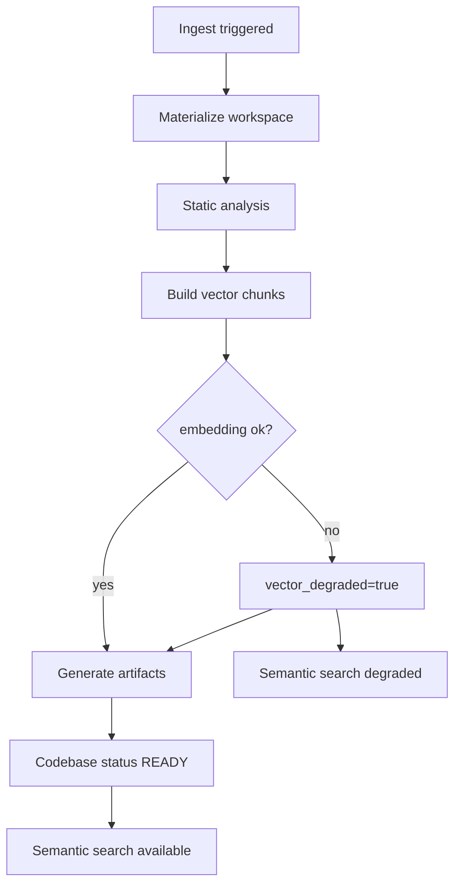
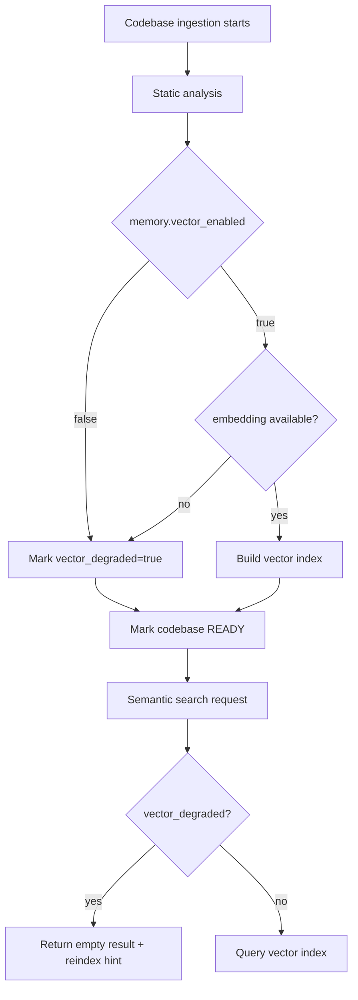

# Codebase Vector Degradation and Reindex

[简体中文](codebase-reindex.zh-CN.md)

This document is the authoritative reference for the **Codebase module**: import sources, Ask/Agent modes, ingestion pipeline, vector degradation, and manual reindexing.

## Codebase module overview

| Capability | Route / API | Description |
|------------|-------------|-------------|
| List / create | `/codebase`, `POST /api/codebases` | ZIP upload or Git URL import |
| Detail | `/codebase/[id]` | Files, symbols, architecture view |
| Ask mode | Session with `codebase_id` + ASK | `CodeAskFlow` — RAG over symbols |
| Agent mode | Session with `codebase_id` + AGENT | `PlannerReActFlow` with codebase tools |
| Reindex | `POST /api/codebases/{id}/reanalyze` | Re-run ingestion after embedding recovery |

**Upload limit:** codebase ZIP max **200 MB** (UI + nginx). Use Git import for larger repos.

Import paths:

- **ZIP upload** — archive extracted in sandbox workspace
- **Git clone** — shallow clone (`git clone --depth 1`) inside sandbox

Agent routing (`AgentTaskRunner`): when `codebase_id` is set and mode is ASK → `CodeAskFlow`; otherwise default Planner/ReAct with codebase tools.

## Full Ingestion Pipeline

Codebase ingestion is driven by `CodebaseIngestionRunner`; stages map one-to-one to SSE `step` events:

| Stage | Implementation | Description |
|-------|----------------|-------------|
| Materialize | sandbox clone / unzip / upload | Place source code in sandbox workspace; uses `sandbox_result.py` for command output |
| Analyze | `StaticAnalyzer.analyze_tree()` | Extract files, symbols, dependency edges |
| Index | `CodebaseIndexer.build_chunks()` | Chunk by symbol and embed vectors |
| Artifacts | `ArtifactGenerator.generate_all()` | Generate architecture diagrams and docs |

## Degradation Triggers

When embedding is unavailable or `memory.vector_enabled=false`, ingestion skips vector steps; the codebase is still marked `READY` with `vector_degraded=true`.

## Recovery Path (Manual)

1. Confirm embedding is available in `/api/llm/status`
2. Call `POST /api/codebases/{codebase_id}/reanalyze`
3. UI shows "Semantic search unavailable (vector index degraded)" when `vector_degraded=true` and provides "Click to rebuild index"

## Behavior Notes

- Static analysis and artifacts complete normally during degradation
- Current semantic search tools do not read `vector_degraded` state; when vectors are unavailable or there are no hits, returns "No relevant code found"

## Related Documentation

- [Model Resilience Design](model-resilience.md)
- [Configuration Source Governance](config-source-governance.md)
- [Architecture Overview](overview.md)
- [Knowledge base ingestion](knowledge-base-ingestion.md)
- [Security Model](security-model.md)
