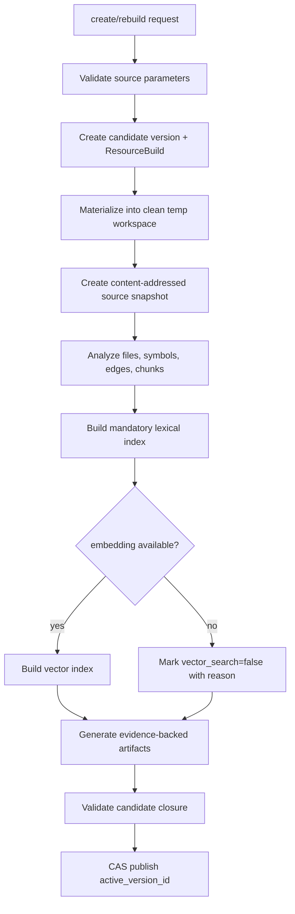

# Codebase Versioned Analysis, Rebuild, and Evidence

[简体中文](codebase-reindex.zh-CN.md)

This document is the authoritative reference for the Codebase module: secure
source acquisition, immutable analysis versions, Ask/Agent bindings, hybrid
retrieval, evidence-backed artifacts, rebuild recovery, compatibility routes,
and retention.

## Capability surface

| Capability | Route / API | Contract |
|------------|-------------|----------|
| List / create | `/codebase`, `POST /api/codebases` | ZIP, file set, or HTTPS Git import after source validation |
| Version history | `GET /api/codebases/{id}/versions` | Active version plus candidate build state |
| Build | `POST /api/codebases/{id}/builds` | Idempotently creates or returns one queued/running candidate |
| Retry / cancel | `POST /api/codebases/{id}/builds/{build_id}/retry`, `/cancel` | Only valid for same-codebase build/version closure |
| Versioned source | `POST /api/codebases/{id}/versions/{version_id}/source` | Reads immutable snapshot for that published version |
| Versioned artifacts | `GET /api/codebases/{id}/versions/{version_id}/artifacts` | Returns evidence-supported artifacts for that version |
| Create download snapshot | `POST /api/codebases/{id}/snapshots` | Packages and persists a snapshot key as an explicit mutation |

Ask sessions and Agent sessions are created with an explicit
`codebase_version_id`. Existing sessions keep reading their bound version even
after a newer codebase version is published.

## Source acquisition and immutable snapshots

Every import or rebuild creates a candidate `codebase_version` and a shared
`resource_build`.


```mermaid
flowchart TD
  Request["create/rebuild request"] --> Validate["Validate source parameters"]
  Validate --> Candidate["Create candidate version + ResourceBuild"]
  Candidate --> Materialize["Materialize into clean temp workspace"]
  Materialize --> Snapshot["Create content-addressed source snapshot"]
  Snapshot --> Analyze["Analyze files, symbols, edges, chunks"]
  Analyze --> Lexical["Build mandatory lexical index"]
  Lexical --> Vector{"embedding available?"}
  Vector -->|"yes"| Hybrid["Build vector index"]
  Vector -->|"no"| Degraded["Mark vector_search=false with reason"]
  Hybrid --> Artifacts["Generate evidence-backed artifacts"]
  Degraded --> Artifacts
  Artifacts --> ValidateClosure["Validate candidate closure"]
  ValidateClosure --> Publish["CAS publish active_version_id"]
```

Security rules at the boundary:

- ZIP imports require an owned upload and reject absolute paths, `..`, symlink
  members, excessive entry counts, excessive uncompressed size, and suspicious
  compression ratios.
- File-set imports require at least one unique owned/downloadable file.
- Git imports are HTTPS-only, reject credentials and non-default ports, resolve
  every address, and reject private, loopback, link-local, multicast, and
  metadata networks.
- Every build starts from an empty workspace. Stale files from prior analysis
  must never survive into the new version.
- The immutable source snapshot is the source of truth for reads and Agent
  workspace attachment. Long-lived ingestion sandboxes are not authoritative.

## Build state and publish semantics

At most one queued/running build exists for a codebase. Duplicate rebuild
requests return the existing candidate instead of dispatching another worker
task.

Publication is a short compare-and-swap transaction:

1. verify the candidate belongs to the codebase and its build;
2. verify the candidate parent still equals the current active version;
3. verify mandatory facts exist: non-empty source set, source snapshot, source
   digest, lexical index, and referential closure;
4. atomically set `codebases.active_version_id` to the candidate;
5. leave older version rows immutable for bound sessions and history.

Core failures in materialize, snapshot, analysis, lexical indexing, validation,
or publish mark the candidate failed and preserve the previous active version.
Vector and artifact failures may publish a degraded version when lexical search
and source reads remain valid.

## Session binding and Agent workspace copy

Session creation resolves the active published codebase version and stores a
`session_resource_bindings` row. Later reads use the binding, not whatever the
codebase active version is at read time.

Agent mode copies the bound source snapshot into the session sandbox and writes
a sentinel containing codebase id, version id, and source digest. Re-attaching
the same version is idempotent. A local-edit upgrade action must compare the
bound version against the latest active version and surface conflicts instead
of silently replacing the user's workspace.

## Retrieval and degradation

Lexical search is mandatory. It uses identifier-aware `search_text` built from
paths, symbol names, qualified names, signatures, and content.

Vector search is optional. When embedding is unavailable or vector lookup fails,
retrieval falls back to lexical results and returns visible degradation:

```json
{
  "capabilities": {
    "lexical_search": true,
    "vector_search": false
  },
  "degraded_reasons": ["EMBEDDING_UNAVAILABLE"]
}
```

The codebase retrieval stack uses reciprocal rank fusion (RRF) when both
lexical and vector results exist, and always filters chunks, files, and symbols
by exact `codebase_version_id`.

## Static analysis, parsers, and evidence

Parser adapters produce qualified symbols, source ranges, confidence, and
evidence-bearing edges. Same-name symbols in different modules remain distinct.
Ambiguous calls are recorded as `resolution="ambiguous"` with evidence, but no
false `dst_symbol_id` is assigned.

Artifacts are generated only when their facts have evidence:

- `overview` is derived from measured counts and source refs;
- `module_dir` is derived from actual paths;
- `architecture` requires import/dependency evidence;
- `call_chain` requires call-edge evidence;
- `data_flow` is omitted until explicit data-flow facts exist;
- `flowchart` is omitted until explicit control-flow facts exist.

Unsupported views are recorded in version metrics and capabilities. The UI
shows unsupported reasons instead of rendering generic diagrams.

## Recovery

Worker reconciliation may fail stale candidates and builds, but it must not
change the active version unless the candidate passes the publish CAS. Retry
creates a fresh candidate closed over the current active version.

## Retention and GC

Codebase version GC is default-off and bounded by:

- `codebase.version_retention_count`
- `codebase.version_retention_min_days`
- `codebase.version_gc_batch_size`

GC protects active versions, historical session bindings, queued/running build
versions, age windows, and retention windows. It deletes version-scoped files,
symbols, edges, chunks, artifacts, terminal build events/builds, and version
rows in a transaction. A source snapshot object is deleted only after no other
version references its key.

## Related documentation

- [Security Model](security-model.md)
- [Knowledge base ingestion](knowledge-base-ingestion.md)
- [Events](events.md)
- [Contract compatibility](contract-compatibility.md)
