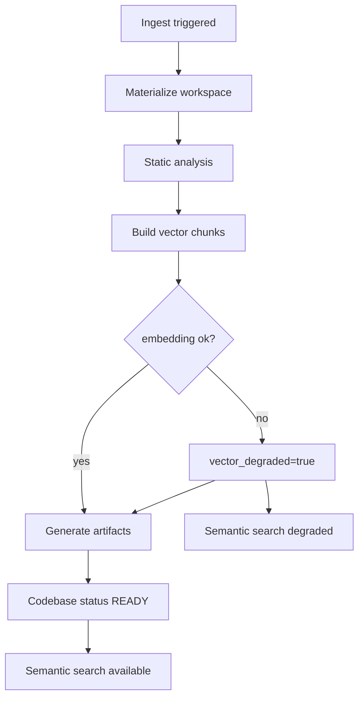
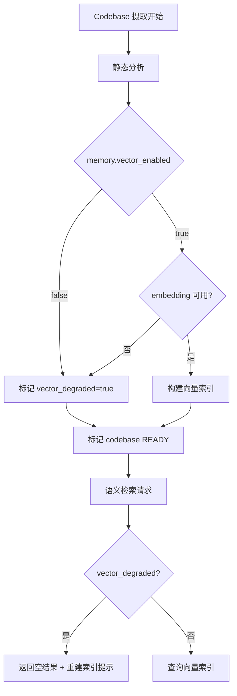

[English](codebase-reindex.md)

# Codebase 向量降级与重新索引

本文档是 **Codebase 模块**的权威说明：导入来源、Ask/Agent 模式、摄取管线、向量降级与手动重新索引。

## Codebase 模块概览

| 能力 | 路由 / API | 说明 |
|------|------------|------|
| 列表 / 创建 | `/codebase`、`POST /api/codebases` | ZIP 上传或 Git URL 导入 |
| 详情 | `/codebase/[id]` | 文件、符号、架构视图 |
| Ask 模式 | 带 `codebase_id` + ASK 的会话 | `CodeAskFlow` — 基于符号的 RAG |
| Agent 模式 | 带 `codebase_id` + AGENT 的会话 | 带代码库工具的 `PlannerReActFlow` |
| 重新索引 | `POST /api/codebases/{id}/reanalyze` | embedding 恢复后重跑摄取 |

导入方式：

- **ZIP 上传** — 在沙箱工作区解压归档
- **Git clone** — 沙箱内浅克隆（`git clone --depth 1`）

Agent 路由（`AgentTaskRunner`）：设置 `codebase_id` 且模式为 ASK → `CodeAskFlow`；否则使用带代码库工具的 Planner/ReAct。

## 完整摄取管线

Codebase 摄取由 `CodebaseIngestionRunner` 驱动，阶段与 SSE `step` 事件一一对应：

| 阶段 | 实现 | 说明 |
|------|------|------|
| Materialize | sandbox clone / unzip / upload | 将源码放入沙箱工作区 |
| Analyze | `StaticAnalyzer.analyze_tree()` | 提取文件、符号、依赖边 |
| Index | `CodebaseIndexer.build_chunks()` | 按符号分块并嵌入向量 |
| Artifacts | `ArtifactGenerator.generate_all()` | 生成架构图与文档 |

## 降级触发

Embedding 不可用或 `memory.vector_enabled=false` 时，摄取流程跳过向量步骤，代码库仍标记为 `READY`，并设置 `vector_degraded=true`。

## 恢复路径（手动）

1. 确认 `/api/llm/status` 中 embedding 可用
2. 调用 `POST /api/codebases/{codebase_id}/reanalyze`
3. UI 在 `vector_degraded=true` 时展示「语义检索不可用（向量索引已降级）」并提供「点此重建索引」

## 行为说明

- 静态分析与 artifacts 在降级时仍正常完成
- 当前语义检索工具未读取 `vector_degraded` 状态；向量不可用或无命中时返回「未找到相关代码」

## 相关文档

- [模型韧性设计](model-resilience.zh-CN.md)
- [配置来源治理](config-source-governance.zh-CN.md)
- [系统架构](overview.zh-CN.md)
- [安全模型](security-model.zh-CN.md)
