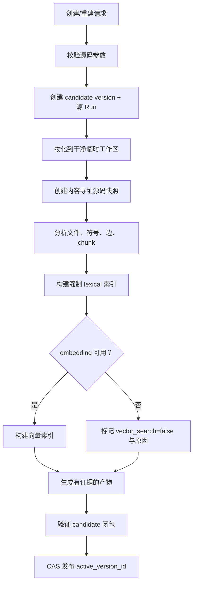

# 代码库版本化分析、重建与证据

[English](codebase-reindex.md)

本文是 Codebase 模块的权威参考：安全源码获取、不可变分析版本、
Ask/Agent 绑定、混合检索、有证据的分析产物、持久恢复与保留策略。

## 能力面

| 能力 | 路由 / API | 契约 |
|------|------------|------|
| 列表 / 创建 | `/codebase`、`POST /api/codebases` | ZIP、文件集或 HTTPS Git 导入，进入任务前完成源码校验 |
| 版本历史 | `GET /api/codebases/{id}/versions` | 返回 active version 与 candidate build 状态 |
| 构建 | `POST /api/codebases/{id}/builds` | 幂等创建一个候选并接入其源 Run |
| 重试 / 取消 | `POST /api/codebases/{id}/builds/{build_id}/retry`、`/cancel` | 只允许同代码库 build/version 闭包 |
| 版本源码 | `POST /api/codebases/{id}/versions/{version_id}/source` | 读取该已发布版本的不可变 snapshot |
| 版本产物 | `GET /api/codebases/{id}/versions/{version_id}/artifacts` | 返回该版本有证据支撑的产物 |
| 创建下载快照 | `POST /api/codebases/{id}/snapshots` | 以显式写操作打包并持久化 snapshot key |

Ask 与 Agent 会话创建时都会携带明确的 `codebase_version_id`。已有会话在
新版本发布后仍继续读取绑定版本。

## 源码获取与不可变快照

每次导入或重建都创建一个带 `build_id`、`request_key` 的 candidate
`codebase_version`，并原子接入一个 `codebase_ingest` Run。


```mermaid
flowchart TD
  Request["创建/重建请求"] --> Validate["校验源码参数"]
  Validate --> Candidate["创建 candidate version + 源 Run"]
  Candidate --> Materialize["物化到干净临时工作区"]
  Materialize --> Snapshot["创建内容寻址源码快照"]
  Snapshot --> Analyze["分析文件、符号、边、chunk"]
  Analyze --> Lexical["构建强制 lexical 索引"]
  Lexical --> Vector{"embedding 可用？"}
  Vector -->|"是"| Hybrid["构建向量索引"]
  Vector -->|"否"| Degraded["标记 vector_search=false 与原因"]
  Hybrid --> Artifacts["生成有证据的产物"]
  Degraded --> Artifacts
  Artifacts --> ValidateClosure["验证 candidate 闭包"]
  ValidateClosure --> Publish["CAS 发布 active_version_id"]
```

边界安全规则：

- ZIP 导入必须来自有权访问的上传文件，并拒绝绝对路径、`..`、符号链接、
  过多 entry、过大解压体积和异常压缩比。
- 文件集导入至少需要一个唯一且有权下载的文件。
- Git 导入仅允许 HTTPS，拒绝凭据和非默认端口，解析所有地址并拒绝私有、
  loopback、link-local、多播和 metadata 网段。
- 每次 build 都从空工作区开始；旧分析残留文件不得进入新版本。
- 不可变源码 snapshot 是读取和 Agent 工作区附着的事实来源；长期存在的
  摄取沙箱不是权威来源。

## 构建状态与发布语义

一个代码库最多存在一个 `building` candidate。源 Run 是生命周期和进度唯一权威，使用 `new`、`queued`、`running`、`waiting`、`completed`、`failed`、`cancelled`。重复请求通过命令与 request-key 幂等返回同一 candidate/Run。

发布是短事务 compare-and-swap：

1. 校验 candidate 属于该代码库及其源 Run identity；
2. 校验 candidate parent 仍等于当前 active version；
3. 校验必需事实存在：非空源码集、源码 snapshot、源码 digest、lexical
   索引和引用闭包；
4. 原子更新 `codebases.active_version_id` 到 candidate；
5. 保留旧版本行，供已绑定会话与历史读取。

materialize、snapshot、analysis、lexical indexing、validation 或 publish
核心失败时，candidate 标记为 failed，旧 active version 保持不变。向量或
产物失败时，如果 lexical search 与 source read 仍有效，可以发布 degraded
版本。

## 会话绑定与 Agent 工作区复制

创建会话时解析当前已发布版本并写入 `session_resource_bindings`。之后读取
使用绑定，而不是读取当时最新的 active version。

Agent 模式会把绑定版本源码 snapshot 复制到会话沙箱，并写入包含 codebase id、
version id 与 source digest 的 sentinel。重复附着同一版本是幂等的。local
edit upgrade 必须比较绑定版本与最新 active version 并显式展示冲突，不能
静默替换用户工作区。

## 检索与降级

Lexical search 是强制能力。它使用由路径、符号名、qualified name、签名与
内容组成的 identifier-aware `search_text`。

Vector search 是可选能力。embedding 不可用或向量查询失败时，检索降级为
lexical 结果，并返回可见降级信息：

```json
{
  "capabilities": {
    "lexical_search": true,
    "vector_search": false
  },
  "degraded_reasons": ["EMBEDDING_UNAVAILABLE"]
}
```

代码库检索在 lexical 与 vector 都有结果时使用 RRF 融合，并始终按精确
`codebase_version_id` 过滤 chunks、files 与 symbols。

## 静态分析、解析器与证据

解析器适配器产出 qualified symbols、源码范围、confidence 和带证据的边。
不同模块里的同名符号必须保留为不同符号。模糊调用记录为
`resolution="ambiguous"` 且带 evidence，但不能伪造 `dst_symbol_id`。

产物只在事实有证据时生成：

- `overview` 来自实测数量和源码 refs；
- `module_dir` 来自真实路径；
- `architecture` 需要 import/dependency evidence；
- `call_chain` 需要 call-edge evidence；
- `data_flow` 在存在显式数据流事实前省略；
- `flowchart` 在存在显式控制流事实前省略。

不支持的视图记录在版本 metrics 和 capabilities 中。UI 展示 unsupported
reason，而不是渲染泛化模板图。

## 恢复

执行内核从 PostgreSQL 回收命令和过期 Activity claim。它可以把未发布候选标记失败，但除非 candidate 通过发布 CAS，否则不得改变 active version。retry 基于当前 active version 创建新的 candidate 和 Run。

## 保留与 GC

Codebase version GC 默认关闭，由以下配置限流：

- `codebase.version_retention_count`
- `codebase.version_retention_min_days`
- `codebase.version_gc_batch_size`

GC 保护 active versions、历史 session bindings、所有 `building` candidates、年龄窗口和保留窗口。它在事务内删除 version-scoped files、symbols、edges、chunks、artifacts 和 version rows。源码 snapshot object 只有在没有其他版本引用该 key 后才会删除。Run 事件遵循执行事件保留策略，不属于产品 GC 数据。

## 相关文档

- [安全模型](security-model.zh-CN.md)
- [知识库摄取](knowledge-base-ingestion.zh-CN.md)
- [执行内核](execution-kernel.zh-CN.md)
