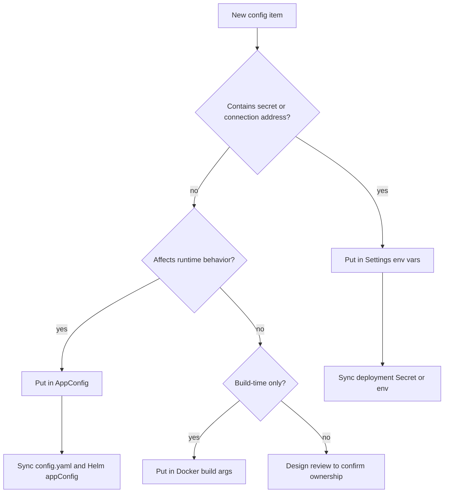

# Configuration Source Governance

[简体中文](config-source-governance.zh-CN.md)

This document is the authoritative reference for OpenCitadel configuration sources, behavioral flag ownership, and configuration sync requirements.

## Single Source of Truth

| Type | Source | Examples |
|------|--------|----------|
| Behavioral config | `AppConfig`, backed by DB; `config.yaml` / Helm `appConfig` are seed only | `model_resilience`, `feature_flags`, `worker`, `sandbox` |
| Secrets / connections | `Settings` environment variables | `EMBEDDING_API_KEY`, Postgres, Redis, COS |

## Decision Tree

## Production Deployment

- **Must** set `USE_DB_APP_CONFIG=true`; Docker Compose does not enforce this by default—set explicitly in `.env`; Helm `env` is already configured
- `config.yaml` / Helm `appConfig` are initial defaults; migrate job seeds DB when the table is empty

## Prohibited

- Do not add parallel environment variables for behavioral flags (except emergency triage: rollback image/config)

## Sync Checklist

When modifying `AppConfig` fields, sync: `app_config.py` schema, `config.yaml`, Helm `appConfig`, and related documentation.

| Change type | Must sync |
|-------------|-----------|
| New `AppConfig` field | `api/app/domain/models/app_config.py`, `api/config.yaml`, Helm `appConfig`, related docs |
| New environment variable | `Settings` schema, `.env.example`, deployment docs / Helm env |
| New user-visible contract | API schema, frontend types, compatibility policy docs |

## Related Documentation

- [Architecture Overview](overview.md)
- [Model Resilience Design](model-resilience.md)
- [API/SSE Protocol Compatibility](contract-compatibility.md)
