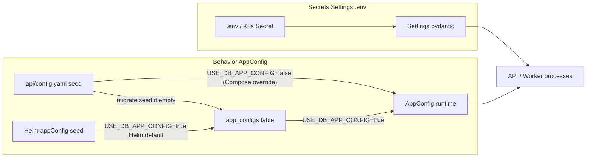
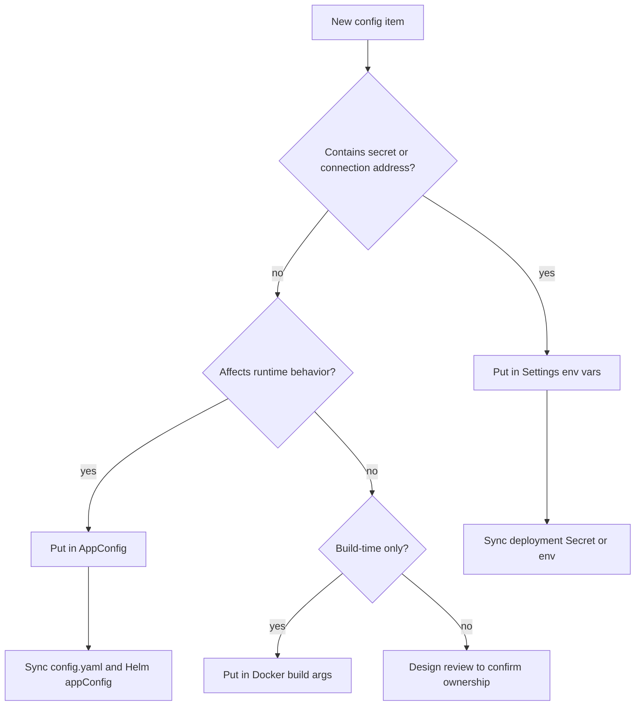

# Configuration Source Governance

[简体中文](config-source-governance.zh-CN.md)

This document is the authoritative reference for OpenCitadel configuration sources, behavioral flag ownership, and configuration sync requirements.

## Single Source of Truth

| Type | Source | Examples |
|------|--------|----------|
| Behavioral config | `AppConfig`, backed by DB; `config.yaml` / Helm `appConfig` are seed only | `model_resilience`, `feature_flags`, `worker`, `sandbox` |
| Secrets / connections | `Settings` environment variables | `EMBEDDING_API_KEY`, Postgres, Redis, COS |

## Configuration flow

## Decision Tree

## Production Deployment

- **Must** set `USE_DB_APP_CONFIG=true` (now the code default); Helm `env` is already configured; Docker Compose should set explicitly in `.env`
- `config.yaml` / Helm `appConfig` are initial defaults; migrate job seeds DB when the table is empty

## Three-tier storage (2026-07)

| Tier | Storage | Examples | Admin UI |
|------|---------|----------|----------|
| Bootstrap secrets | `.env` / `Settings` | Postgres, Redis, JWT, COS keys | N/A |
| Behavioral config | `app_configs` JSONB (`scope=global` + optional `scope=user` overrides) | `worker`, `sandbox`, `feature_flags`, per-user `agent_config` | Settings → Runtime / Common |
| Integration entities | `mcp_servers`, `a2a_servers`, `llm_endpoints`, `llm_models` tables | MCP/A2A connections; LLM provider endpoints and model configs | Settings → Integrations / Models |

### Per-user overrides

Only session-scoped sections may be overridden per user: `agent_config`, `memory`, `hitl`, `model_resilience`, `knowledge_base`. Process-scoped sections remain global: `server`, `worker`, `streams`, `sandbox`, `scheduler`, `observability`, `feature_flags`.

### Hot reload vs restart

- Hot reload (Redis invalidate → reload `app_configs` → re-apply sandbox/worker/streams module settings): most `AppConfig` sections
- Requires API restart: `server.cors_origins` (CORS middleware registered at app build time)

### Audit / rollback

- `app_config_revisions` stores snapshots on every `app_configs` save (global and user rows)
- MCP/A2A CRUD is recorded via `AuditService`

### Known limitations

- `OwnerScope.team(...)` does not filter MCP/A2A or `llm_endpoints` / `llm_models` by `team_id`; team members do not automatically share those resources. This is an existing architectural limitation.
- Global `app_configs` JSONB row uses read-modify-write without optimistic locking; concurrent edits may race (low priority, consistent with prior patterns).

## Prohibited

- Do not add parallel environment variables for behavioral flags (except emergency triage: rollback image/config)

## Sync Checklist

When modifying `AppConfig` fields, sync: `app_config.py` schema, `config.yaml`, Helm `appConfig`, and related documentation.

| Change type | Must sync |
|-------------|-----------|
| New `AppConfig` field | `api/app/domain/models/app_config.py`, `api/config.yaml`, Helm `appConfig`, related docs |
| New environment variable | `Settings` schema, `.env.example`, deployment docs / Helm env |
| New user-visible contract | API schema, frontend types, compatibility policy docs |

## Related Documentation

- [Architecture Overview](overview.md)
- [Model Resilience Design](model-resilience.md)
- [API/SSE Protocol Compatibility](contract-compatibility.md)
