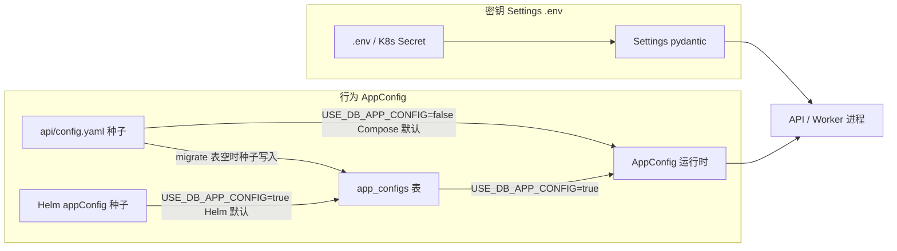
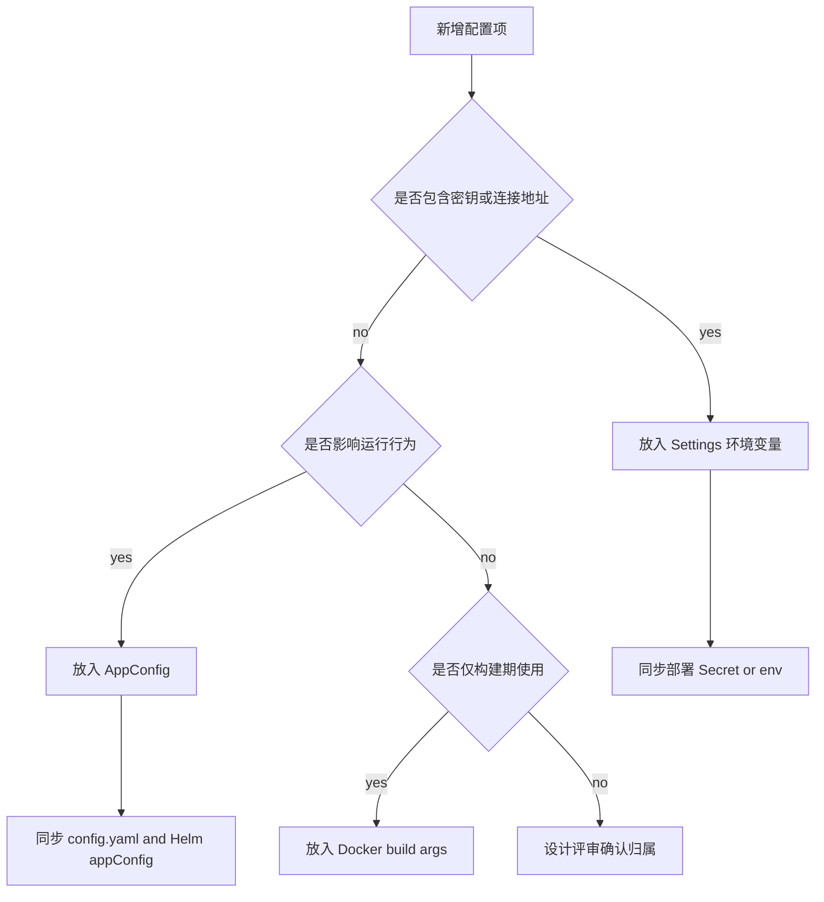

[English](config-source-governance.md)

# 配置来源治理

本文档是 OpenCitadel 配置来源、行为开关归属和配置同步要求的权威说明。

## 唯一权威

| 类型 | 来源 | 示例 |
|------|------|------|
| 行为配置 | `AppConfig`，由 DB 承载，`config.yaml` / Helm `appConfig` 只做种子 | `model_resilience`, `feature_flags`, `worker`, `sandbox` |
| 密钥/连接 | `Settings` 环境变量 | `EMBEDDING_API_KEY`, Postgres, Redis, COS |

## 配置流转

## 决策树

## 生产部署

- **必须** `USE_DB_APP_CONFIG=true`（现为代码默认值）；Helm `env` 已配置；Docker Compose 建议在 `.env` 显式开启
- `config.yaml` / Helm `appConfig` 为初始默认值；migrate job 在表空时种子写入 DB

## 三层存储（2026-07）

| 层级 | 存储 | 示例 | 管理界面 |
|------|------|------|----------|
| 引导/密钥 | `.env` / `Settings` | Postgres、Redis、JWT、COS | 无 |
| 行为配置 | `app_configs` JSONB（`scope=global` + 可选 `scope=user` 覆盖） | `worker`、`sandbox`、`feature_flags`、用户级 `agent_config` | 设置 → 运行时 / 通用 |
| 集成实体 | `mcp_servers`、`a2a_servers` 表（owner + visibility，密钥加密） | MCP headers/env、A2A URL | 设置 → 集成 |

### 按用户覆盖

仅会话级段可 per-user 覆盖：`agent_config`、`memory`、`hitl`、`model_resilience`、`knowledge_base`。进程级段保持全局：`server`、`worker`、`streams`、`sandbox`、`scheduler`、`observability`、`feature_flags`。

### 热生效 vs 重启

- 热生效（Redis 失效 → 重载 app_configs → 重推 sandbox/worker/streams）：大部分 AppConfig 段
- 需重启 API：`server.cors_origins`（CORS 中间件在应用构建期注册）

### 审计 / 回滚

- 每次保存 `app_configs` 写入 `app_config_revisions` 快照（全局与用户行）
- MCP/A2A 增删改经 `AuditService` 审计

### 已知限制

- `OwnerScope.team(...)` 当前未按 `team_id` 过滤 MCP/A2A（以及既有的 `llm_model`）；团队成员之间不会自动共享这些资源。此为现有架构限制。
- 全局 `app_configs` JSONB 行采用读-改-写且无乐观锁；并发编辑可能产生竞争（低优先级，与既有模式一致）。

## 禁止

- 不为行为开关新增平行环境变量（紧急止血除外：回滚镜像/配置）

## 同步清单

修改 `AppConfig` 字段时需同步：`app_config.py` schema、`config.yaml`、Helm `appConfig`、相关文档。

| 变更类型 | 必须同步 |
|----------|----------|
| 新增 `AppConfig` 字段 | `api/app/domain/models/app_config.py`、`api/config.yaml`、Helm `appConfig`、相关文档（如 `hitl.tool_gate_risk_list` 含 browser 写工具） |
| 新增环境变量 | `Settings` schema、`.env.example`、部署文档 / Helm env |
| 新增用户可见契约 | API schema、前端类型、兼容策略文档 |

## 相关文档

- [系统架构](overview.zh-CN.md)
- [模型韧性设计](model-resilience.zh-CN.md)
- [API/SSE 协议兼容策略](contract-compatibility.zh-CN.md)
