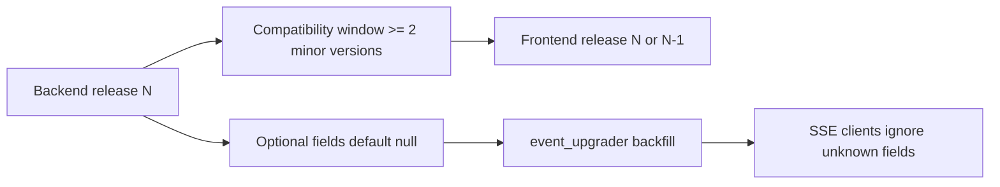

# API/SSE Protocol Compatibility

[简体中文](contract-compatibility.zh-CN.md)

This document is the authoritative reference for OpenCitadel API, SSE events, and frontend/backend compatibility windows.

## ErrorEvent.code

| Side | Policy |
|------|--------|
| Backend | `ErrorEvent.code` is optional; defaults to `null`; legacy events backfilled via `event_upgrader` |
| Frontend | Readable and ignorable; prefer `code` to drive UI, fall back to `error` text |
| Compatibility window | At least 2 minor versions |

## Marketplace model_dependency

| Item | Policy |
|------|--------|
| Values | `none | optional | required` |
| Default | Frontend falls back to `optional` when field is missing; catalog API guarantees full delivery |
| `FALLBACK_APPS` | Offline fallback also carries `model_dependency` |

## /api/llm/status

| Item | Policy |
|------|--------|
| Contract relationship | New endpoint; does not affect existing `/api/status` contract |
| Caching | Response `Cache-Control: max-age=30` |

## Related Documentation

- [Event System](events.md)
- [Model Resilience Design](model-resilience.md)
- [Configuration Source Governance](config-source-governance.md)
