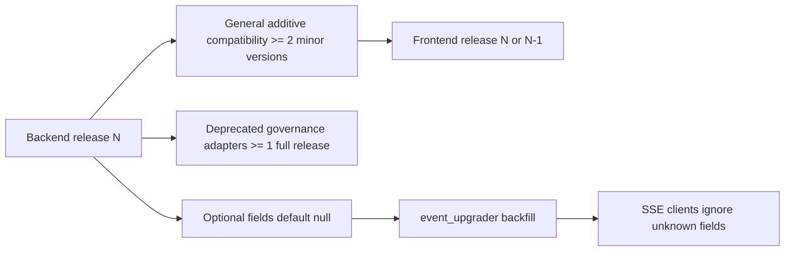

# API/SSE Protocol Compatibility

[简体中文](contract-compatibility.zh-CN.md)

This document is the authoritative reference for OpenCitadel API, SSE events, and frontend/backend compatibility windows.

```mermaid
flowchart LR
  Backend["Backend release N"] --> Window["General additive compatibility >= 2 minor versions"]
  Window --> Frontend["Frontend release N or N-1"]
  Backend --> Deprecated["Deprecated governance adapters >= 1 full release"]
  Backend --> Optional["Optional fields default null"]
  Optional --> Upgrader["event_upgrader backfill"]
  Upgrader --> Clients["SSE clients ignore unknown fields"]
```

## ErrorEvent.code

| Side | Policy |
|------|--------|
| Backend | `ErrorEvent.code` is optional; defaults to `null`; legacy events backfilled via `event_upgrader` |
| Frontend | Readable and ignorable; prefer `code` to drive UI, fall back to `error` text |
| Compatibility window | At least 2 minor versions |

## /api/llm/status

| Item | Policy |
|------|--------|
| Contract relationship | New endpoint; does not affect existing `/api/status` contract |
| Caching | Response `Cache-Control: max-age=30` |

## Shared-governance compatibility

Shared governance additions are additive. Clients must ignore unknown fields,
tolerate absent optional fields, and treat PostgreSQL projections as
authoritative.

| Contract | Stable fields / behavior |
|----------|--------------------------|
| Tool policy | `capability`, `effect`, `idempotency`, `approval`, `concurrency_group`; missing declarations become conservative and are hidden from Ask |
| Approval batch | Top-level `id`, `session_id`, `status`, timestamps, ordered `calls`; each call carries identity, ordinal, normalized args/hash, policy snapshot, decision state/actor/time |
| Run status | Public `session_status` keeps `status`, optional `reason`, optional `code`, and `run_epoch_id`; internal full `outcome` is not projected to SSE |
| Session resource binding | `binding_id`, `resource_kind`, `resource_id`, `version_id`; current API rows additionally expose `is_current` and optional `supersedes_binding_id` |
| Resource-build SSE | Outer event `resource-build-event`; data discriminator `resource_build`; identity, cursor, resource/version, phase/state/progress, degradation, payload, timestamp |

### Resource binding APIs

| Route | Compatibility behavior |
|-------|------------------------|
| `GET /api/sessions/{id}/resource-bindings` | Returns current owner-scoped immutable pins |
| `GET /api/sessions/{id}/resource-bindings/{kind}/available-versions` | Returns provider-validated published versions; `binding_id=""`, `is_current=false` indicate catalog rows |
| `POST /api/sessions/{id}/resource-bindings/{kind}/upgrade` | Requires an explicit `target_version_id`; returns `old_binding_id`, `new_binding_id`, `current_version_id` |
| `GET /api/resource-builds/{build_id}/events?after=<seq>` | PostgreSQL cursor replay followed by advisory Redis hints |

`ResourceVersionProvider` is independently implemented per resource kind and
returns the shared publication contract:
`resource_kind`, `resource_id`, `version_id`, `state`, `published`,
`degraded`, `capabilities`, and `degraded_reasons`. The shared layer does not
define knowledge-base or codebase domain-version tables.

### Deprecated adapters and one-release window

Deprecated fields and routes stay available for at least one complete release
after the replacement is generally available. Removal requires migration
verification and release-note notice; no compatibility adapter may retain a
write side effect on a GET route.

| Deprecated contract | Replacement and compatibility rule |
|---------------------|------------------------------------|
| `GET /api/codebases/{id}/download` as snapshot preparation | It is now a read-only lookup of the existing `snapshot_key`; `POST /api/codebases/{id}/snapshots` is the only snapshot-creation mutation. Keep the GET adapter for one full release, then remove it. |
| `pending_metadata.pending_tool_call` single-call gate | New writes use persistent approval batches and `pending_metadata.approval_batch_id`. Legacy single-call data remains a read/resume fallback for one full release and must never bypass batch governance. |
| Direct `codebase_id` / `knowledge_base_id` session fields without immutable history | Creation accepts the existing IDs and optional version IDs during the window, but responses and events expose `resource_bindings`; no automatic upgrade is inferred. |
| Pre-version ready resources | Only rows explicitly marked `legacy_v1_migrated=true` may resolve synthetic `legacy:<resource_id>`; building, failed, or newly created ready rows never receive this fallback. |

The normal additive API/SSE window remains at least two minor versions. The
one-release rule above is a minimum retention period for explicitly deprecated
governance adapters, not permission to break other additive contracts early.

## Related Documentation

- [Event System](events.md)
- [Checkpoints and HITL](checkpoints-and-hitl.md)
- [Model Resilience Design](model-resilience.md)
- [Configuration Source Governance](config-source-governance.md)
