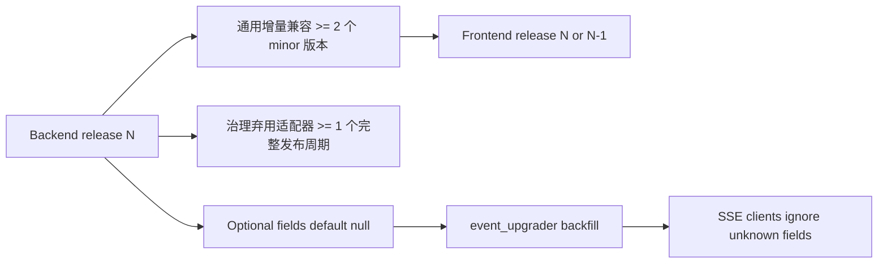

[English](contract-compatibility.md)

# API/SSE 协议兼容策略

本文档是 OpenCitadel API、SSE 事件与前后端兼容窗口的权威说明。

## ErrorEvent.code

| 侧 | 策略 |
|----|------|
| 后端 | `ErrorEvent.code` 可选，缺省为 `null`；旧事件经 `event_upgrader` 补全 |
| 前端 | 可读可忽略；优先用 `code` 驱动 UI，回退到 `error` 文案 |
| 兼容窗口 | 至少 2 个 minor 版本 |

## /api/llm/status

| 项 | 策略 |
|----|------|
| 契约关系 | 新增端点，不影响现有 `/api/status` 契约 |
| 缓存 | 响应 `Cache-Control: max-age=30` |

## 共享治理兼容契约

共享治理新增字段均为增量字段。客户端必须忽略未知字段、容忍缺失的可选字段，
并以 PostgreSQL 投影为权威。

| 契约 | 稳定字段 / 行为 |
|------|----------------|
| 工具策略 | `capability`、`effect`、`idempotency`、`approval`、`concurrency_group`；缺失声明采用最保守策略并从 Ask 隐藏 |
| 审批批次 | 顶层 `id`、`session_id`、`status`、时间戳与有序 `calls`；每个调用携带 identity、ordinal、规范化参数/哈希、策略快照、决策状态/操作人/时间 |
| Run 状态 | 公共 `session_status` 保留 `status`、可选 `reason`、可选 `code` 和 `run_epoch_id`；内部完整 `outcome` 不投影到 SSE |
| 会话资源绑定 | `binding_id`、`resource_kind`、`resource_id`、`version_id`；当前 API 行另外包含 `is_current` 与可选 `supersedes_binding_id` |
| 资源构建 SSE | 外层 event 为 `resource-build-event`；data discriminator 为 `resource_build`；包含 identity、游标、资源/版本、phase/state/progress、降级、payload、时间戳 |

### 资源绑定 API

| 路由 | 兼容行为 |
|------|----------|
| `GET /api/sessions/{id}/resource-bindings` | 返回 owner scope 下当前不可变 pins |
| `GET /api/sessions/{id}/resource-bindings/{kind}/available-versions` | 返回 provider 验证过的已发布版本；`binding_id=""`、`is_current=false` 表示 catalog 行 |
| `POST /api/sessions/{id}/resource-bindings/{kind}/upgrade` | 必须显式提供 `target_version_id`；返回 `old_binding_id`、`new_binding_id`、`current_version_id` |
| `GET /api/resource-builds/{build_id}/events?after=<seq>` | 先按 PostgreSQL 游标重放，再使用 Redis 提示 |

每个资源类型独立实现 `ResourceVersionProvider`，返回共享发布契约：
`resource_kind`、`resource_id`、`version_id`、`state`、`published`、
`degraded`、`capabilities`、`degraded_reasons`。共享层不定义知识库或
Codebase 的领域版本表。

### 弃用适配器与一个发布周期

弃用字段和路由在替代项正式可用后至少保留一个完整发布周期。移除前必须完成
迁移校验并在 release notes 中说明；任何兼容适配器都不得让 GET 保留写副作用。

| 弃用契约 | 替代项与兼容规则 |
|----------|------------------|
| 使用 `GET /api/codebases/{id}/download` 准备 snapshot | 该 GET 现在只读取已有 `snapshot_key`；只有 `POST /api/codebases/{id}/snapshots` 创建 snapshot。GET 适配器保留一个完整发布周期后移除。 |
| `pending_metadata.pending_tool_call` 单调用门控 | 新写入使用持久化 approval batch 与 `pending_metadata.approval_batch_id`。旧单调用数据仅保留一个发布周期的读取/恢复 fallback，且不能绕过批次治理。 |
| 缺少不可变历史的直接 `codebase_id` / `knowledge_base_id` 会话字段 | 兼容期创建请求仍接受现有 ID 与可选 version ID，但响应和事件暴露 `resource_bindings`，且不会推断自动升级。 |
| 版本化之前的 ready 资源 | 只有显式标记 `legacy_v1_migrated=true` 的行可解析为合成 `legacy:<resource_id>`；building、failed 或迁移后新建的 ready 行都不能回落。 |

通用增量 API/SSE 兼容窗口仍至少为两个 minor 版本。上述一个发布周期是显式
弃用治理适配器的最低保留期，不代表可以提前破坏其他增量契约。

## 相关文档

- [事件系统](events.zh-CN.md)
- [检查点与 HITL](checkpoints-and-hitl.zh-CN.md)
- [模型韧性设计](model-resilience.zh-CN.md)
- [配置来源治理](config-source-governance.zh-CN.md)
