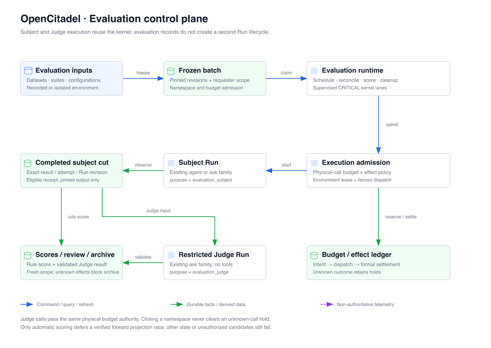

# Evaluation Control Plane

[简体中文](evaluation-control-plane.zh-CN.md)

Evaluation composes immutable datasets, configurations, rubrics, suites, and
recorded or isolated sources into durable batches. It uses the
[execution kernel](execution-kernel.md) for every subject and Judge Run. Batch
orchestration, scoring, review, environment leases, and budget accounting have
separate persisted authority; none substitutes for the Run event log.

## Admission and kernel ownership

The API authorizes the original principal and OwnerScope, validates immutable
version membership and resource pins, captures current policy/configuration
proofs, and persists commands and batch state. It does not call providers or
execute a case. The kernel owns four critical `EvaluationRuntime` lanes:

| Lane                    | Responsibility                                                                                        |
| ----------------------- | ----------------------------------------------------------------------------------------------------- |
| `evaluation-scheduler`  | Claim/fence batches, admit subject Runs, reconcile results, submit cancellation and eligible retries. |
| `evaluation-reconciler` | Reconcile Judge intents and late physical facts; consume durable review commands.                     |
| `evaluation-scoring`    | Discover batches, reauthorize, compute rule scores, and schedule restricted Judge Runs.               |
| `evaluation-cleanup`    | Process recording/environment work, clean object stores, and maintain summary inventory.              |

Inventory is discovery, not authorization. Every mutation revalidates the
original requester, current membership, selected versions, and cancellation
state. Permission revocation is handled for the affected owner. An unexpected
critical-lane failure withdraws kernel readiness and requests shutdown rather
than leaving a dead evaluation service marked ready.

A deterministic case × configuration × repetition matrix produces durable slots
and attempts. Source prebinding, budget binding, execution-slot preparation,
`CreateRun` submission, and attempt binding share the borrowed admission UoW;
errors roll back that transaction. Idempotent admission keys and claim fencing
prevent duplicate scheduling. The subject uses its configured `agent` or `ask`
family with source type `evaluation_recorded_case` or `evaluation_isolated_case`.
Judge admission uses `ask`, source type `evaluation_judge`, and `parent_run_id`
bound to the subject. Evaluation introduces no new Run family.

Cancellation submits ordinary Run commands and waits for formal outcomes.
Automatic retry requires a failed infrastructure attempt, remaining attempt
budget, and no unknown effects. A retry is a distinct, linked attempt, not a
rewrite of the previous Run or its evidence. Execution, scoring, review, and
cleanup status remain separate in the Batch view.

## Recorded and isolated sources

Recorded admission binds a trusted immutable recording and its selected tool
contracts before Run admission. Replay dispatch consumes that recording through
the dedicated replay adapter. Missing, mismatched, revoked, or unavailable
bindings fail closed; replay never silently falls through to a real external
write. Coverage distinguishes consumed, unused, and mismatched calls.

Isolated admission binds an approved environment version, exact case slot,
requester, lease generation, configuration fingerprint, and policy digest.
`EnvironmentRuntime` builds the selected test catalog instead of an ordinary
session catalog. It rechecks lease state/expiry/generation, current tool policy,
target contracts, credentials, and any required approval before invocation.
External test targets use registered executors bound to that lease; sandbox calls
use the isolated adapter. The broker deployment is described in
[Evaluation Environments](../evaluation-environments.md).

Lease transitions are persisted: `allocated → preparing → ready → leased →
cleaning → verified_clean`; uncertainty or failed verification leads to
`quarantine`. Only `verified_clean` is reusable. Quarantined leases require
explicit administrative repair authorization before cleaning; cancellation or
process exit alone does not prove cleanup.

## Physical model calls and budgets

The budget namespace fixes the suite, original requester, selected candidates,
policy revisions, source identities, and batch token/money limits. Separate
execution slots bound subject/Judge/global/user Run concurrency. Physical model
calls pass capacity and budget reservation at the shared dispatch boundary,
including provider attempts and fallback candidates; counting logical case
completion is insufficient for physical usage accounting.

Persisted reservations and `execution_model_dispatches` bind each physical call
identity, configuration, price snapshot, lineage, and admission proof before a
send. Trusted usage and original completion evidence produce formal settlement
and usage records. Token or price evidence that is unavailable stays unknown;
missing values do not become zero. An uncertain external outcome retains budget
holds and prohibits unsafe retry, scoring, and archival while unresolved.
Closing a namespace stops new admission but does not erase existing accounting
obligations. Late original evidence may settle the original call under kernel
authority, without manufacturing another user action or call.

## Scores and a stable completed cut

Rule, model, and human scores append separate immutable source revisions with
explicit result, subject Run, rubric, and evaluation revision bindings. Missing
or non-evaluable dimensions retain null values. Required-rule pass rate uses
valid completed cases as its denominator and reports missing/excluded counts;
optional rules do not inflate coverage. Human review does not overwrite model
source evidence or settle an unknown physical effect.

A Judge intent captures fixed authorized materials and a restricted protocol.
The Judge has no tools, external retrieval, session memory, or external
knowledge. Its JSON output must match applicable dimensions and supplied
evidence identifiers; material fields are untrusted data. Current intent,
requester, pins, and physical-call authority are checked again before model
assembly and sends.

A terminal subject projection may still advance when late usage is published.
`DBEvaluationJudgeRepository.current()` refreshes the batch-bound attempt and
result revision, takes an exact Run/source/owner/team `FOR SHARE` lock, reads the
current completed projection, and revalidates eligibility within the same UoW.
This preserves a stable cut rather than inventing a revision.

Automatic rule/Judge batch consumers catch only `ScoringProjectionAdvanced`:
a newer completed projection after all requester, membership, revision, accepted
receipt, terminal-state, cancellation, and unresolved-effect checks pass. They
defer that candidate; the next tick fetches a fresh real cut. Public stale
candidates remain rejected. A backwards revision, missing/failed projection,
rejected receipt, revocation, or unresolved effect is not this defer condition.

## Retention and implementation status

Archival changes resource discovery while retaining immutable evidence and pins.
The public archive guard rejects busy or unresolved resources. Cleanup of owned
Docker infrastructure is distinct from deleting accounting, scoring, review, or
execution evidence; a successful container cleanup does not resolve an unknown
model call.

This document describes implemented boundaries. It does not certify the AC21
full-scale reference capacity acceptance. That acceptance still requires its
reference environment, complete multi-round collection/cleanup handoff, and
original workload criteria; component tests or lower-scale runs are not a
substitute.

## Implementation anchors

- Composition and lanes: `api/app/composition/evaluation.py`,
  `api/app/composition/kernel.py`, `api/app/application/evaluation/runtime.py`.
- Admission and scheduling: `api/app/application/evaluation/scheduler.py`,
  `budget_admission.py`, `replay_admission.py`, `environment_admission.py`.
- Isolated and replay dispatch: `api/app/application/evaluation/environment_runtime.py`,
  `replay_runtime.py`; `api/app/domain/evaluation/environment.py`.
- Physical accounting: `api/app/infrastructure/execution/budget_dispatch.py`,
  `api/app/infrastructure/repositories/db_evaluation_budget_repository.py`.
- Restricted Judge and stable scoring: `api/app/domain/evaluation/judge_protocol.py`,
  `scoring.py`; `api/app/application/evaluation/judge_service.py`,
  `rule_scoring_service.py`; `api/app/infrastructure/repositories/db_evaluation_judge_repository.py`,
  `db_evaluation_score_repository.py`.
- Review and archive: `api/app/application/evaluation/review_consumer.py`,
  `archive_service.py`; `api/app/infrastructure/repositories/db_evaluation_archive_repository.py`.
