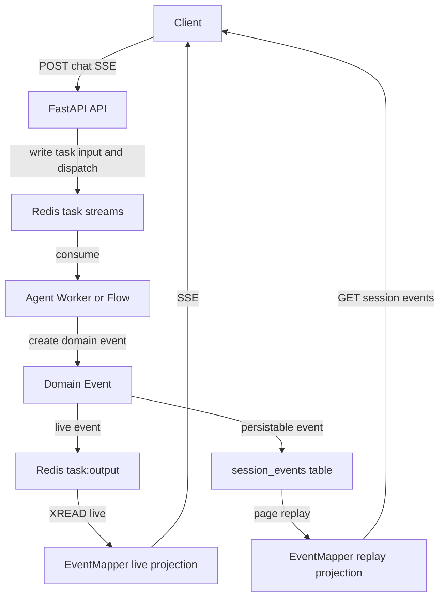
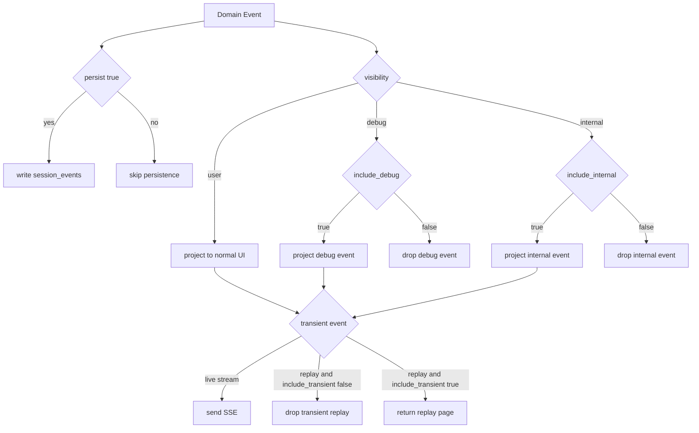

# Event System Design

[简体中文](events.zh-CN.md)

This document is the authoritative reference for OpenCitadel session event system, covering domain events, SSE live contract, projection policy, persistence, and paginated replay.

## Event Pipeline

- **Domain events** are defined in `api/app/domain/models/event.py` and created by Agent, Flow, and TaskRunner.
- **Live channel** uses Redis Stream `task:output:{task_id}`; API forwards via `XREAD` as SSE.
- **Persistence channel** uses append-only `session_events` table, paginated replay by `(session_id, seq)`.
- **SSE projection** is centralized in `EventMapper` at `api/app/interfaces/schemas/event.py`.

## EventMeta

All SSE data must carry unified metadata:

| Field | Description |
|-------|-------------|
| `event_id` | Redis stream id or domain event id |
| `created_at` | Unix timestamp (seconds) |
| `schema_version` | Current event schema version |
| `visibility` | `user` / `internal` / `debug` |
| `channel` | `ui` / `runtime` / `debug` |
| `persist` | Whether persistence is allowed |

Current `EVENT_SCHEMA_VERSION=2`. Legacy payloads are upgraded via `event_upgrader.py` before deserialization.

## SSE Event Catalog

| Event | Description | Default projection |
|-------|-------------|-------------------|
| `clarify` | Agent asks user a clarifying question (ClarifyAgent) | live + replay |
| `message` | Complete user or assistant message | live + replay |
| `message_delta` | Assistant text delta | live |
| `reasoning_delta` | Reasoning content delta | debug live |
| `tool_args_delta` | Tool argument delta | debug live |
| `assistant_notice` | User-facing assistant notice | live + replay |
| `session_status` | Server-authoritative session status | live + replay |
| `debug_item` | Internal debug item | debug replay |
| `title` | Session title update | live + replay |
| `plan` | Plan step snapshot | live + replay |
| `step` | Single execution step status | live + replay |
| `subagent` | Sub-agent delegation status (goal / summary) | live + replay |
| `tool` | Tool call status and result | live + replay |
| `wait` | Waiting for user input | live + replay |
| `usage` | Token usage delta/summary | live + replay |
| `done` | End of current stream round | live + replay |
| `error` | Error event | live + replay |

The `error` event may optionally carry a `code` field (e.g. `MODEL_UNAVAILABLE`, `EMBEDDING_UNAVAILABLE`) for frontend and ops to distinguish error types. See [Model Resilience Design](model-resilience.md) and `api/app/domain/models/error_codes.py` for the full error code list. Frontends should tolerate missing `code` and fall back to displaying the `error` text.

Default UI audience receives only `user`-visible events and `message_delta`. Use `include_debug=true` when diagnostic information is needed.

## Projection Policy

`event_policy.py` provides unified policy:

- `should_persist_event(event)`: decides whether to write to `session_events`.
- `should_project_event(event, include_transient, include_debug, include_internal)`: decides whether to send to the current client.
- `project_events(...)`: batch projection for replay.

Both live SSE and historical replay must use the same projection policy to avoid live/replay inconsistency.

## Persistence and Pagination

Events are written to the append-only `session_events` table:

| Field | Description |
|-------|-------------|
| `seq` | Globally incrementing cursor |
| `session_id` | Session id |
| `stream_id` | Redis stream id |
| `type` | Event type |
| `payload` | Raw domain event JSONB |
| `created_at` | Event timestamp |
| `source` | `agent` or `legacy` |

Read APIs:

- `GET /api/sessions/{id}`: returns session details and first event page; `events_next_cursor` indicates subsequent cursor.
- `GET /api/sessions/{id}/events?after=<seq>&limit=100`: incrementally read event pages by cursor.

The legacy `sessions.events` JSONB array serves only as a migration source and compatibility fallback; it is no longer the primary write path for new events.

## Frontend Conventions

Frontend type definitions are in `ui/src/lib/api/types.ts`:

- `EventMeta` is required on all event data.
- `SSEEventData` is a discriminated union by `type`.
- `ui/src/hooks/use-session-detail.ts` first reads the initial event page from `GET /sessions/{id}`, then paginates history using `events_next_cursor`, and finally follows live events via `/chat` SSE.

## Related Documentation

- [Architecture Overview](overview.md)
- [API/SSE Protocol Compatibility](contract-compatibility.md)
- [Model Resilience Design](model-resilience.md)
