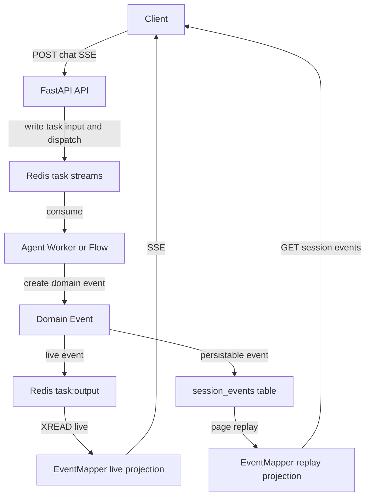
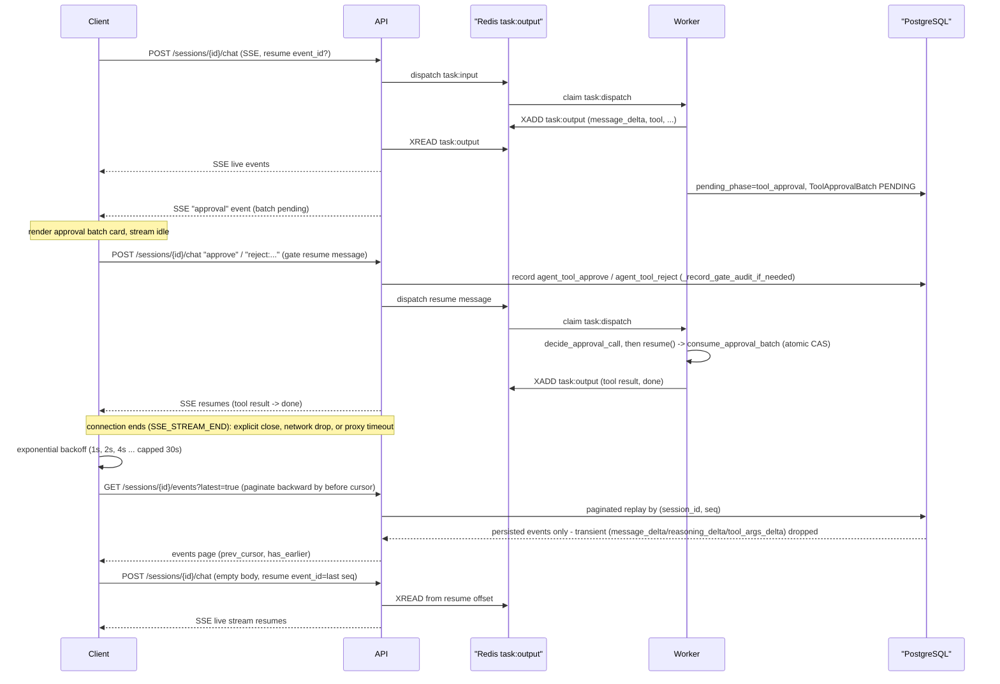
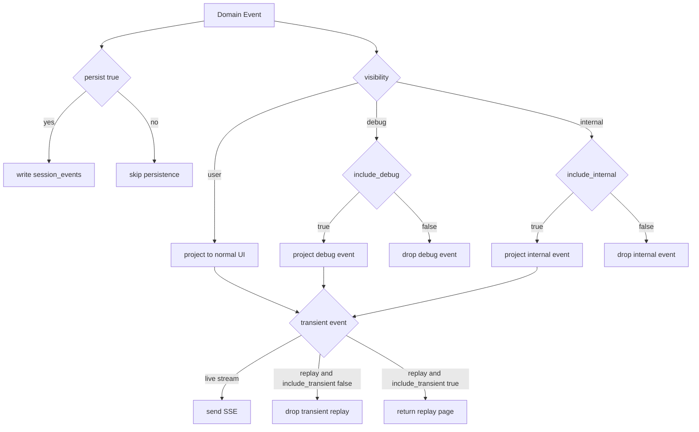

# Event System Design

[简体中文](events.zh-CN.md)

This document is the authoritative reference for OpenCitadel session event system, covering domain events, SSE live contract, projection policy, persistence, and paginated replay.

## Event Pipeline


```mermaid
flowchart TD
  Client["Client"] -->|"POST chat SSE"| Api["FastAPI API"]
  Api -->|"write task input and dispatch"| RedisInput["Redis task streams"]
  RedisInput -->|"consume"| Worker["Agent Worker or Flow"]
  Worker -->|"create domain event"| DomainEvent["Domain Event"]
  DomainEvent -->|"live event"| TaskOutput["Redis task:output"]
  DomainEvent -->|"persistable event"| SessionEvents["session_events table"]
  TaskOutput -->|"XREAD live"| EventMapperLive["EventMapper live projection"]
  SessionEvents -->|"page replay"| EventMapperReplay["EventMapper replay projection"]
  EventMapperLive -->|"SSE"| Client
  EventMapperReplay -->|"GET session events"| Client
```

- **Domain events** are defined in `api/app/domain/models/event.py` and created by Agent, Flow, and TaskRunner.
- **Live channel** uses Redis Stream `task:output:{task_id}`; API forwards via `XREAD` as SSE.
- **Persistence channel** uses append-only `session_events` table, paginated replay by `(session_id, seq)`.
- **SSE projection** is centralized in `EventMapper` at `api/app/interfaces/schemas/event.py`.

## EventMeta

All SSE data must carry unified metadata:

| Field | Description |
|-------|-------------|
| `event_id` | Redis stream id or domain event id |
| `created_at` | Unix timestamp (seconds) |
| `schema_version` | Current event schema version |
| `visibility` | `user` / `internal` / `debug` |
| `channel` | `ui` / `runtime` / `debug` |
| `persist` | Whether persistence is allowed |

Current `EVENT_SCHEMA_VERSION=3`. Legacy payloads are upgraded via `event_upgrader.py` before deserialization.

## SSE Event Catalog

| Event | Description | Default projection |
|-------|-------------|-------------------|
| `clarify` | Agent asks user a clarifying question (ClarifyAgent) | live + replay |
| `message` | Complete user or assistant message | live + replay |
| `message_delta` | Assistant text delta | live |
| `reasoning_delta` | Reasoning content delta | debug live |
| `tool_args_delta` | Tool argument delta | debug live |
| `assistant_notice` | User-facing assistant notice | live + replay |
| `session_status` | Server-authoritative session status | live + replay |
| `debug_item` | Internal debug item | debug replay |
| `title` | Session title update | live + replay |
| `plan` | Plan step snapshot | live + replay |
| `step` | Single execution step status | live + replay |
| `subagent` | Sub-agent delegation status (goal / summary) | live + replay |
| `tool` | Tool call status and result | live + replay |
| `artifact` | Artifact workbench update (write/finalize/share) | live + replay |
| `approval` | Plan or tool approval gate state | live + replay |
| `wait` | Waiting for user input | live + replay |
| `usage` | Token usage delta/summary | live + replay |
| `done` | End of current stream round | live + replay |
| `error` | Error event | live + replay |

The `error` event may optionally carry a `code` field (e.g. `MODEL_UNAVAILABLE`, `EMBEDDING_UNAVAILABLE`, `DOCUMENT_PARSE_FAILED`) for frontend and ops to distinguish error types. See [Model Resilience Design](model-resilience.md) and `api/app/domain/models/error_codes.py` for the full error code list. Frontends should tolerate missing `code` and fall back to displaying the `error` text.

## SSE connect, approval wait, and reconnect

The frontend (`use-session-streams.ts`, `use-session-event-log.ts`) treats the chat SSE connection as disposable and the persisted event log as the source of truth. A `tool_approval` wait is not a special transport state — it is an ordinary `approval` event followed by the stream going quiet until a decision is sent; a network drop is handled the same way as a normal end-of-turn stream close (`SSE_STREAM_END`), just with backoff. The approval decision itself is an ordinary chat message (`GateActionsBar` calls the same `sendMessage`/`sessionApi.chat` path as any other reply), not a separate REST call.


```mermaid
sequenceDiagram
  participant Client
  participant API
  participant Redis as "Redis task:output"
  participant Worker
  participant DB as "PostgreSQL"

  Client->>API: POST /sessions/{id}/chat (SSE, resume event_id?)
  API->>Redis: dispatch task:input
  Redis->>Worker: claim task:dispatch
  Worker->>Redis: XADD task:output (message_delta, tool, ...)
  API->>Redis: XREAD task:output
  API-->>Client: SSE live events
  Worker->>DB: pending_phase=tool_approval, ToolApprovalBatch PENDING
  API-->>Client: SSE "approval" event (batch pending)
  Note over Client: render approval batch card, stream idle
  Client->>API: POST /sessions/{id}/chat "approve" / "reject:..." (gate resume message)
  API->>DB: record agent_tool_approve / agent_tool_reject (_record_gate_audit_if_needed)
  API->>Redis: dispatch resume message
  Redis->>Worker: claim task:dispatch
  Worker->>Worker: decide_approval_call, then resume() -> consume_approval_batch (atomic CAS)
  Worker->>Redis: XADD task:output (tool result, done)
  API-->>Client: SSE resumes (tool result -> done)

  Note over Client,API: connection ends (SSE_STREAM_END): explicit close, network drop, or proxy timeout
  Client->>Client: exponential backoff (1s, 2s, 4s ... capped 30s)
  Client->>API: GET /sessions/{id}/events?latest=true (paginate backward by before cursor)
  API->>DB: paginated replay by (session_id, seq)
  DB-->>API: persisted events only - transient (message_delta/reasoning_delta/tool_args_delta) dropped
  API-->>Client: events page (prev_cursor, has_earlier)
  Client->>API: POST /sessions/{id}/chat (empty body, resume event_id=last seq)
  API->>Redis: XREAD from resume offset
  API-->>Client: SSE live stream resumes
```

The decision-approval step and the reconnect step share the same shape: the API records the durable fact (an `agent_tool_approve`/`agent_tool_reject` audit row, or a caught-up event page) *before* the client re-attaches to the live tail, never after. `decide_approval_call` and the `resume()` call that performs `consume_approval_batch` both run inside the Worker's flow (`react.py`), not the API process — the API's only role in the approval hop is to audit the decision and dispatch it. On reconnect, the client unconditionally runs `syncMissingEvents` (`GET .../events?latest=true`, paginating backward until it reaches the last known persisted sequence) before resuming the live tail with an empty `POST /chat` — this is not a live-vs-replay choice, every reconnect does both steps in that order. The replay call only ever returns events written to `session_events`; the three truly transient types (`message_delta`, `reasoning_delta`, `tool_args_delta`) never reach that table, so a reconnect can lose at most an in-progress text/reasoning delta, never a `wait`/`tool`/`approval`/`done` event. `debug_item` is not transient — it is persisted like any other event and is simply gated behind `include_debug` on both the live and replay paths. After two failed reconnect attempts the UI reports the stream as `stale` rather than retrying silently forever.

## RunOutcome and terminal transition contract

Flows return an explicit `RunOutcome`; generator exhaustion and presentation
events never infer semantic success.

| `RunOutcome.status` | Session terminal event | Redis task mapping |
|---------------------|------------------------|--------------------|
| `succeeded` | `session_status=completed` | `done` |
| `failed` | `session_status=failed` | `failed` |
| `cancelled` | `session_status=cancelled` | `cancelled` |
| `waiting` | `session_status=waiting` | remains `pending` for resume |

`RunOutcome.error` is either null or
`{message, code?, details?}`; `usage` is a numeric counter map. Complete
outcomes are stored inside the PostgreSQL status-event payload for
authoritative reconciliation. The internal `outcome` object is excluded from
Redis/SSE projection; public compatibility fields remain `status`, `reason`,
and `code`.

The durable status state machine is:

| Current state for `run_epoch_id` | Accepted next state |
|----------------------------------|---------------------|
| none | `running` |
| `running` | exactly one of `waiting`, `completed`, `failed`, `cancelled` |
| any terminal | none for the same epoch |
| a later user turn | a new `running` event with a new deterministic epoch |

`waiting` is terminal for the current run epoch, but not completion of the
session or Redis task. `DoneEvent`, `ErrorEvent`, delivery failure, or cleanup
cannot select or overwrite the semantic terminal. PostgreSQL atomically claims
the terminal before Redis publication; a CAS loser rereads and adopts the
durable winner. Thus every run has exactly one persisted terminal
`SessionStatusEvent`.

## Dispatch generations and durable handoff

Task metadata starts with `run_generation=1`, and every dispatch, lease,
heartbeat, status mutation, and reconciliation record carries that generation.
Initial delivery and ordinary redelivery keep it; only creation of a
replacement execution attempt advances it through an expected-generation CAS.

Workers classify claims as `ACK_DUPLICATE`, `EXECUTE`, or `REQUEUE`. A stale
generation, a terminal current generation, or a proven live same-generation
lease cannot execute again. Missing, malformed, future, or unresolved lease
state remains reclaimable. Local execution is keyed by
`(task_id, run_generation)`, so an old worker cannot overwrite a newer
generation or clear its reconciliation proposal.

Retry, orphan recovery, and DLQ replay use durable-first handoff:

1. append the replacement dispatch/DLQ row and obtain its real message ID;
2. atomically advance generation, reset execution fields, record the durable
   dispatch marker, and promote any `RunOutcome` reconciliation proposal;
3. acknowledge the source only after the successor is durably proven.

The same-generation DLQ identity includes status, session, retry count, error
code, and error text. `RecoverableTaskReconciliationRequired` deliberately
leaves the current dispatch unacknowledged. If primary task metadata cannot
store a selected outcome, an internal `run_reconciliation` input envelope is
the durable fallback; it is acknowledged only after PostgreSQL has claimed or
reread the authoritative terminal.

## Resource binding and build-event projection

Every user input snapshots current session bindings in the same transaction as
the message. Ordinary and durable status events copy the immutable four-field
projection:

```json
{
  "binding_id": "binding-id",
  "resource_kind": "knowledge_base",
  "resource_id": "kb-id",
  "version_id": "version-id"
}
```

Historical events without this metadata upgrade in memory to an empty list;
the server never guesses or rewrites their version.

Resource builds have a separate persisted event log and SSE endpoint:
`GET /api/resource-builds/{build_id}/events?after=<seq>`. The outer SSE event
name is `resource-build-event`; every JSON data object has one unified
projection:

| Field | Contract |
|-------|----------|
| `event` | Always `resource_build` |
| `id`, `seq`, `build_id` | Durable event identity and per-build cursor |
| `resource_kind`, `resource_id`, `version_id` | From the owner-scoped authoritative build |
| `phase`, `state`, `progress` | Event transition; progress is a float from 0 through 1 |
| `degraded_reasons` | From the authoritative build; older null values project `[]` |
| `payload`, `created_at` | Event-specific additive data and timestamp |

`after` is inclusive-exclusion: replay returns committed rows with
`seq > after`. Valid cursors are from `0` through the durable
`last_event_seq`; a higher cursor returns a stable 400 before streaming
headers. PostgreSQL is authoritative: the endpoint replays it first, then
subscribes, immediately catches up to close the race, and refetches after every
hint or heartbeat. Redis carries only `{"build_id", "seq"}` and retains no
history. Notification loss, duplication, gaps, ordering, or Redis failure
therefore cannot alter replay. A terminal event—or reconnect exactly at an
already-terminal last cursor—closes the stream without waiting on Redis.

### Ingestion `step` events

Codebase and knowledge-base ingest tasks emit `step` events with stable step ids:

| Step id | Stage | Typical description |
|---------|-------|---------------------|
| `parse` | Document/source parse | Parsing documents or materializing workspace |
| `chunk` | KB chunking | Parent/child chunk build |
| `index` | Vector/BM25 index | Embedding and index write |
| `graph` | GraphRAG | Entity graph build (KB only, when enabled) |
| `analyze` | Codebase static analysis | Symbol/dependency extraction |
| `artifacts` | Codebase artifacts | Architecture Mermaid generation |

Ingest sessions use synthetic ids (`kb-ingest:{kb_id}`, `codebase-ingest:{codebase_id}`). See [Knowledge base ingestion](knowledge-base-ingestion.md) and [Codebase reindex](codebase-reindex.md).

Default UI audience receives only `user`-visible events and `message_delta`. Use `include_debug=true` when diagnostic information is needed.

## Projection Policy

`event_policy.py` provides unified policy:

- `should_persist_event(event)`: decides whether to write to `session_events`.
- `should_project_event(event, include_transient, include_debug, include_internal)`: decides whether to send to the current client.
- `project_events(...)`: batch projection for replay.

Both live SSE and historical replay must use the same projection policy to avoid live/replay inconsistency.


```mermaid
flowchart TD
  Event["Domain Event"] --> PersistCheck{"persist true"}
  PersistCheck -->|"yes"| Persist["write session_events"]
  PersistCheck -->|"no"| SkipPersist["skip persistence"]
  Event --> VisibilityCheck{"visibility"}
  VisibilityCheck -->|"user"| ProjectUser["project to normal UI"]
  VisibilityCheck -->|"debug"| DebugFlag{"include_debug"}
  VisibilityCheck -->|"internal"| InternalFlag{"include_internal"}
  DebugFlag -->|"true"| ProjectDebug["project debug event"]
  DebugFlag -->|"false"| DropDebug["drop debug event"]
  InternalFlag -->|"true"| ProjectInternal["project internal event"]
  InternalFlag -->|"false"| DropInternal["drop internal event"]
  ProjectUser --> TransientCheck{"transient event"}
  ProjectDebug --> TransientCheck
  ProjectInternal --> TransientCheck
  TransientCheck -->|"live stream"| LiveOut["send SSE"]
  TransientCheck -->|"replay and include_transient false"| DropTransient["drop transient replay"]
  TransientCheck -->|"replay and include_transient true"| ReplayOut["return replay page"]
```

## Persistence and Pagination

Events are written to the append-only `session_events` table:

| Field | Description |
|-------|-------------|
| `seq` | Globally incrementing cursor |
| `session_id` | Session id |
| `stream_id` | Redis stream id |
| `type` | Event type |
| `payload` | Raw domain event JSONB |
| `created_at` | Event timestamp |
| `source` | `agent` or `legacy` |

Read APIs:

- `GET /api/sessions/{id}`: returns session details and first event page; `events_next_cursor` indicates subsequent cursor.
- `GET /api/sessions/{id}/events?after=<seq>&limit=100`: incrementally read event pages by cursor.

The legacy `sessions.events` JSONB array serves only as a migration source and compatibility fallback; it is no longer the primary write path for new events.

## Frontend Conventions

Frontend type definitions are in `ui/src/lib/api/types.ts`:

- `EventMeta` is required on all event data.
- `SSEEventData` is a discriminated union by `type`.
- `ui/src/hooks/use-session-detail.ts` first reads the initial event page from `GET /sessions/{id}`, then paginates history using `events_next_cursor`, and finally follows live events via `/chat` SSE.

## Related Documentation

- [Architecture Overview](overview.md)
- [API/SSE Protocol Compatibility](contract-compatibility.md)
- [Knowledge base ingestion](knowledge-base-ingestion.md)
- [Codebase reindex](codebase-reindex.md)
- [Model Resilience Design](model-resilience.md)
