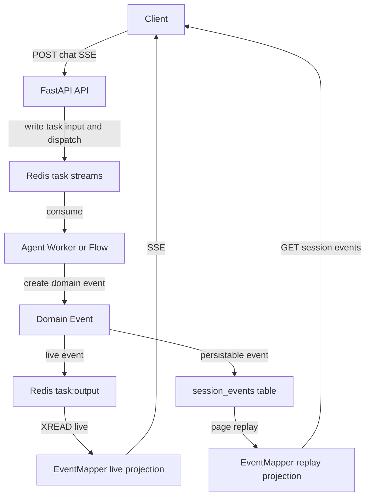
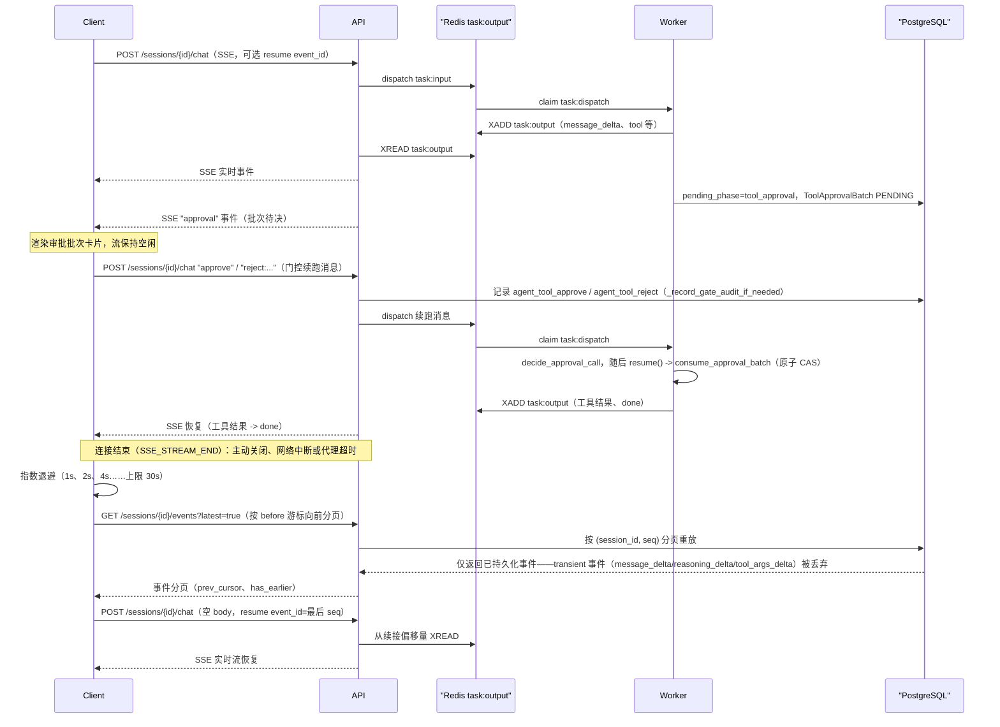
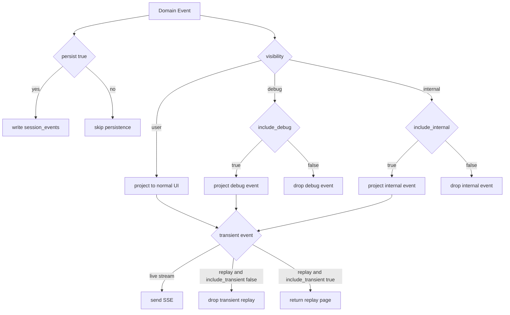

[English](events.md)

# 事件系统设计

本文档是 OpenCitadel 会话事件系统的权威说明，覆盖领域事件、SSE 线上契约、投影策略、持久化与分页重放。

## 事件链路



- **领域事件**定义在 `api/app/domain/models/event.py`，由 Agent、Flow、TaskRunner 创建。
- **实时通道**使用 Redis Stream `task:output:{task_id}`，API 通过 `XREAD` 转发为 SSE。
- **持久化通道**使用追加式 `session_events` 表，按 `(session_id, seq)` 分页重放。
- **SSE 投影**集中在 `api/app/interfaces/schemas/event.py` 的 `EventMapper`。

## EventMeta

所有 SSE data 都必须携带统一元信息：

| 字段 | 说明 |
|------|------|
| `event_id` | Redis stream id 或领域事件 id |
| `created_at` | 秒级时间戳 |
| `schema_version` | 当前事件 schema 版本 |
| `visibility` | `user` / `internal` / `debug` |
| `channel` | `ui` / `runtime` / `debug` |
| `persist` | 是否允许持久化 |

当前 `EVENT_SCHEMA_VERSION=3`。旧 payload 会通过 `event_upgrader.py` 升级后再反序列化。

## SSE 事件目录

| 事件 | 说明 | 默认投影 |
|------|------|----------|
| `clarify` | Agent 向用户询问澄清问题（ClarifyAgent） | live + replay |
| `message` | 用户或助手完整消息 | live + replay |
| `message_delta` | 助手文本增量 | live |
| `reasoning_delta` | 思考内容增量 | debug live |
| `tool_args_delta` | 工具参数增量 | debug live |
| `assistant_notice` | 面向用户的助手提示 | live + replay |
| `session_status` | 服务端权威会话状态 | live + replay |
| `debug_item` | 内部调试项 | debug replay |
| `title` | 会话标题更新 | live + replay |
| `plan` | 计划步骤快照 | live + replay |
| `step` | 单个执行步骤状态 | live + replay |
| `subagent` | 子 Agent 委派状态（goal / 摘要） | live + replay |
| `tool` | 工具调用状态与结果 | live + replay |
| `artifact` | 交付物工作台更新（写入/定稿/分享） | live + replay |
| `approval` | 计划或工具审批门控状态 | live + replay |
| `wait` | 等待用户输入 | live + replay |
| `usage` | Token 用量增量/汇总 | live + replay |
| `done` | 本轮流结束 | live + replay |
| `error` | 错误事件 | live + replay |

`error` 事件可选携带 `code` 字段（如 `MODEL_UNAVAILABLE`、`EMBEDDING_UNAVAILABLE`、`DOCUMENT_PARSE_FAILED`），用于前端与运维区分错误类型。完整错误码列表见 [模型韧性设计](model-resilience.zh-CN.md) 与 `api/app/domain/models/error_codes.py`。前端应容忍缺失 `code` 并按 `error` 文本降级展示。

## SSE 建立、审批等待与断线重连

前端（`use-session-streams.ts`、`use-session-event-log.ts`）把 chat SSE 连接当作一次性资源，把已持久化的事件日志当作真相来源。`tool_approval` 等待并不是特殊的传输态——它只是一个普通的 `approval` 事件，之后流保持安静直到某个决定被发送；网络中断的处理方式与一轮正常结束时的流关闭（`SSE_STREAM_END`）完全相同，只是多了退避重试。审批决定本身就是一条普通的 chat 消息（`GateActionsBar` 走的是与任何其他回复相同的 `sendMessage`/`sessionApi.chat` 路径），而不是单独的 REST 调用。



审批决定这一步与重连这一步形状相同：API 都是先落定持久化事实（一条 `agent_tool_approve`/`agent_tool_reject` 审计记录，或一页补齐的事件），*之后*客户端才重新挂接实时尾部，顺序从不颠倒。`decide_approval_call` 与执行 `consume_approval_batch` 的 `resume()` 调用都运行在 Worker 的 Flow（`react.py`）内部，而不是 API 进程；API 在审批这一跳里唯一的职责是记审计并派发消息。重连时，客户端无条件先跑一次 `syncMissingEvents`（`GET .../events?latest=true`，向前分页直到到达已知的最后持久化序号）补齐断线期间可能产生的缺口，然后再用一个空 `POST /chat` 续接实时尾部——这不是「实时或重放」的二选一，每次重连都会依次做完这两步。重放调用只会返回写入过 `session_events` 的事件；三个真正 transient 的类型（`message_delta`、`reasoning_delta`、`tool_args_delta`）从不落表，因此一次重连最多丢失一段尚未完成的文本/思考增量，绝不会丢 `wait`/`tool`/`approval`/`done` 事件。`debug_item` 并不是 transient——它和其他事件一样会被持久化，只是在实时与重放两条路径上都由 `include_debug` 门控。连续两次重连失败后，UI 会把流状态报告为 `stale`，而不是无限静默重试。

## RunOutcome 与终态转换契约

Flow 显式返回 `RunOutcome`；生成器结束和展示事件都不能隐式推断语义成功。

| `RunOutcome.status` | 会话终态事件 | Redis 任务映射 |
|---------------------|-------------|----------------|
| `succeeded` | `session_status=completed` | `done` |
| `failed` | `session_status=failed` | `failed` |
| `cancelled` | `session_status=cancelled` | `cancelled` |
| `waiting` | `session_status=waiting` | 保持 `pending`，等待恢复 |

`RunOutcome.error` 为 null 或 `{message, code?, details?}`；`usage` 是数值
计数 map。完整 outcome 保存在 PostgreSQL status-event payload 内供权威
对账；内部 `outcome` 对象不会投影到 Redis/SSE，公共兼容字段仍为 `status`、
`reason` 和 `code`。

持久化状态机如下：

| `run_epoch_id` 当前状态 | 允许的下一状态 |
|-------------------------|----------------|
| 无 | `running` |
| `running` | `waiting`、`completed`、`failed`、`cancelled` 中恰好一个 |
| 任意终态 | 同一 epoch 不再接受任何状态 |
| 后续用户轮次 | 使用新的确定性 epoch 写入新的 `running` |

`waiting` 是当前 run epoch 的终态，但不是会话或 Redis 任务的完成。
`DoneEvent`、`ErrorEvent`、投递失败或清理都不能选择或覆盖语义终态。
PostgreSQL 在 Redis 发布前原子 claim 终态；CAS 失败方重新读取并采用持久化
胜者。因此每个 run 恰好有一个持久化终态 `SessionStatusEvent`。

## 调度代次与持久化交接

任务 metadata 从 `run_generation=1` 开始，每个 dispatch、lease、heartbeat、
状态变更和对账记录都携带 generation。初始投递和普通 redelivery 不推进它；
只有创建替代执行尝试时，才通过 expected-generation CAS 推进。

Worker 将 claim 明确分类为 `ACK_DUPLICATE`、`EXECUTE` 或 `REQUEUE`。旧代次、
当前代次已终态或已证明存在同代活 lease 的消息不能再次执行；缺失、损坏、
未来代次或无法确认的 lease 状态保留以供 reclaim。本地执行按
`(task_id, run_generation)` 去重，旧 Worker 不能覆盖新代状态或清除新代
对账 proposal。

重试、孤儿恢复与 DLQ 重放采用 durable-first 交接：

1. 先追加替代 dispatch/DLQ 行并取得真实 message ID；
2. 原子推进 generation、重置执行字段、记录 durable dispatch marker，并迁移
   已有 `RunOutcome` 对账 proposal；
3. 只有证明后继已持久化后才确认源消息。

同代 DLQ identity 同时匹配 status、session、retry count、error code 和 error
text。`RecoverableTaskReconciliationRequired` 会故意保持当前 dispatch
未确认。如果主任务 metadata 暂时无法保存已选 outcome，内部
`run_reconciliation` 输入 envelope 是持久化 fallback；只有 PostgreSQL
成功 claim 或重新读到权威终态后才确认该 envelope。

## 资源绑定与构建事件投影

每条用户输入都在保存消息的同一事务内快照当前 session bindings。普通事件
和持久化 status 事件复制以下不可变四字段投影：

```json
{
  "binding_id": "binding-id",
  "resource_kind": "knowledge_base",
  "resource_id": "kb-id",
  "version_id": "version-id"
}
```

缺少该 metadata 的历史事件只在内存中升级为空列表；服务端不会猜测版本，
也不会重写旧事件。

资源构建使用独立持久化事件日志和 SSE 端点：
`GET /api/resource-builds/{build_id}/events?after=<seq>`。外层 SSE event 名为
`resource-build-event`；每个 JSON data 对象使用同一投影：

| 字段 | 契约 |
|------|------|
| `event` | 固定为 `resource_build` |
| `id`、`seq`、`build_id` | 持久化事件 identity 与每 build 游标 |
| `resource_kind`、`resource_id`、`version_id` | 来自 owner-scoped 权威 build |
| `phase`、`state`、`progress` | 事件转换；progress 为 0 到 1 的浮点数 |
| `degraded_reasons` | 来自权威 build；旧 null 值投影为 `[]` |
| `payload`、`created_at` | 事件专属增量数据与时间戳 |

`after` 采用排除式游标：返回 `seq > after` 的已提交记录。合法范围为 `0`
到持久化 `last_event_seq`；更大的游标在发送 stream headers 前稳定返回
400。PostgreSQL 是权威源：端点先重放数据库，再订阅并立即 catch-up 关闭
竞争窗口，此后每个 hint 或 heartbeat 都重新查询。Redis 只携带
`{"build_id", "seq"}`，不保存历史，因此通知丢失、重复、乱序、缺口或 Redis
失败都不改变重放。读到终态事件，或重连游标恰好等于已终态的最后游标时，
stream 立即关闭且不会等待 Redis。

### 摄取 `step` 事件

Codebase 与知识库摄取任务发出固定 step id 的 `step` 事件：

| Step id | 阶段 | 典型描述 |
|---------|------|----------|
| `parse` | 文档/源码解析 | 解析文档或 materialize 工作区 |
| `chunk` | KB 分块 | 父子块构建 |
| `index` | 向量/BM25 索引 | 向量化与索引写入 |
| `graph` | GraphRAG | 实体图构建（仅 KB，启用时） |
| `analyze` | Codebase 静态分析 | 符号/依赖抽取 |
| `artifacts` | Codebase 产物 | 架构 Mermaid 生成 |

摄取 session 使用合成 id（`kb-ingest:{kb_id}`、`codebase-ingest:{codebase_id}`）。见 [知识库摄取](knowledge-base-ingestion.zh-CN.md) 与 [Codebase 重新索引](codebase-reindex.zh-CN.md)。

默认 UI 受众只接收 `user` 可见事件和 `message_delta`。需要诊断信息时，请使用 `include_debug=true`。

## 投影策略

`event_policy.py` 提供统一策略：

- `should_persist_event(event)`：决定是否写入 `session_events`。
- `should_project_event(event, include_transient, include_debug, include_internal)`：决定事件是否发送给当前客户端。
- `project_events(...)`：批量投影，用于 replay。

实时 SSE 与历史 replay 都必须通过同一投影策略，避免 live/replay 行为不一致。



## 持久化与分页

事件写入使用 `session_events` 追加表：

| 字段 | 说明 |
|------|------|
| `seq` | 全局递增游标 |
| `session_id` | 会话 id |
| `stream_id` | Redis stream id |
| `type` | 事件类型 |
| `payload` | 原始领域事件 JSONB |
| `created_at` | 事件时间 |
| `source` | `agent` 或 `legacy` |

读取接口：

- `GET /api/sessions/{id}`：返回会话详情和首个事件页，`events_next_cursor` 表示后续游标。
- `GET /api/sessions/{id}/events?after=<seq>&limit=100`：按游标增量读取事件页。

旧的 `sessions.events` JSONB 数组只作为迁移来源和兼容 fallback，不再作为新增事件的主写入路径。

## 前端约定

前端类型定义在 `ui/src/lib/api/types.ts`：

- `EventMeta` 为所有事件 data 的必备字段。
- `SSEEventData` 是按 `type` 区分的联合类型。
- `ui/src/hooks/use-session-detail.ts` 会先读取 `GET /sessions/{id}` 的首屏事件，再使用 `events_next_cursor` 分页补齐历史事件，最后通过 `/chat` SSE 追实时事件。

## 相关文档

- [系统架构](overview.zh-CN.md)
- [API/SSE 协议兼容策略](contract-compatibility.zh-CN.md)
- [知识库摄取](knowledge-base-ingestion.zh-CN.md)
- [Codebase 重新索引](codebase-reindex.zh-CN.md)
- [模型韧性设计](model-resilience.zh-CN.md)
