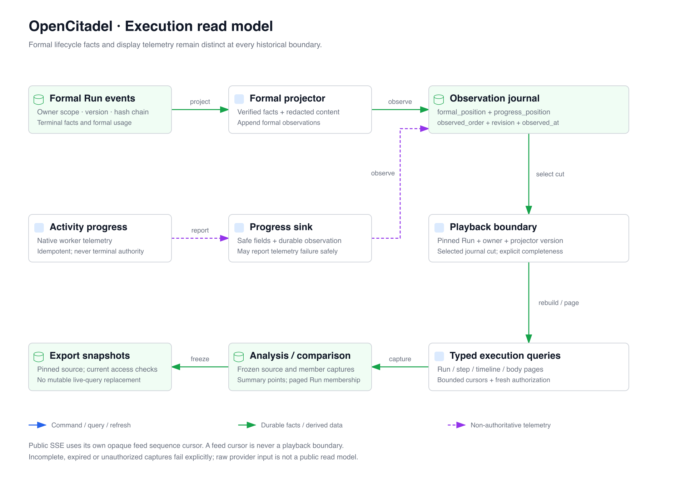

# Execution Read Models and Analysis

[简体中文](execution-analysis.zh-CN.md)

Execution visualization is a read side of the execution kernel. Run workbenches,
analysis summaries, comparisons, and exports read scoped, versioned facts; none
of them determines whether a Run, invocation, or evaluation result succeeded.

## Read-model flow

The PostgreSQL execution-view projection combines formal execution facts and
sanitized public progress observations. A `PlaybackBoundary` records the selected
Run, observed order, formal and progress positions, projector version, and
projection revision. Live and historical views use this boundary to reconstruct
the same public entities. Checkpoints and shadow generations accelerate reads;
missing intervals and incomplete fields remain explicit in `completeness`.
An observation of progress does not replace formal terminal or accounting facts.

The API provides Run lists, a composite view, Step lists/details, timelines, events,
and bounded content reads. These resources share a selected cut where the contract
requires one. Playback, Step-page, body-page, and SSE-resume cursors have different
purposes and cannot be substituted for each other. A caller must preserve opaque
cursors, the selected boundary, and revision rather than decode or invent them.

## Scope and current authority

All routes derive principal and workspace scope from authenticated server context.
Execution read grants, owner/team constraints, and database authorization remain
mandatory on reads. Typed signed database operations expose analysis and comparison
facts without granting the runtime raw access to private capture tables.

Capture transactions use `REPEATABLE READ` to collect a consistent fact set.
Current-authority checks use a fresh `READ COMMITTED` transaction. An immutable
capture fixes the facts; it does not freeze permission or entitle the caller to
continue reading after membership, coverage, or resource authority changes.
Analysis checks current authority after capture and on both sides of Run paging.
Comparison reads check it after assembling retained details and alignments;
body and export paths have their own current-authority barriers.

Authorization or coverage changes fail closed. Missing retained data is reported
as unavailable or requiring refresh; the service does not silently substitute a
new live selection. Retention pins keep the original comparison resources available
while their owner is valid, without granting additional access.

## Analysis captures and chart facts

`GET /execution-analysis/summary` parses explicit filters, time range, hour/day
grain, and timezone. Workspace timezone preference takes precedence where configured;
requested zones are still validated. The result includes an opaque watermark,
metric version, coverage, capture time, and typed metrics. Reusing a watermark
requires the same query and compatible metric version. Old captures without the
required chart facts require refresh rather than reconstruction from current data.

The caller-bound application cache holds at most 32 captures for 30 seconds and
performs a fresh authority check even on a cache hit. Database captures declare a
15-minute TTL, at most 20 active captures per caller, up to 100,000 primary members,
and up to 1,000,000 accounting members. These are enforced implementation limits,
not evidence that the full reference workload has passed acceptance.

`GET /execution-analysis/runs` pages the capture's Run members, at most 200 per
request. Its encrypted cursor binds scope, caller, watermark, and ordinal.
Chart facts and scalar evaluation rows are captured through bounded internal database
operations and returned in the summary's typed charts and evaluation series; there
is no separate public analysis chart-points endpoint. Evaluation batch summaries
have their own cursor-based paging contract.

Metric values preserve units, numerators, denominators, sample counts, missing
counts, and excluded counts. Success, cancellation, unknown outcomes, execution
errors, and business errors are distinct. Accounting explicitly selects `run`,
`selected_result`, or `batch_total` grain and distinguishes subject and Judge physical
usage. Evaluation series reuse the evaluation snapshot derivation and include its
revision, usage watermark, scoring source, dimension, rubric, and cost basis.

Comparability includes Run family, dataset version, execution mode, environment
version, rubric, metric version, scoring source, dimension, and applicable dimensions.
Configuration contrasts use paired case means inside one comparable stratum. The
seeded bootstrap interval is descriptive and only supplied with enough paired cases.
The UI retains missing observations and chooses sparse alternatives: fewer than
eight observed trend buckets use discrete points, fewer than 20 latency samples
use exact values, fewer than five cases use points instead of a box, and fewer than
12 complete cases use a table instead of a scatter plot.

## Fixed comparison revisions

`POST /execution-comparisons` captures explicit Runs or all matching members.
Materialization acquires resource pins, captures retained evaluation points, and
publishes the revision in one transaction. Reads require that exact revision and
page members with an owner-bound cursor. Up to five selected Runs can provide
retained details alongside the member page.

Refresh is a command with an expected revision and creates a new immutable revision.
Manual Step alignments have a separate expected alignment revision and idempotent
request identity; they do not rewrite the underlying execution cut. Automatic
alignment suggestions use retained Step identities and remain suggestions until
confirmed. Artifact differences are asynchronous leased jobs tied to exact retained
artifact versions; their output pages have a separate cursor.

Retained input, output, and artifact bodies are read in bounded UTF-8 pages and
sanitized before return. Current authority is checked around body access. A retained
preview limit or unavailable binary body is explicit; it never authorizes a fallback
to a newer artifact or a different Run.

## Export lifecycle

`POST /execution-analysis/exports` accepts a caller-private filter, comparison, or
batch selection and returns an asynchronous Job. A filter export fixes its selection;
a comparison export names a revision; a batch export carries its evaluation cut.
Request fingerprints prevent an idempotency key from silently accepting another
intent. Auditor principals cannot create exports or mutate comparisons.

The export worker claims a durable lease, reads bounded pages, writes private
immutable chunks under durable write intent, and validates current authority before
publishing the manifest. The downloader acquires a use lease, checks ordered chunks,
sizes and SHA-256 digests into an anonymous local spool, and obtains a fresh authority
proof after provider reads before releasing bytes. It releases retention use before
streaming the verified spool. The endpoint serves one authenticated CSV/JSON response
with `Cache-Control: no-store`, not a public object-storage URL. Spreadsheet-dangerous
text is escaped in CSV; typed numeric columns preserve numeric encoding.

## Implementation and validation boundary

Read-model, paging, authority, retention, comparison, and export behavior is implemented
in the modules below. Full AC21 capacity acceptance still requires the prescribed
reference environment and multi-round native evidence, including collection, cleanup,
and reuse. Bounded queries and individual pressure tests do not complete that gate.

## Key locations

- `api/app/application/services/execution_view_service.py`: public view and cursor contracts
- `api/app/infrastructure/execution/postgres_execution_view.py`: boundary reconstruction and generations
- `api/app/application/services/execution_analysis_service.py`: caller cache and fresh authority barriers
- `api/app/infrastructure/repositories/db_execution_analysis_repository.py`: signed captures and metric assembly
- `api/app/infrastructure/repositories/db_analysis_native.py`: fixed member paging
- `api/app/infrastructure/repositories/db_analysis_points.py`: bounded evaluation point capture and pins
- `api/app/domain/analysis/`: chart facts, comparability, metrics, retained point adaptation
- `api/app/application/services/execution_comparison_service.py`: revision reads, refresh, alignments, diff jobs
- `api/app/infrastructure/repositories/db_execution_comparison_repository.py`: materialization and retention
- `api/app/application/services/comparison_body_service.py`: retained body authorization and sanitization
- `api/app/application/services/execution_export_worker.py`: leased generation and manifest publication
- `api/app/application/services/execution_export_download.py`: verified private download
- `api/app/interfaces/endpoints/execution_{view,analysis,comparison,export}_routes.py`: HTTP/SSE boundaries
- `ui/src/components/analysis/` and `ui/src/lib/analysis-view/`: fixed capture rendering and navigation
