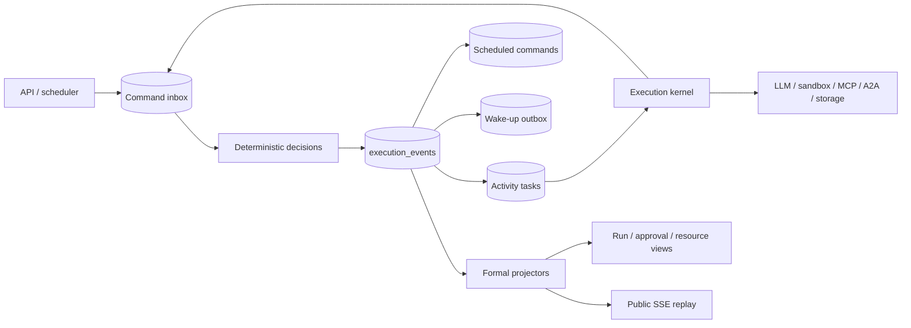

# Event-Sourced Execution Kernel

[简体中文](execution-kernel.zh-CN.md)

OpenCitadel has one execution runtime for Agent, Ask, knowledge ingestion,
codebase analysis, automation, patrol, and remediation. PostgreSQL execution
events are the only lifecycle authority. Product tables store content and query
projections; Redis is only a disposable wake-up transport.

## Runtime topology

The API validates identity and owner scope, persists a command, and returns or
streams projections. It never executes workflow steps. The execution-kernel
process claims database work, calls registered Activity handlers, and reports
outcomes through new commands. A lost Redis notification is recovered by
polling pending PostgreSQL rows.

## Authoritative records

- `execution_events` is the append-only fact log. Every stream has an owner
  scope, monotonically increasing version, and verified hash chain.
- `execution_command_inbox` makes command submission idempotent and records a
  stable accepted or rejected result.
- `execution_activity_tasks` persists request generation, claim fencing,
  call-start, heartbeat, outcome, and unknown-outcome state.
- `execution_scheduled_commands` persists timers and cancellation.
- `execution_outbox` persists post-commit wake-ups. Delivery may repeat without
  changing business semantics.
- snapshots accelerate replay; each snapshot is integrity-checked and an
  invalid snapshot falls back to verified event replay.

`execution_run_projection`, `execution_resource_build_projection`, approval
and activity projections, and `execution_public_events` are rebuildable. They
may lag but cannot create facts or decide terminal state.

## Run and Activity protocol

Every production behavior is a `Run` in one of seven families: `agent`, `ask`,
`kb_ingest`, `codebase_ingest`, `automation`, `patrol`, or `remediation`.
A Run accepts typed commands and produces typed events through a pure decision
handler. Only one terminal event can be accepted.

All nondeterministic work is an Activity. The request and invocation identity
are committed before an external call. A repeated delivery for the same
invocation reuses its persisted result; a new invocation executes even when
its arguments match a previous one. Claim generation fences stale workers.
Timeout, retry, approval, cancellation, and unknown outcome are explicit
states, never inferred from process death or transport metadata.

External writes require a persisted policy snapshot and formal approval before
call-start. Approval decisions use dedicated command endpoints and projections;
chat text cannot bypass the gate.

## Resource candidates

Knowledge and codebase rebuilds have one artifact authority: their immutable
candidate version. The candidate carries `build_id`, request idempotency key,
state, capability result, metrics, and publication timestamp. Build lifecycle
and progress come exclusively from the source Run projection.

At most one `building` candidate exists per resource. Publication validates the
complete candidate closure and compare-and-swaps `active_version_id`. Failures
and cancellation mark only the candidate; the active published version remains
readable. Session resource bindings pin a concrete published version.

## Public events and recovery

SSE live delivery and replay read the same sanitized public-event projection.
The cursor is the formal event position; reconnecting does not change workflow
state. Private Activity inputs and provider payloads never enter the public
projection.

Recovery always starts from PostgreSQL: verify the event chain, load a valid
snapshot when available, replay later events, and reclaim expired database
work. Redis loss, process restart, and duplicate delivery are expected
conditions. If integrity or owner scope validation fails, execution stops
closed and emits operational evidence.

## Runtime ownership and shutdown

`app.composition.kernel` constructs one immutable `KernelRuntime`; it never
shares the API's resources. Its `TaskSupervisor` owns the execution loop,
heartbeat, scheduler, policy listener, sandbox pool, and maintenance loops.
Critical-task failure requests process shutdown, while an auxiliary listener
may restart under its declared bounded policy.

The health marker is written atomically by the owned heartbeat and removed in
its `finally` block. Readiness requires that marker, a ready Runtime Policy,
the execution schema, and the dedicated database role; liveness checks only
the process identity and marker freshness. On SIGTERM the supervisor first
revokes readiness, then cancels and waits for owned tasks within
`OPENCITADEL_SHUTDOWN_TIMEOUT_SECONDS`.

Every execution mutation follows the same transaction rule as the API:
repositories flush but never commit, application code calls `uow.commit()`,
and an uncommitted context exit rolls back. Outbox delivery and Redis wake-ups
are post-commit effects.

## Process and privilege boundaries

- API role: submit commands and read owner-scoped projections.
- Execution role: append events, claim Activities/timers/outbox, and update
  formal projections.
- Migration role: schema ownership and DDL only.
- PostgreSQL bootstrap role: provisions the narrower roles; applications do not
  own execution tables.

Row-level security is enabled and forced on every owner-scoped execution table.
The store rejects an append whose context differs from the existing stream
scope even when the caller has system authorization.
