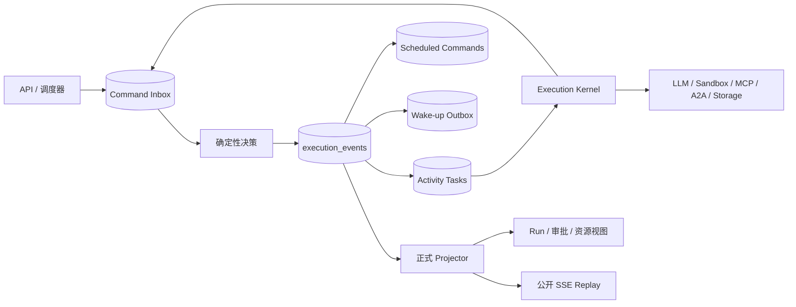

# 事件溯源执行内核

[English](execution-kernel.md)

OpenCitadel 使用一套执行运行时承载 Agent、Ask、知识库摄取、自动化、
Patrol 与 Remediation。PostgreSQL 执行事件是唯一生命周期事实来源；产品表只保存
内容与查询投影，Redis 只承担可丢失的唤醒通知。

## 运行拓扑

API 只校验身份与 OwnerScope、持久化 Command、返回或流式读取投影，不直接执行工作流。
Execution Kernel 进程认领数据库工作，调用注册的 Activity Handler，再通过新 Command
报告结果。Redis 通知丢失后，由 PostgreSQL 待处理行轮询恢复。

## 权威记录

- `execution_events` 是追加式事实日志；每条 Stream 都有 OwnerScope、单调版本与可验证哈希链。
- `execution_command_inbox` 保证 Command 幂等，并保存稳定的接受或拒绝结果。
- `execution_activity_tasks` 保存请求代次、认领 fencing、call-start、心跳、结果与未知结果状态。
- `execution_scheduled_commands` 保存 Timer 及其取消状态。
- `execution_outbox` 保存提交后的唤醒；允许重复投递，但不得重复产生业务事实。
- Snapshot 只用于加速；读取时校验完整性，失效时回退到已验证的事件重放。

`execution_run_projection`、`execution_resource_build_projection`、审批与 Activity 投影以及
`execution_public_events` 都可重建。它们可以短暂落后，但不能产生事实或决定终态。

## 水平扩展与单一写者投影

多个执行内核副本可安全地对同一数据库运行：

- **Inbox `SKIP LOCKED`。** Command Inbox 认领使用 `FOR UPDATE SKIP LOCKED`，副本认领互不
  相交的行，而非争抢同一批。
- **安全水位投影。** 投影器只推进到稳定快照水位（`pg_snapshot_xmin`）以下的 Position，因此
  在途事务后乱序提交的事件绝不会被跳过。按 Owner Scope 的 `execution_scope_head` 表记录各
  Scope 的 Head Position；待处理 Scope 发现退化为 `head > checkpoint` 索引查询而非扫描。
- **产品状态单一写者。** 产品表上的执行权威列（Session/Patrol 状态、
  `active_execution_run_id` 等）只由投影器写入，应用服务读投影。每个此类投影行带
  `last_event_position` 列，投影器的 `UPDATE` 由 `WHERE last_event_position IS NULL OR <
  :position` 守卫，慢或重复的投影绝不会覆盖更新的状态。
- **毒行隔离。** 无法处理的 Decision 行按 `run_id` 隔离到 `execution_poisoned_runs` 并计数
  （`execution_poisoned_runs_total`），而不作废整批；每个控制面 Lane 也隔离自身失败，一个
  Lane 不会拖垮其他 Lane。

## Run 与 Activity 协议

所有生产行为都属于六类 Run：`agent`、`ask`、`kb_ingest`、
`automation`、`patrol`、`remediation`。Run 通过纯 Decision Handler 接受类型化 Command、
产生类型化 Event，并且只能接受一个终态事件。

所有非确定性工作都建模为 Activity。外部调用前先提交请求与 Invocation 身份；同一
Invocation 的重复投递复用持久化结果，新 Invocation 即使参数相同也必须重新执行。
Claim generation 隔离过期 Worker。超时、重试、审批、取消和未知结果都是显式状态，
不能从进程死亡或传输元数据推断。

外部写操作必须在 call-start 前持久化策略快照并获得正式审批。审批通过专用 Command
端点和投影处理，聊天文本不能绕过门控。

## 资源候选版本

知识库重建只有一个制品状态来源：不可变候选版本。候选版本保存 `build_id`、
请求幂等键、制品状态、能力结果、指标与发布时间；构建生命周期和进度只来自源 Run 投影。

每个资源最多存在一个 `building` 候选。发布前验证完整闭包，并对 `active_version_id`
执行 CAS。失败或取消只标记候选版本，不影响当前已发布版本。Session Resource Binding
固定到一个具体的已发布版本。

## 公开事件与恢复

SSE 实时流和 replay 读取同一份脱敏公开事件投影，cursor 即正式事件 position；重连不会
改变工作流状态。Activity 私有输入和 Provider 原始载荷不得进入公开投影。

恢复始终从 PostgreSQL 开始：校验事件链、读取有效 Snapshot、重放后续事件、重新认领
过期数据库工作。Redis 丢失、进程重启和重复投递都属于正常故障模型。完整性或 OwnerScope
校验失败时必须 fail-closed，并产生运维证据。

## 运行时所有权与关闭

`app.composition.kernel` 构建一个不可变 `KernelRuntime`，不会与 API 共享资源。
`TaskSupervisor` 持有执行循环、Heartbeat、Scheduler、Policy Listener、Sandbox Pool 与
Maintenance Loop。关键任务失败会请求进程关闭；辅助监听器只按声明的有界策略重启。

健康 Marker 由归属明确的 Heartbeat 原子写入，并在其 `finally` 中删除。Readiness 同时要求
Marker、Runtime Policy、执行 Schema 与专用数据库角色就绪；Liveness 只检查进程身份和
Marker 新鲜度。收到 SIGTERM 后，Supervisor 先撤销就绪状态，再在
`OPENCITADEL_SHUTDOWN_TIMEOUT_SECONDS` 内取消并等待全部归属任务。

每个执行 Mutation 与 API 遵守相同事务规则：Repository 只 flush、永不 commit，Application
调用 `uow.commit()`；Context 未提交即退出时 rollback。Outbox 投递与 Redis 唤醒均为
post-commit Effect。

## 进程与权限边界

- API Role：提交 Command、读取 OwnerScope 投影。
- Execution Role：追加事件、认领 Activity/Timer/Outbox、更新正式投影。
- Migration Role：只负责 schema ownership 与 DDL。
- PostgreSQL Bootstrap Role：创建最小权限角色；应用进程不拥有执行表。

所有 OwnerScope 执行表都启用并强制 RLS。即使调用方拥有 system authorization，Event Store
也会拒绝与既有 Stream OwnerScope 不一致的追加。
