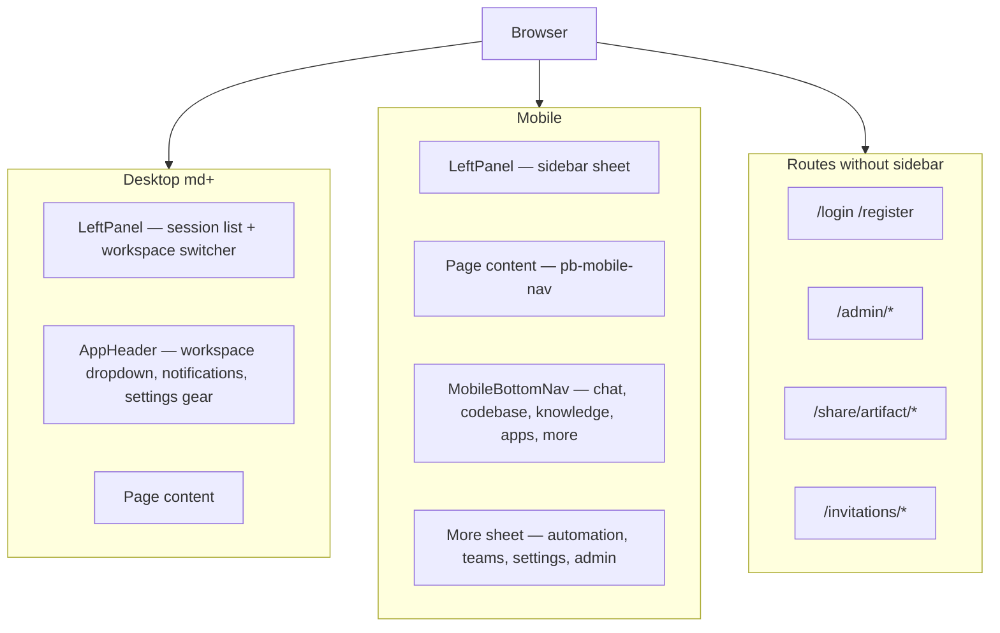
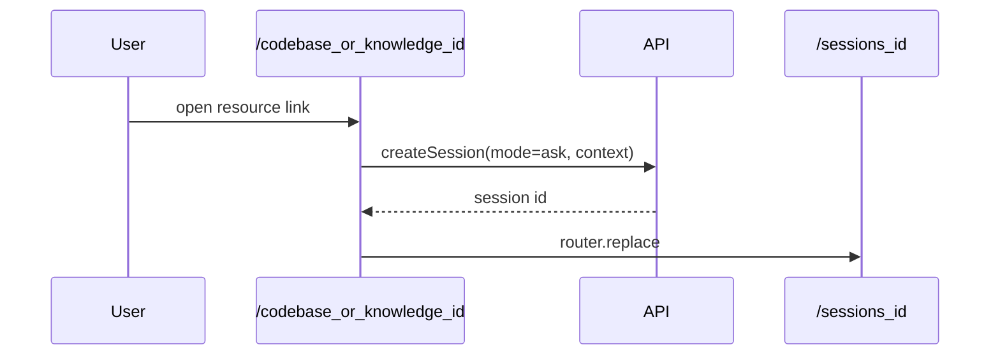
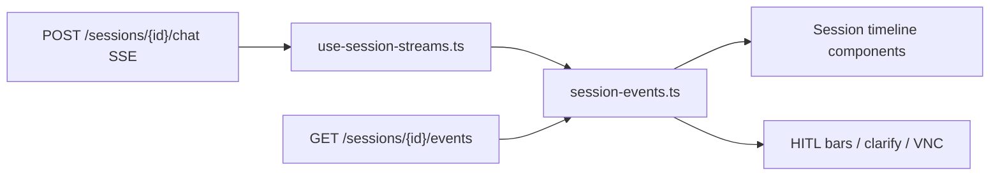
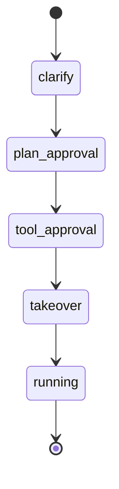

# Frontend UI Architecture

[简体中文](frontend-ui.zh-CN.md)

This document describes the Next.js UI shell, settings modal, API client, SSE event projection, and HITL component mapping.

## Shell layout

Implementation: `ui/src/components/app-shell.tsx`, `left-panel.tsx`, `app-header.tsx`, `mobile-bottom-nav.tsx`.

**Navigation split**

- **Desktop**: Codebase, Knowledge, Marketplace, and Automation live in the **header workspace dropdown** (`app-header.tsx`).
- **Mobile**: the first four modules are in `MobileBottomNav`; Automation, Teams, Settings, and Admin are in the **More** sheet.
- **Session toolbar** (model, Skill, context): inline on desktop; collapsed into `ChatOptionsSheet` on mobile.

## Settings modal (eight tabs)

| Tab key | Component | Access |
|---------|-----------|--------|
| `common-setting` | `GeneralSettings` — theme + language | All users |
| `agent-setting` | `AgentSettings` — max_iterations/retries/search | All users |
| `models-setting` | `ModelsSettings` — endpoints + models | All users |
| `skills-setting` | `SkillsSettings` | All users |
| `memory-setting` | `MemorySettings` | All users |
| `integrations-setting` | MCP + A2A + `ServiceKeysSettings` | All users |
| `hitl-setting` | `HitlSettings` — plan/tool gates, gate profile | Global fields admin-only; users can clear overrides |
| `runtime-setting` | `RuntimeSettings` (feature flags, scheduler, server) | Admin only |

Entry points:

- Account menu → Settings (opens last tab or default)
- Header gear icon → opens **Models** tab directly (`openSettings("models-setting")`)
- `SettingsDialogProvider`

Hook: `use-open-citadel-settings.ts`.

## Codebase / knowledge detail routes

`/codebase/[id]` and `/knowledge/[id]` do **not** render standalone detail pages. They create an Ask session bound to the resource and `replace` to `/sessions/{id}`.

## SSE event projection

| SSE event | UI component / behavior |
|-----------|-------------------------|
| `clarify` | `clarify-questions.tsx` |
| `plan` | `plan-approval-bar.tsx`, `plan-panel.tsx` |
| `tool` + gate | `gate-actions-bar.tsx`, `approval-bar.tsx` |
| `wait` | Input disabled until resume |
| `artifact` | Artifact workbench panel |
| `session_status` | Session status badge |
| takeover phase | `vnc-overlay.tsx`, `vnc-viewer.tsx` |

Domain event catalog: [Events](events.md).

## HITL component map

| `pending_phase` | UI | Resume prefixes |
|-----------------|-----|-----------------|
| `clarify` | `clarify-questions.tsx` | User text answer |
| `plan_approval` | `plan-approval-bar.tsx` | `approve`, `approve_with_edits`, `reject:` |
| `tool_approval` | `gate-actions-bar.tsx` | `approve`, `reject:` |
| `takeover` | VNC overlay | `takeover`, `skip` |

Session-level HITL defaults and overrides: `hitl-settings.tsx` (Settings → HITL).

Checkpoint restore: `checkpoint-restore-dialog.tsx` → `POST /api/sessions/{id}/checkpoints/{id}/restore`.

Web Operator scope: `operator-scope-dialog.tsx` on home/session when Skill is `web-operator`.

See [Checkpoints & HITL](checkpoints-and-hitl.md).

## Session context panels

When a session binds a codebase or knowledge base, `SessionContextPanel` shows:

- **Codebase**: file tree, symbol search, Mermaid architecture artifacts (`codebase-context-panel.tsx`)
- **Knowledge**: document/snippet preview (`knowledge-context-panel.tsx`)

Desktop: fixed side panel. Mobile: bottom sheet.

## Notifications

`NotificationInbox` in the header polls REST and subscribes to `/notifications/stream` SSE, linking to sessions or the automation page.

## API client

- **Fetch layer**: `lib/api/fetch.ts` — cookies, CSRF double-submit, `X-Workspace-Id`, 401 refresh queue, SSE parser
- **Modules**: see [UI README](../../ui/README.md#api-client)
- **Types**: `lib/api/types.ts` — `ClarifyQuestion`, `LLMEndpoint`, `operator_scope`, etc.

## Internationalization

- `next-intl` with `localePrefix: "never"`; locale in `NEXT_LOCALE` cookie
- Source keys: `scripts/build-messages.mjs` (+ `i18n-supplement.mjs` for drift backfill); CI check: `npm run i18n:check`
- Theme and language: **Settings → General** (`GeneralSettings`); no standalone header toggle

## LLM status UI

- Polls `GET /api/llm/status` (`llm-status.ts`)
- Badge in AppHeader; also surfaced on Marketplace when providers degraded

## Related documentation

- [UI README](../../ui/README.md)
- [Events](events.md)
- [LLM endpoints and models](llm-endpoints-and-models.md)
- [Contract compatibility](contract-compatibility.md)
- [Skills](skills.md)
