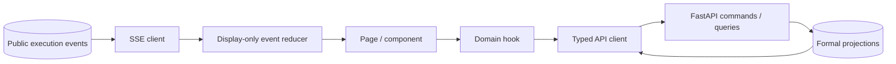

# Frontend UI Architecture

[简体中文](frontend-ui.zh-CN.md)

The Next.js application is a typed command/projection client for the execution
kernel. It does not host a workflow state machine.

## Data flow

```mermaid
flowchart LR
  Page[Page / component] --> Hook[Domain hook]
  Hook --> Client[Typed API client]
  Client --> API[FastAPI commands / queries]
  API --> Projection[(Formal projections)]
  Projection --> Client
  Public[(Public execution events)] --> SSE[SSE client]
  SSE --> Reducer[Display-only event reducer]
  Reducer --> Page
```

Mutation functions live in `src/lib/api`; hooks coordinate request lifecycle;
components render state and collect user intent. SSE live and replay share one
sanitized event type. An opaque cursor is stored and returned without parsing.
Disconnect, retry, and stale-view state affect presentation only.

## Session surface

The session timeline renders user/assistant messages, Activity progress,
approval waits, tool results, formal errors, resource references, and terminal
state. Deltas merge only into their matching public event identity. Unknown
public kinds render conservatively and cannot trigger actions.

Approval bars call the dedicated approval API for a persisted batch. The UI
shows frozen subject labels and policy information; it cannot alter invocation
arguments. VNC gives the user interactive access to the isolated sandbox but
does not itself mark an Activity successful.

Session deletion is rejected while a formal Run is active. Resource context
shows the exact published knowledge-base version bound to the session.

## Resource builds

Knowledge-base pages use one candidate-build model: create candidate,
observe formal progress, retry/cancel when the projection permits, and publish
atomically. The active published version remains visible during a failed or
cancelled candidate. Document reads require an explicit version and document
revision.

## Authorization UX

Workspace selection is sent as `X-Workspace-Id`; the server remains the
authority. Auditor views are read-only. Admin-only settings and controls are
hidden, but hiding is never treated as authorization. Cross-scope not-found
responses are not distinguished from absent resources.

Authenticated resource data is owned by `ClientDataProvider`, never by module
globals. The cache key is exactly `userId + workspaceId`; logout and workspace
changes invalidate the previous generation before navigation or exposure of
the next scope. Anonymous views cannot read authenticated entries, and a late
promise cannot restore invalidated data.

## Internationalization and quality

`ui/messages/en.json` and `ui/messages/zh.json` are the authoritative catalogs.
The AST-based checker rejects locale mismatch, missing or unused keys, unknown
dynamic calls, orphan dynamic expansions, and hardcoded user-facing text.
Runtime API error and notification keys are shared through
`contracts/i18n-runtime-keys.json` and verified against Python emitters. CI also
runs Prettier, TypeScript, ESLint, Vitest, and the production Next.js build. API
types live under `src/lib/api/types`; no independent browser schema is maintained.

## Key locations

- `src/hooks/use-session-streams.ts`: stream lifecycle and cursor handling
- `src/lib/session-events.ts`: public event normalization/display reduction
- `src/components/session/`: timeline, approval, error, VNC, artifacts
- `src/components/resource/`: build candidate and version state
- `src/lib/api/`: authenticated HTTP/SSE contract
- `src/lib/data/scoped-resource-cache.ts`: scope/generation cache primitive
- `src/providers/client-data-provider.tsx`: authenticated cache ownership
- `src/components/open-citadel-settings.tsx`: settings composition
