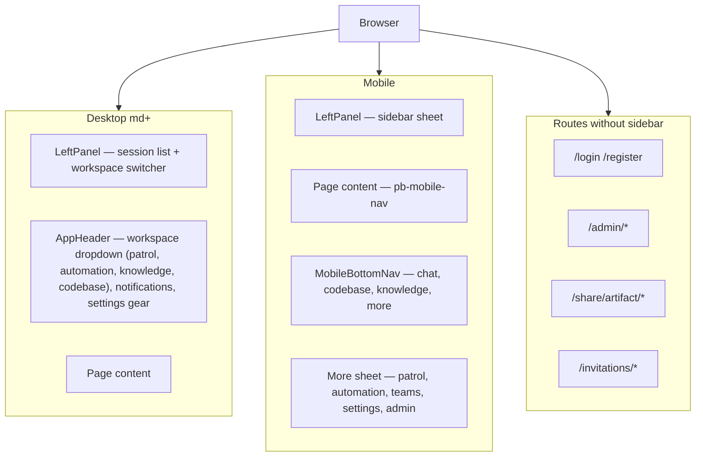
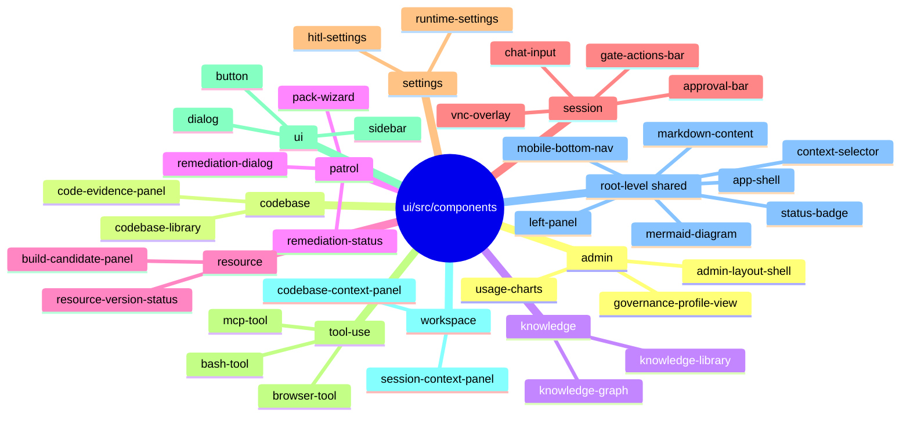
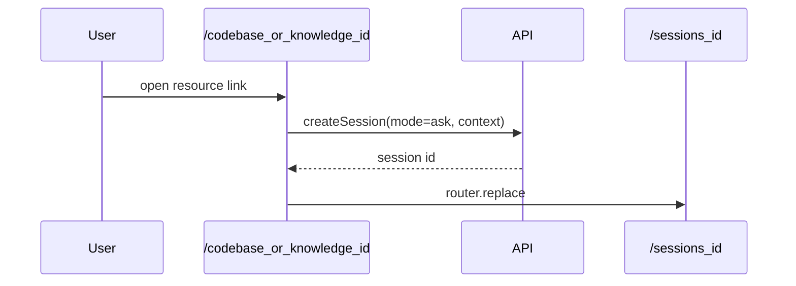
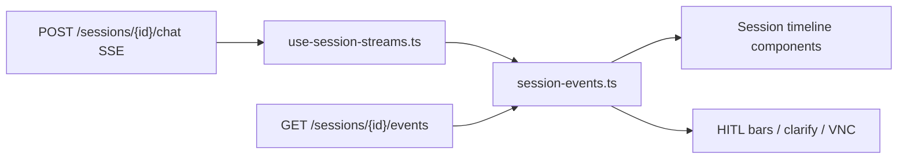
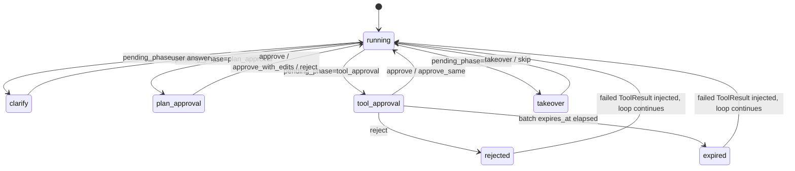

# Frontend UI Architecture

[简体中文](frontend-ui.zh-CN.md)

This document describes the Next.js UI shell, settings modal, API client, SSE event projection, and HITL component mapping.

## Shell layout

```mermaid
flowchart TB
  subgraph desktop ["Desktop md+"]
    LP["LeftPanel — session list + workspace switcher"]
    HDR["AppHeader — workspace dropdown (patrol, automation, knowledge, codebase), notifications, settings gear"]
    MAIN["Page content"]
  end
  subgraph mobile ["Mobile"]
    LPm["LeftPanel — sidebar sheet"]
    MAINm["Page content — pb-mobile-nav"]
    NAV["MobileBottomNav — chat, codebase, knowledge, more"]
    MORE["More sheet — patrol, automation, teams, settings, admin"]
  end
  subgraph noShell ["Routes without sidebar"]
    AUTH["/login /register"]
    ADMIN["/admin/*"]
    SHARE["/share/artifact/*"]
    INV["/invitations/*"]
  end
  User["Browser"] --> desktop
  User --> mobile
  User --> noShell
```

Implementation: `ui/src/components/app-shell.tsx`, `left-panel.tsx`, `app-header.tsx`, `mobile-bottom-nav.tsx`.

`MobileBottomNav` renders exactly 3 fixed tabs (chat, codebase, knowledge) plus a "more" button; there is no "apps" tab. Patrol only appears — in both the desktop header dropdown and the mobile "more" sheet — when `useFeatureFlags().opsPatrolEnabled` is true.

**Navigation split**

- **Desktop**: Codebase, Knowledge, and Automation live in the **header workspace dropdown** (`app-header.tsx`); Patrol joins the same dropdown when feature-flagged.
- **Mobile**: `MobileBottomNav` has 3 fixed tabs — chat, codebase, knowledge; Patrol (when feature-flagged), Automation, Teams, Settings, and Admin are in the **More** sheet behind the 4th tab.
- **Ops Patrol**: header/mobile navigation is feature-flagged; `/patrols`, `/patrols/new`, `/patrols/[id]`, and `/patrol-runs/[id]` use the normal authenticated shell. Auditor views omit mutation controls.
- **Session toolbar** (model, Skill, context): inline on desktop; collapsed into `ChatOptionsSheet` on mobile.

## Component domains

`ui/src/components/` is organized into ten domains plus root-level shared components (see [UI README — Project Structure](../../ui/README.md#project-structure) for the full directory tree):

```mermaid
mindmap
  root((ui/src/components))
    admin
      admin-layout-shell
      governance-profile-view
      usage-charts
    codebase
      codebase-library
      code-evidence-panel
    knowledge
      knowledge-library
      knowledge-graph
    patrol
      pack-wizard
      remediation-dialog
      remediation-status
    resource
      build-candidate-panel
      resource-version-status
    session
      chat-input
      approval-bar
      gate-actions-bar
      vnc-overlay
    settings
      hitl-settings
      runtime-settings
    tool-use
      bash-tool
      browser-tool
      mcp-tool
    ui
      button
      dialog
      sidebar
    workspace
      session-context-panel
      codebase-context-panel
    root-level shared
      app-shell
      left-panel
      mobile-bottom-nav
      context-selector
      markdown-content
      mermaid-diagram
      status-badge
```

## Settings modal (eight tabs)

| Tab key | Component | Access |
|---------|-----------|--------|
| `common-setting` | `GeneralSettings` — theme + language | All users |
| `agent-setting` | `AgentSettings` — max_iterations/retries/search | All users |
| `models-setting` | `ModelsSettings` — endpoints + models | All users |
| `skills-setting` | `SkillsSettings` | All users |
| `memory-setting` | `MemorySettings` | All users |
| `integrations-setting` | MCP + A2A + `ServiceKeysSettings` | All users |
| `hitl-setting` | `HitlSettings` — plan/tool gates, gate profile | Global fields admin-only; users can clear overrides |
| `runtime-setting` | `RuntimeSettings` (feature flags, scheduler, server) | Admin only |

Entry points:

- Account menu → Settings (opens last tab or default)
- Header gear icon → opens **Models** tab directly (`openSettings("models-setting")`)
- `SettingsDialogProvider`

Hook: `use-open-citadel-settings.ts`.

## Codebase / knowledge detail routes

`/codebase/[id]` and `/knowledge/[id]` do **not** render standalone detail pages. They create an Ask session bound to the resource and `replace` to `/sessions/{id}`.

```mermaid
sequenceDiagram
  participant User
  participant DetailRoute as /codebase_or_knowledge_id
  participant API
  participant Session as /sessions_id
  User->>DetailRoute: open resource link
  DetailRoute->>API: createSession(mode=ask, context)
  API-->>DetailRoute: session id
  DetailRoute->>Session: router.replace
```

## SSE event projection

```mermaid
flowchart LR
  API["POST /sessions/{id}/chat SSE"] --> Stream["use-session-streams.ts"]
  Stream --> Merge["session-events.ts"]
  Merge --> Timeline["Session timeline components"]
  Merge --> HITL["HITL bars / clarify / VNC"]
  Replay["GET /sessions/{id}/events"] --> Merge
```

`session-events.ts` delegates to `lib/session-events/{normalize,format,debug}.ts` for event-shape normalization, timeline formatting, and debug-sheet payload shaping respectively.

| SSE event | UI component / behavior |
|-----------|-------------------------|
| `clarify` | `clarify-questions.tsx` |
| `plan` | `plan-approval-bar.tsx`, `plan-panel.tsx` |
| `tool` + gate | `gate-actions-bar.tsx`, `approval-bar.tsx` |
| `wait` | Input disabled until resume |
| `artifact` | Artifact workbench panel |
| `session_status` | Session status badge |
| takeover phase | `vnc-overlay.tsx`, `vnc-viewer.tsx` |

Domain event catalog: [Events](events.md).

## HITL component map

`pending_phase` is **not** a linear chain — the four values are mutually exclusive, independently reachable gates on `running`. Only `tool_approval` (a persisted `ToolApprovalBatch`) has distinct `rejected`/`expired` terminal outcomes; `clarify`/`plan_approval`/`takeover` always clear back to `running` regardless of the user's answer (a plan `reject` re-plans; it does not end the session). See [Checkpoints & HITL — Persistent approval batches](checkpoints-and-hitl.md#persistent-approval-batches).

```mermaid
stateDiagram-v2
  [*] --> running
  running --> clarify: pending_phase=clarify
  running --> plan_approval: pending_phase=plan_approval
  running --> tool_approval: pending_phase=tool_approval
  running --> takeover: pending_phase=takeover
  clarify --> running: user answer
  plan_approval --> running: approve / approve_with_edits / reject
  tool_approval --> running: approve / approve_same
  tool_approval --> rejected: reject
  tool_approval --> expired: batch expires_at elapsed
  rejected --> running: failed ToolResult injected, loop continues
  expired --> running: failed ToolResult injected, loop continues
  takeover --> running: takeover / skip
```

| `pending_phase` | UI | Resume prefixes |
|-----------------|-----|-----------------|
| `clarify` | `clarify-questions.tsx` | User text answer |
| `plan_approval` | `plan-approval-bar.tsx` | `approve`, `approve_with_edits`, `reject:` |
| `tool_approval` | `gate-actions-bar.tsx` | `approve`, `reject:` |
| `takeover` | VNC overlay | `takeover`, `skip` |

Session-level HITL defaults and overrides: `hitl-settings.tsx` (Settings → HITL).

Checkpoint restore: `checkpoint-restore-dialog.tsx` → `POST /api/sessions/{id}/checkpoints/{id}/restore`.

Web Operator scope: `operator-scope-dialog.tsx` on home/session when Skill is `web-operator`.

Patrol remediation reuses the same `tool_approval` gate and `gate-actions-bar.tsx` for its human approval step: `remediation-dialog.tsx` composes the proposal, `remediation-status.tsx` renders the resulting `PatrolRemediationStatus` (`proposed`/`executing`/`executed`/`verified`/`failed`/`cancelled` — see [Ops Patrol architecture](ops-patrol.md)). Session-level governance summaries (capability narrowing, approval batches, run outcome, audit chain) render via `admin/governance-profile-view.tsx` at `/admin/compliance/sessions/[sessionId]`.

All HITL and remediation components above live under `ui/src/components/session/` (session-scoped) or `ui/src/components/patrol/` (remediation-specific), respectively — not the package root.

See [Checkpoints & HITL](checkpoints-and-hitl.md).

## Ops Patrol views

`useFeatureFlags` reads the global `feature_flags` AppConfig section before showing Patrol navigation. The Pack wizard selects a persisted Collector, target scope, checks, IANA timezone, and daily cron; it never accepts raw probe URLs or PromQL. Pack detail exposes validation/activation/pause/trigger controls and 30-day metrics. Run detail renders server-computed check results, Finding decisions, and the signed evidence download.

`AUDITOR` can open list/detail/report/evidence views but cannot create, validate, activate, pause, trigger, cancel, replay, delete, or decide a Finding. API enforcement remains authoritative even if a client renders stale controls.

Client modules: `lib/api/patrols.ts`, `lib/api/types/patrols.ts`; business components live in `components/patrol/`. See [Ops Patrol architecture](ops-patrol.md).

## Session context panels

When a session binds a codebase or knowledge base, `SessionContextPanel` shows:

- **Codebase**: file tree, symbol search, Mermaid architecture artifacts (`codebase-context-panel.tsx`)
- **Knowledge**: document/snippet preview (`knowledge-context-panel.tsx`)

Desktop: fixed side panel. Mobile: bottom sheet.

## Notifications

`NotificationInbox` in the header polls REST and subscribes to `/notifications/stream` SSE, linking to sessions or the automation page.

## API client

- **Fetch layer**: `lib/api/fetch.ts` — cookies, CSRF double-submit, `X-Workspace-Id`, 401 refresh queue, SSE parser
- **Modules**: see [UI README](../../ui/README.md#api-client)
- **Types**: `lib/api/types.ts` — `ClarifyQuestion`, `LLMEndpoint`, `operator_scope`, etc.

## Internationalization

- `next-intl` with `localePrefix: "never"`; locale in `NEXT_LOCALE` cookie
- Source keys: `scripts/build-messages.mjs` (+ `i18n-supplement.mjs` for drift backfill); CI check: `npm run i18n:check`
- Theme and language: **Settings → General** (`GeneralSettings`); no standalone header toggle

## LLM status UI

- Polls `GET /api/llm/status` (`llm-status.ts`)
- Badge in AppHeader when providers degraded

## Related documentation

- [UI README](../../ui/README.md)
- [Events](events.md)
- [LLM endpoints and models](llm-endpoints-and-models.md)
- [Contract compatibility](contract-compatibility.md)
- [Skills](skills.md)
- [Ops Patrol](ops-patrol.md)
