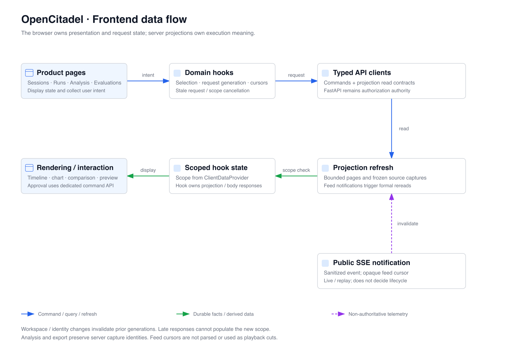

# Frontend UI Architecture

[简体中文](frontend-ui.zh-CN.md)

The Next.js application is a typed command and read-model client for the execution
kernel. The session surface, Run workbench, analysis workspace, and evaluation
management pages share authenticated API contracts; the browser does not host the
execution state machine.

## Data flow

Pages and components collect intent, domain hooks own request lifecycle, and
`ui/src/lib/api` transports commands and typed queries. Types are aliases of the
generated OpenAPI schema in `ui/src/lib/api/generated/schema.d.ts`.

The session timeline has a display-only reducer for sanitized public events. The
Run workbench additionally reads a server-selected projection boundary. Its event
subscription signals that a fresh view may be available: an SSE feed cursor only
resumes that subscription and never becomes the playback `at` cursor. Disconnect,
retry, and stale-view indicators affect presentation, not formal execution state.

## Execution workbench

Sessions select Runs through a source-bound Run cohort. `/runs/[id]` also opens the
same workbench directly. Task and debug views share the selected Run, its exact
boundary, steps, approvals, artifacts, and source references. Trace pagination
keeps `at` and projection revision fixed, rejects cursor cycles, and distinguishes
an unloaded parent from missing or incomplete history. Iterative trace layout and
virtualized rendering keep deep or large traces bounded in the visible surface.

URL state records Run, view, playback boundary, step, panel, artifact version, and
citation selection. Local storage holds only scoped layout preferences such as
panel dimensions and shortcuts; it does not persist execution bodies or playback
authority. Returning live is an explicit selection change. New-turn and approval
commands require current source/Run authority and cannot be enabled by a historical
view. Approval decisions reconcile persisted inbox state after an uncertain write;
the UI neither assumes success nor automatically retries the command.

The timeline renders user and assistant messages, Activity progress, approval
waits, tool results, formal errors, resource references, and terminal state. Deltas
merge only with their matching public event identity. Unknown public kinds render
conservatively and cannot trigger actions. VNC provides interactive sandbox access
without marking an Activity successful. Session deletion is rejected while a
formal Run is active.

## Analysis and evaluation surfaces

`/analysis` obtains a fixed summary watermark and requests its Run pages with that
same capture. Charts use the server's metric version, units, sample coverage, and
retained evaluation points rather than computing a second scoring or accounting
model. Comparison workspaces address a fixed comparison revision; refresh creates
a new revision. Retained bodies and asynchronous artifact diff jobs remain bound
to that comparison. Exports are caller-private jobs created from a fixed filter,
comparison, or batch selection, then polled and downloaded through authenticated
HTTP. See [execution read models and analysis](execution-analysis.md).

`/evaluations` provides datasets, suites, configurations, rubrics, batches, scoring,
review queues, recordings, and environments. `EvaluationBoundary` remounts the
surface for an authenticated scope revision, while `useEvaluationTask` serializes
form operations and fences stale callbacks. Batch feeds refresh durable projections;
they do not infer execution or scoring completion from connection status.

## Authorization and content boundaries

Workspace selection is sent as `X-Workspace-Id`; the server remains authoritative.
Auditor surfaces are read-only. Admin controls are hidden where appropriate, but
visibility is not authorization. Cross-scope not-found responses are not
distinguished from absent resources.

`ClientDataProvider` owns authenticated resource caches. Their key is exactly
`userId + workspaceId`; logout and workspace changes invalidate the previous
generation before the next scope is exposed. Workbench and detail hooks also fence
Run, boundary, scope revision, and request generation. Authority loss clears retained
body pages and pending downloads, and late responses cannot restore them. Analysis
captures are revalidated on focus, pageshow, and a 30-second mounted interval;
changed source identity or a failed revalidation invalidates the current view.

Detail bodies are read in bounded UTF-8 pages. Artifact and source reads preserve
their original immutable version and provenance; there is no fallback to the
current knowledge-base document. The shared `SafeArtifactPreview` rebuilds a static
HTML allowlist in an inert template, strips attributes and active/resource content,
and renders it in an iframe with an empty sandbox and restrictive CSP. Downloads
use the typed full-read path, current authority, and revocable browser object URLs.

## Resource builds

Knowledge-base pages create a candidate build, observe formal progress, retry or
cancel when permitted, and publish atomically. The published version remains visible
when a candidate fails or is cancelled. Document reads require an explicit version
and document revision; session context shows its exact published binding.

## Internationalization and quality

`ui/messages/en.json` and `ui/messages/zh.json` are authoritative catalogs. The
AST-based checker rejects locale mismatch, missing or unused keys, unknown dynamic
calls, orphan dynamic expansions, and hardcoded user-facing text. Runtime API error
and notification keys are shared through `contracts/i18n-runtime-keys.json` and
verified against Python emitters. CI also runs Prettier, TypeScript, ESLint, Vitest,
and the production Next.js build. Implementation of bounded views does not itself
establish the reference-environment capacity acceptance; AC21 remains pending.

## Key locations

- `ui/src/app/runs/[id]/run-page-client.tsx`: direct Run workbench entry
- `ui/src/hooks/use-session-runs.ts`: session/source Run selection
- `ui/src/hooks/use-execution-workbench.ts`: shared boundary, lifecycle, and authority
- `ui/src/hooks/use-execution-detail-body.ts`: body paging and invalidation
- `ui/src/lib/execution-view/`: URL state, trace loading/layout, event subscription
- `ui/src/components/execution/`: task/debug views, detail, artifact, source, playback
- `ui/src/components/analysis/`: captures, comparisons, charts, exports
- `ui/src/hooks/use-analysis-source.ts`: periodic fixed-source revalidation
- `ui/src/components/evaluation/evaluation-boundary.tsx`: scope and task fencing
- `ui/src/components/session/safe-artifact-preview.tsx`: static artifact isolation
- `ui/src/lib/api/`: generated-contract HTTP/SSE adapters
- `ui/src/lib/data/scoped-resource-cache.ts`: scope/generation cache primitive
- `ui/src/providers/client-data-provider.tsx`: authenticated cache ownership
