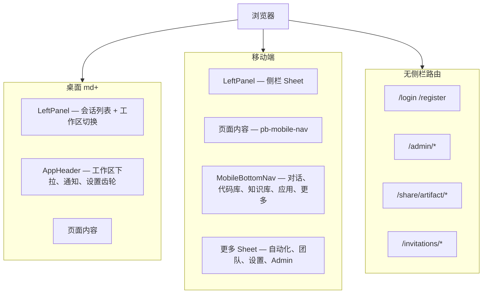
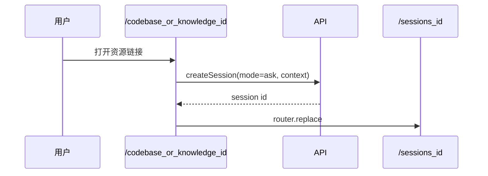
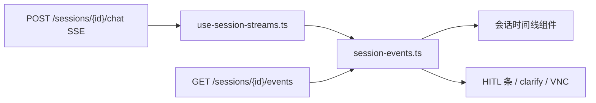
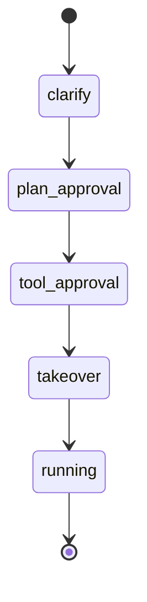

[English](frontend-ui.md)

# 前端 UI 架构

本文档说明 Next.js UI Shell、设置弹窗、API 客户端、SSE 事件投影与 HITL 组件映射。

## Shell 布局

实现：`ui/src/components/app-shell.tsx`、`left-panel.tsx`、`app-header.tsx`、`mobile-bottom-nav.tsx`。

**导航分工**

- **桌面**：Codebase、Knowledge、Marketplace、Automation 在 **顶栏工作区下拉**（`app-header.tsx`）。
- **移动**：前四个模块在 `MobileBottomNav`；Automation、Teams、Settings、Admin 在 **更多** Sheet。
- **会话工具栏**（模型、Skill、上下文）：桌面内联；移动端收入 `ChatOptionsSheet`。

## 设置弹窗（八 Tab）

| Tab key | 组件 | 权限 |
|---------|------|------|
| `common-setting` | `GeneralSettings` — 主题 + 语言 | 全员 |
| `agent-setting` | `AgentSettings` — max_iterations/retries/search | 全员 |
| `models-setting` | `ModelsSettings` — 端点 + 模型 | 全员 |
| `skills-setting` | `SkillsSettings` | 全员 |
| `memory-setting` | `MemorySettings` | 全员 |
| `integrations-setting` | MCP + A2A + `ServiceKeysSettings` | 全员 |
| `hitl-setting` | `HitlSettings` — 计划/工具门控、gate profile | 全局字段仅 admin；用户可清除覆盖 |
| `runtime-setting` | `RuntimeSettings`（功能开关、调度、server） | 仅 admin |

入口：

- 账户菜单 → 设置（打开默认或上次 Tab）
- 顶栏齿轮 → **直接打开「模型」Tab**（`openSettings("models-setting")`）
- `SettingsDialogProvider`

Hook：`use-open-citadel-settings.ts`。

## Codebase / 知识库详情路由

`/codebase/[id]` 与 `/knowledge/[id]` **不渲染**独立详情页，而是创建绑定资源的 Ask 会话并 `replace` 到 `/sessions/{id}`。

## SSE 事件投影

| SSE 事件 | UI 组件 / 行为 |
|----------|----------------|
| `clarify` | `clarify-questions.tsx` |
| `plan` | `plan-approval-bar.tsx`、`plan-panel.tsx` |
| `tool` + 门控 | `gate-actions-bar.tsx`、`approval-bar.tsx` |
| `wait` | 等待用户恢复输入 |
| `artifact` | 交付物工作台面板 |
| `session_status` | 会话状态 Badge |
| takeover 阶段 | `vnc-overlay.tsx`、`vnc-viewer.tsx` |

领域事件目录：[Events](events.zh-CN.md)。

## HITL 组件映射

| `pending_phase` | UI | 恢复前缀 |
|-----------------|-----|----------|
| `clarify` | `clarify-questions.tsx` | 用户文本回答 |
| `plan_approval` | `plan-approval-bar.tsx` | `approve`、`approve_with_edits`、`reject:` |
| `tool_approval` | `gate-actions-bar.tsx` | `approve`、`reject:` |
| `takeover` | VNC overlay | `takeover`、`skip` |

会话级 HITL 默认与覆盖：设置 → HITL（`hitl-settings.tsx`）。

检查点恢复：`checkpoint-restore-dialog.tsx` → `POST /api/sessions/{id}/checkpoints/{id}/restore`。

Web Operator 归属：`operator-scope-dialog.tsx`（Skill 为 `web-operator` 时）。

见 [检查点与 HITL](checkpoints-and-hitl.zh-CN.md)。

## 会话上下文侧栏

会话绑定代码库或知识库时，`SessionContextPanel` 展示：

- **代码库**：文件树、符号检索、Mermaid 架构图（`codebase-context-panel.tsx`）
- **知识库**：文档/片段预览（`knowledge-context-panel.tsx`）

桌面：固定侧栏。移动：底部 Sheet。

## 通知收件箱

顶栏 `NotificationInbox` 通过 REST 轮询并订阅 `/notifications/stream` SSE，可跳转到会话或自动化页。

## API 客户端

- **Fetch 层**：`lib/api/fetch.ts` — Cookie、CSRF 双提交、`X-Workspace-Id`、401 刷新队列、SSE 解析
- **模块**：见 [UI README](../../ui/README.zh-CN.md)
- **类型**：`lib/api/types.ts` — `ClarifyQuestion`、`LLMEndpoint`、`operator_scope` 等

## 国际化

- `next-intl`，`localePrefix: "never"`；locale 存于 `NEXT_LOCALE` Cookie
- 键源：`scripts/build-messages.mjs`（+ `i18n-supplement.mjs` 回填漂移）；CI：`npm run i18n:check`
- 主题与语言：**设置 → 通用**（`GeneralSettings`）；顶栏无独立切换组件

## LLM 状态 UI

- 轮询 `GET /api/llm/status`（`llm-status.ts`）
- AppHeader Badge；Marketplace 在 Provider 降级时展示

## 相关文档

- [UI README](../../ui/README.zh-CN.md)
- [Events](events.zh-CN.md)
- [LLM 端点与模型](llm-endpoints-and-models.zh-CN.md)
- [契约兼容](contract-compatibility.zh-CN.md)
- [Skills](skills.zh-CN.md)
