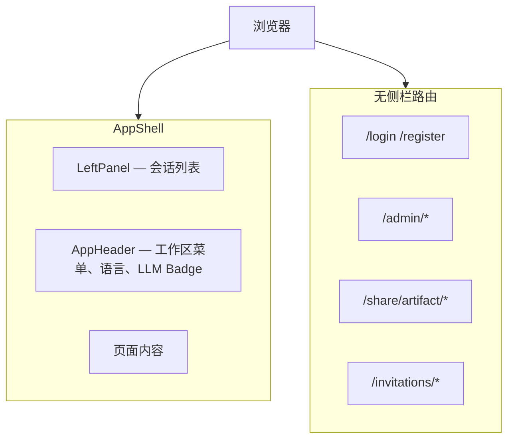
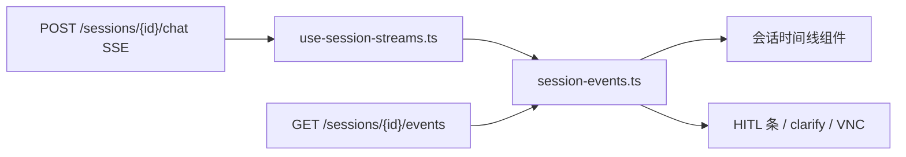

[English](frontend-ui.md)

# 前端 UI 架构

本文档说明 Next.js UI Shell、设置弹窗、API 客户端、SSE 事件投影与 HITL 组件映射。

## Shell 布局

实现：`ui/src/components/app-shell.tsx`、`left-panel.tsx`、`app-header.tsx`。

## 设置弹窗（六 Tab）

| Tab key | 组件 | 权限 |
|---------|------|------|
| `common-setting` | 通用 Agent 参数 | 全员 |
| `models-setting` | `ModelsSettings` — 端点 + 模型 | 全员 |
| `skills-setting` | `SkillsSettings` | 全员 |
| `memory-setting` | `MemorySettings` | 全员 |
| `integrations-setting` | MCP + A2A | 全员 |
| `runtime-setting` | `RuntimeSettings`（功能开关、调度、server） | 仅 admin |

入口：顶栏齿轮、账户菜单 → 设置、`SettingsDialogProvider`。

Hook：`use-open-citadel-settings.ts`。

## SSE 事件投影

| SSE 事件 | UI 组件 / 行为 |
|----------|----------------|
| `clarify` | `clarify-questions.tsx` |
| `plan` | `plan-approval-bar.tsx` |
| `tool` + 门控 | `gate-actions-bar.tsx`、`approval-bar.tsx` |
| `wait` | 等待用户恢复输入 |
| `artifact` | 交付物工作台面板 |
| `session_status` | 会话状态 Badge |
| takeover 阶段 | `vnc-overlay.tsx`、`vnc-viewer.tsx` |

领域事件目录：[Events](events.zh-CN.md)。

## HITL 组件映射

| `pending_phase` | UI | 恢复前缀 |
|-----------------|-----|----------|
| `clarify` | `clarify-questions.tsx` | 用户文本回答 |
| `plan_approval` | `plan-approval-bar.tsx` | `approve`、`approve_with_edits`、`reject:` |
| `tool_approval` | `gate-actions-bar.tsx` | `approve`、`reject:` |
| `takeover` | VNC  overlay | `takeover`、`skip` |

检查点恢复：`checkpoint-restore-dialog.tsx` → `POST /api/sessions/{id}/checkpoints/{id}/restore`。

Web Operator 归属：`operator-scope-dialog.tsx`（Skill 为 `web-operator` 时）。

见 [检查点与 HITL](checkpoints-and-hitl.zh-CN.md)。

## API 客户端

- **Fetch 层**：`lib/api/fetch.ts` — Cookie、CSRF 双提交、`X-Workspace-Id`、401 刷新队列、SSE 解析
- **模块**：见 [UI README](../../ui/README.zh-CN.md)
- **类型**：`lib/api/types.ts` — `ClarifyQuestion`、`LLMEndpoint`、`operator_scope` 等

## 国际化

- `next-intl`，`localePrefix: "never"`；locale 存于 `NEXT_LOCALE` Cookie
- 键源：`scripts/build-messages.mjs`；CI：`npm run i18n:check`
- 语言切换：`app-header.tsx` 中 `LanguageToggle`

## LLM 状态 UI

- 轮询 `GET /api/llm/status`（`llm-status.ts`）
- AppHeader Badge；Marketplace 在 Provider 降级时展示

## 相关文档

- [UI README](../../ui/README.zh-CN.md)
- [Events](events.zh-CN.md)
- [LLM 端点与模型](llm-endpoints-and-models.zh-CN.md)
- [契约兼容](contract-compatibility.zh-CN.md)
