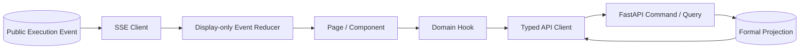

# 前端 UI 架构

[English](frontend-ui.md)

Next.js 应用是执行内核的强类型 Command/Projection Client，不承载工作流状态机。

## 数据流

```mermaid
flowchart LR
  Page[Page / Component] --> Hook[Domain Hook]
  Hook --> Client[Typed API Client]
  Client --> API[FastAPI Command / Query]
  API --> Projection[(Formal Projection)]
  Projection --> Client
  Public[(Public Execution Event)] --> SSE[SSE Client]
  SSE --> Reducer[Display-only Event Reducer]
  Reducer --> Page
```

Mutation Function 位于 `src/lib/api`，Hook 协调 Request Lifecycle，Component 只展示状态并
收集用户意图。SSE 实时与回放共享同一脱敏 Event Type。不透明 Cursor 原样保存和回传，不解析。
Disconnect、Retry 与 Stale View 只影响展示。

## Session Surface

Session Timeline 展示 User/Assistant Message、Activity Progress、Approval Wait、Tool Result、
Formal Error、Resource Reference 与 Terminal State。Delta 只合并到匹配的 Public Event Identity。
未知 Public Kind 保守展示，不能触发 Action。

Approval Bar 通过专用 Approval API 操作持久 Batch。UI 展示冻结的 Subject Label 与 Policy，
不能修改 Invocation Argument。VNC 让用户交互访问隔离沙箱，但不会自行把 Activity 标记成功。

正式 Run 活跃时拒绝删除 Session。Resource Context 展示 Session 绑定的精确已发布知识库版本。

## 资源构建

知识库页面使用 Candidate Build Model：创建 Candidate、观察正式 Progress、在投影
允许时 Retry/Cancel，并原子 Publish。Candidate 失败或取消时，Active Published Version 仍可见。
Document Read 必须指定 Version 与 Document Revision。

## 授权 UX

Workspace 选择通过 `X-Workspace-Id` 发送，服务端始终是权威。Auditor View 只读。Admin-only
Setting/Control 会隐藏，但隐藏不是授权。跨 Scope Not Found 与资源不存在在 UI 中不区分。

认证资源数据由 `ClientDataProvider` 持有，不使用模块全局变量。缓存键严格为
`userId + workspaceId`；Logout 与 Workspace 切换会在导航或暴露新 Scope 前使旧
Generation 失效。匿名视图不能读取认证 Entry，晚到 Promise 也不能恢复已失效数据。

## 国际化与质量

`ui/messages/en.json` 与 `ui/messages/zh.json` 是权威 Catalog。AST 检查器会拒绝 Locale
错配、缺失或未使用键、未知动态调用、孤儿动态展开和面向用户的硬编码文本。运行时 API
错误键与通知键通过 `contracts/i18n-runtime-keys.json` 共享，并与 Python Emitter 双向验证。
CI 还会执行 Prettier、TypeScript、ESLint、Vitest 与生产 Next.js Build。API Type 位于
`src/lib/api/types`，不维护独立浏览器 Schema。

## 关键位置

- `src/hooks/use-session-streams.ts`：Stream Lifecycle 与 Cursor
- `src/lib/session-events.ts`：Public Event Normalization / Display Reduction
- `src/components/session/`：Timeline、Approval、Error、VNC、Artifact
- `src/components/resource/`：Build Candidate 与 Version State
- `src/lib/api/`：认证 HTTP/SSE Contract
- `src/lib/data/scoped-resource-cache.ts`：Scope/Generation 缓存原语
- `src/providers/client-data-provider.tsx`：认证缓存所有权
- `src/components/open-citadel-settings.tsx`：设置装配
