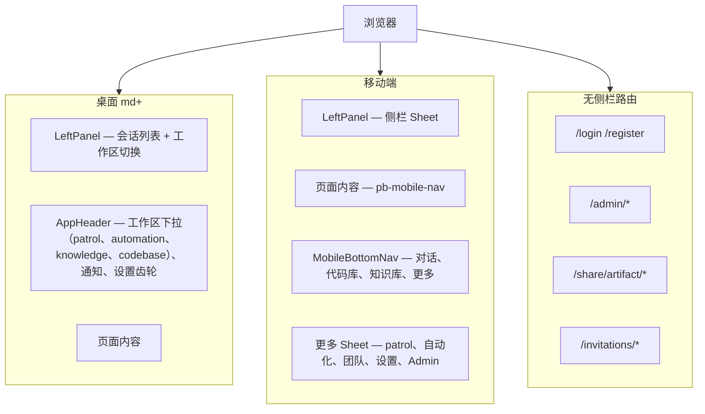
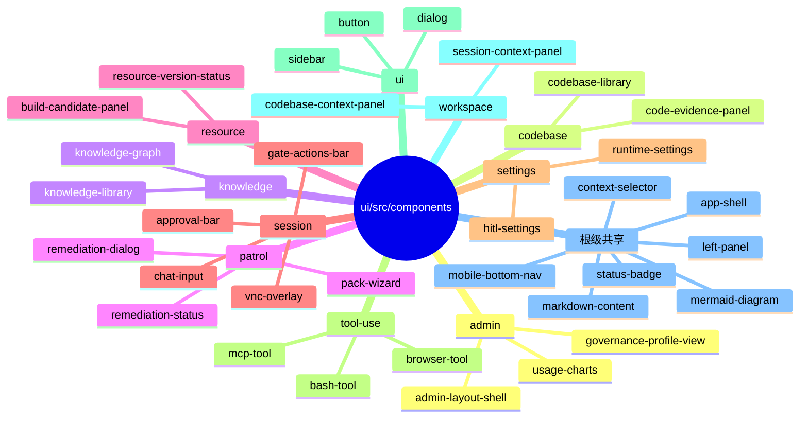
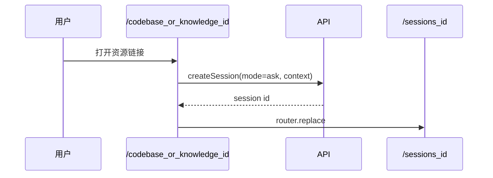
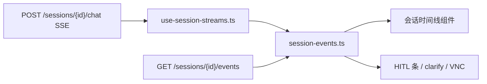
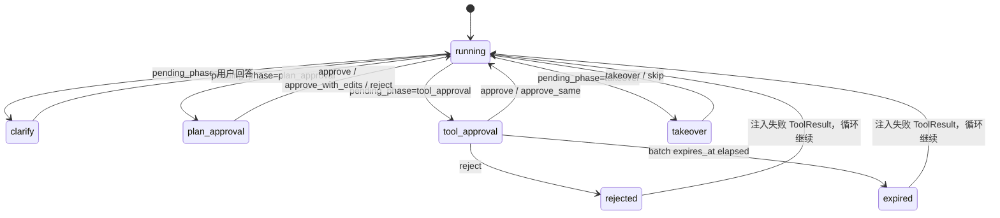

[English](frontend-ui.md)

# 前端 UI 架构

本文档说明 Next.js UI Shell、设置弹窗、API 客户端、SSE 事件投影与 HITL 组件映射。

## Shell 布局

```mermaid
flowchart TB
  subgraph desktop ["桌面 md+"]
    LP["LeftPanel — 会话列表 + 工作区切换"]
    HDR["AppHeader — 工作区下拉（patrol、automation、knowledge、codebase）、通知、设置齿轮"]
    MAIN["页面内容"]
  end
  subgraph mobile ["移动端"]
    LPm["LeftPanel — 侧栏 Sheet"]
    MAINm["页面内容 — pb-mobile-nav"]
    NAV["MobileBottomNav — 对话、代码库、知识库、更多"]
    MORE["更多 Sheet — patrol、自动化、团队、设置、Admin"]
  end
  subgraph noShell ["无侧栏路由"]
    AUTH["/login /register"]
    ADMIN["/admin/*"]
    SHARE["/share/artifact/*"]
    INV["/invitations/*"]
  end
  User["浏览器"] --> desktop
  User --> mobile
  User --> noShell
```

实现：`ui/src/components/app-shell.tsx`、`left-panel.tsx`、`app-header.tsx`、`mobile-bottom-nav.tsx`。

`MobileBottomNav` 固定渲染 3 个 Tab（对话、代码库、知识库）加一个「更多」按钮；不存在「应用」Tab。Patrol 仅在 `useFeatureFlags().opsPatrolEnabled` 为真时出现——无论桌面顶栏下拉还是移动端「更多」Sheet。

**导航分工**

- **桌面**：Codebase、Knowledge、Automation 在 **顶栏工作区下拉**（`app-header.tsx`）；功能开关开启时 Patrol 同样加入该下拉。
- **移动**：`MobileBottomNav` 固定 3 个 Tab——对话、代码库、知识库；Patrol（功能开关开启时）、Automation、Teams、Settings、Admin 在第 4 个 Tab 背后的 **更多** Sheet。
- **Ops Patrol**：顶栏/移动导航受功能开关控制；`/patrols`、`/patrols/new`、`/patrols/[id]`、`/patrol-runs/[id]` 使用常规认证 Shell。Auditor 视图隐藏变更控件。
- **会话工具栏**（模型、Skill、上下文）：桌面内联；移动端收入 `ChatOptionsSheet`。

## 组件域

`ui/src/components/` 划分为十个域，加上根级共享组件（完整目录树见 [UI README — 项目结构](../../ui/README.zh-CN.md#项目结构)）：

```mermaid
mindmap
  root((ui/src/components))
    admin
      admin-layout-shell
      governance-profile-view
      usage-charts
    codebase
      codebase-library
      code-evidence-panel
    knowledge
      knowledge-library
      knowledge-graph
    patrol
      pack-wizard
      remediation-dialog
      remediation-status
    resource
      build-candidate-panel
      resource-version-status
    session
      chat-input
      approval-bar
      gate-actions-bar
      vnc-overlay
    settings
      hitl-settings
      runtime-settings
    tool-use
      bash-tool
      browser-tool
      mcp-tool
    ui
      button
      dialog
      sidebar
    workspace
      session-context-panel
      codebase-context-panel
    根级共享
      app-shell
      left-panel
      mobile-bottom-nav
      context-selector
      markdown-content
      mermaid-diagram
      status-badge
```

## 设置弹窗（八 Tab）

| Tab key | 组件 | 权限 |
|---------|------|------|
| `common-setting` | `GeneralSettings` — 主题 + 语言 | 全员 |
| `agent-setting` | `AgentSettings` — max_iterations/retries/search | 全员 |
| `models-setting` | `ModelsSettings` — 端点 + 模型 | 全员 |
| `skills-setting` | `SkillsSettings` | 全员 |
| `memory-setting` | `MemorySettings` | 全员 |
| `integrations-setting` | MCP + A2A + `ServiceKeysSettings` | 全员 |
| `hitl-setting` | `HitlSettings` — 计划/工具门控、gate profile | 全局字段仅 admin；用户可清除覆盖 |
| `runtime-setting` | `RuntimeSettings`（功能开关、调度、server） | 仅 admin |

入口：

- 账户菜单 → 设置（打开默认或上次 Tab）
- 顶栏齿轮 → **直接打开「模型」Tab**（`openSettings("models-setting")`）
- `SettingsDialogProvider`

Hook：`use-open-citadel-settings.ts`。

## Codebase / 知识库详情路由

`/codebase/[id]` 与 `/knowledge/[id]` **不渲染**独立详情页，而是创建绑定资源的 Ask 会话并 `replace` 到 `/sessions/{id}`。

```mermaid
sequenceDiagram
  participant User as 用户
  participant DetailRoute as /codebase_or_knowledge_id
  participant API
  participant Session as /sessions_id
  User->>DetailRoute: 打开资源链接
  DetailRoute->>API: createSession(mode=ask, context)
  API-->>DetailRoute: session id
  DetailRoute->>Session: router.replace
```

## SSE 事件投影

```mermaid
flowchart LR
  API["POST /sessions/{id}/chat SSE"] --> Stream["use-session-streams.ts"]
  Stream --> Merge["session-events.ts"]
  Merge --> Timeline["会话时间线组件"]
  Merge --> HITL["HITL 条 / clarify / VNC"]
  Replay["GET /sessions/{id}/events"] --> Merge
```

`session-events.ts` 将事件形态归一化、时间线格式化、Debug 面板载荷整形分别委托给 `lib/session-events/{normalize,format,debug}.ts`。

| SSE 事件 | UI 组件 / 行为 |
|----------|----------------|
| `clarify` | `clarify-questions.tsx` |
| `plan` | `plan-approval-bar.tsx`、`plan-panel.tsx` |
| `tool` + 门控 | `gate-actions-bar.tsx`、`approval-bar.tsx` |
| `wait` | 等待用户恢复输入 |
| `artifact` | 交付物工作台面板 |
| `session_status` | 会话状态 Badge |
| takeover 阶段 | `vnc-overlay.tsx`、`vnc-viewer.tsx` |

领域事件目录：[Events](events.zh-CN.md)。

## HITL 组件映射

`pending_phase` **不是**线性链——四个取值是 `running` 之上互斥、可独立到达的门控。只有 `tool_approval`（持久化的 `ToolApprovalBatch`）拥有独立的 `rejected`/`expired` 终态；`clarify`/`plan_approval`/`takeover` 无论用户如何回应都会清空回到 `running`（计划 `reject` 会重新规划，不会结束会话）。见 [检查点与 HITL — 持久化审批批次](checkpoints-and-hitl.zh-CN.md#持久化审批批次)。

```mermaid
stateDiagram-v2
  [*] --> running
  running --> clarify: pending_phase=clarify
  running --> plan_approval: pending_phase=plan_approval
  running --> tool_approval: pending_phase=tool_approval
  running --> takeover: pending_phase=takeover
  clarify --> running: 用户回答
  plan_approval --> running: approve / approve_with_edits / reject
  tool_approval --> running: approve / approve_same
  tool_approval --> rejected: reject
  tool_approval --> expired: batch expires_at elapsed
  rejected --> running: 注入失败 ToolResult，循环继续
  expired --> running: 注入失败 ToolResult，循环继续
  takeover --> running: takeover / skip
```

| `pending_phase` | UI | 恢复前缀 |
|-----------------|-----|----------|
| `clarify` | `clarify-questions.tsx` | 用户文本回答 |
| `plan_approval` | `plan-approval-bar.tsx` | `approve`、`approve_with_edits`、`reject:` |
| `tool_approval` | `gate-actions-bar.tsx` | `approve`、`reject:` |
| `takeover` | VNC overlay | `takeover`、`skip` |

会话级 HITL 默认与覆盖：设置 → HITL（`hitl-settings.tsx`）。

检查点恢复：`checkpoint-restore-dialog.tsx` → `POST /api/sessions/{id}/checkpoints/{id}/restore`。

Web Operator 归属：`operator-scope-dialog.tsx`（Skill 为 `web-operator` 时）。

Patrol 修复复用同一个 `tool_approval` 门控与 `gate-actions-bar.tsx` 完成人工审批：`remediation-dialog.tsx` 组装提案，`remediation-status.tsx` 渲染最终的 `PatrolRemediationStatus`（`proposed`/`executing`/`executed`/`verified`/`failed`/`cancelled`——见 [Ops Patrol 架构](ops-patrol.zh-CN.md)）。会话级治理摘要（能力收窄、审批批次、终态结果、审计链）通过 `admin/governance-profile-view.tsx` 在 `/admin/compliance/sessions/[sessionId]` 渲染。

以上 HITL 与修复相关组件均位于 `ui/src/components/session/`（会话域）或 `ui/src/components/patrol/`（修复专属），而非包根目录。

见 [检查点与 HITL](checkpoints-and-hitl.zh-CN.md)。

## Ops Patrol 视图

`useFeatureFlags` 读取全局 `feature_flags` AppConfig 后才显示 Patrol 导航。Pack 向导选择已持久化 Collector、Target Scope、检查项、IANA 时区与每日 Cron，不接受原始 Probe URL 或 PromQL。Pack 详情提供验证/激活/暂停/触发与 30 天指标；Run 详情渲染服务端计算的检查结果、Finding 决策和签名证据下载。

`AUDITOR` 可以打开列表、详情、报告与证据，但不能创建、验证、激活、暂停、触发、取消、回放、删除或决策 Finding。即使客户端错误显示了过期控件，API Enforcement 仍是权威边界。

客户端模块为 `lib/api/patrols.ts`、`lib/api/types/patrols.ts`，业务组件位于 `components/patrol/`。见 [Ops Patrol 架构](ops-patrol.zh-CN.md)。

## 会话上下文侧栏

会话绑定代码库或知识库时，`SessionContextPanel` 展示：

- **代码库**：文件树、符号检索、Mermaid 架构图（`codebase-context-panel.tsx`）
- **知识库**：文档/片段预览（`knowledge-context-panel.tsx`）

桌面：固定侧栏。移动：底部 Sheet。

## 通知收件箱

顶栏 `NotificationInbox` 通过 REST 轮询并订阅 `/notifications/stream` SSE，可跳转到会话或自动化页。

## API 客户端

- **Fetch 层**：`lib/api/fetch.ts` — Cookie、CSRF 双提交、`X-Workspace-Id`、401 刷新队列、SSE 解析
- **模块**：见 [UI README](../../ui/README.zh-CN.md)
- **类型**：`lib/api/types.ts` — `ClarifyQuestion`、`LLMEndpoint`、`operator_scope` 等

## 国际化

- `next-intl`，`localePrefix: "never"`；locale 存于 `NEXT_LOCALE` Cookie
- 键源：`scripts/build-messages.mjs`（+ `i18n-supplement.mjs` 回填漂移）；CI：`npm run i18n:check`
- 主题与语言：**设置 → 通用**（`GeneralSettings`）；顶栏无独立切换组件

## LLM 状态 UI

- 轮询 `GET /api/llm/status`（`llm-status.ts`）
- AppHeader Badge；Provider 降级时展示

## 相关文档

- [UI README](../../ui/README.zh-CN.md)
- [Events](events.zh-CN.md)
- [LLM 端点与模型](llm-endpoints-and-models.zh-CN.md)
- [契约兼容](contract-compatibility.zh-CN.md)
- [Skills](skills.zh-CN.md)
- [Ops Patrol](ops-patrol.zh-CN.md)
