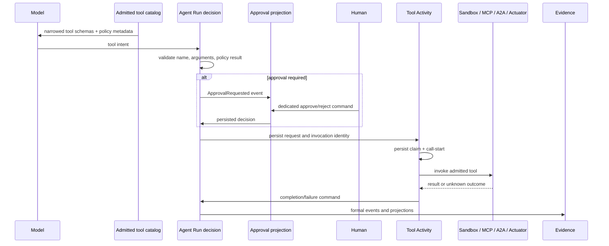

# Governance Plane

[简体中文](governance-plane.zh-CN.md)

Governance is part of the Run/Activity protocol. A model can propose a tool
call, but cannot expose, approve, or execute a capability by itself.

## End-to-end path

## Capability narrowing

A callable tool must pass every boundary:

1. platform registration and explicit `ToolExecutionPolicy`;
2. authenticated role, OwnerScope, and Operator domain;
3. Run family/mode;
4. selected Skill `allowed_tools` and MCP/A2A server refs;
5. exposure filtering before model invocation;
6. lookup and policy validation again at Activity execution.

Missing policy falls back to `capability=unknown`, `effect=interactive`,
`idempotency=unknown`, and `approval=always`. A Skill can only narrow existing
authority.

## Effect and approval contract

Policies declare capability, effect (`read_only`, `workspace_write`,
`external_write`, `interactive`), idempotency, approval mode, and concurrency
group. The model-call Activity serializes the server-derived
`requires_approval` and risk summary into the durable model result; the pure
Agent decision validates these fields before it can request a tool Activity.

Approval is a formal event and projection with stable identities for the Run,
approval, and subject Activity. The decision endpoint records actor, status,
time, and feedback. Reject, expiry, cancellation, duplicate decisions, and a
decision for the wrong owner all fail without calling the provider.

Approvals are a closed loop rather than an open-ended wait:

- **Inbox.** `GET /api/approvals?status=pending` lists the caller's pending
  approvals (with `approved`/`rejected`/`cancelled`/`expired` also selectable)
  so a reviewer can find every request across Runs from one queue.
- **Notification.** When a Run raises `ApprovalRequested`, the formal projector
  sends a durable notification so the reviewer is alerted instead of polling.
- **Timeout.** Requesting an approval schedules a durable self-cancelling
  timeout command. When it fires the approval transitions to the terminal
  `expired` status (an `ApprovalExpired` event), the Run leaves the waiting
  state, and the provider is never called. The window is the
  `approval.ttl_minutes` Operations Policy field (default one day), not an
  environment variable.

## Invocation safety

Each tool request has a unique Activity/Invocation identity. Equal arguments in
two intentional calls do not collapse into one invocation. Claim generation
fences stale workers. Calls with uncertain external effects are not blindly
repeated after a crash; they enter explicit unknown-outcome resolution.

Arguments and large results use object references and digests. Public events
contain only bounded, sanitized summaries. Workspace writes occur inside the
session sandbox; external writes remain subject to the provider's own
idempotency key where available.

## Evidence

Formal Run, approval, and Activity projections feed the governance profile.
The independent audit hash chain records user/admin actions and policy denials.
Evidence export is deterministic, redacted, manifested, and signed. A pending
or rejected approval never appears as a successful tool execution.

See [execution kernel](execution-kernel.md), [security model](security-model.md),
[admin and compliance](admin-auditor-compliance.md), and
[Ops Patrol](ops-patrol.md).
