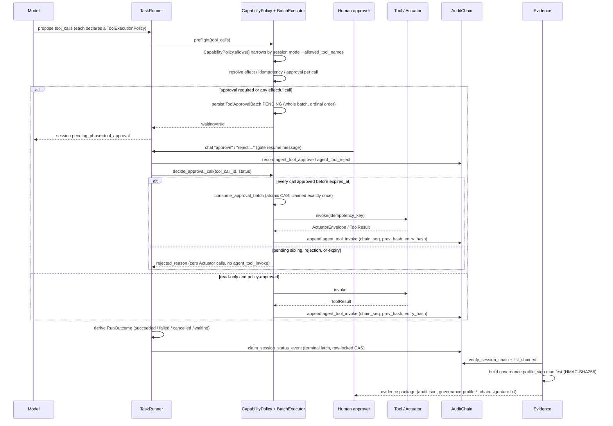

[简体中文](governance-plane.zh-CN.md)

# Governance plane: from tool call to signed evidence

OpenCitadel treats every Agent tool call — browser, shell, file, MCP, A2A, or an Ops Patrol remediation — as a governed action, not a function call the model can fire and forget. This document is the single narrative that ties together the pieces described elsewhere: the declarative effect contract on each tool, the three places a call is narrowed before it can run, the whole-batch preflight/approval gate, the durable terminal-state latch, and the signed evidence package an auditor downloads afterward. It complements [Checkpoints & HITL](checkpoints-and-hitl.md) (gate state machine), [Security model](security-model.md) (trust boundaries), [Admin, auditor & compliance](admin-auditor-compliance.md) (who can read what), and [Ops Patrol](ops-patrol.md) (the one governed write path that reaches live infrastructure today).

## End-to-end flow

Every hop in this diagram is a real code path, not an aspirational one: the same `ToolBatchExecutor` machinery runs for a plain file write and for `patrol_execute_remediation` against the Ops Actuator — see [Ops Patrol architecture](ops-patrol.md#safety-invariants) for that path's contract tests. `agent_tool_invoke` is only ever appended on an execution path — a batch that stays `pending`, gets `rejected`, or `expires` never reaches `_execute_call` and never produces that audit entry; the human decision itself is a separate audit fact (`agent_tool_approve`/`agent_tool_reject`), written the moment the decision arrives, whether or not execution later succeeds. The five sections below walk the diagram left to right: what a tool declares about itself, where that declaration is checked, how a risky call waits for a person, how its outcome is latched exactly once, and how the whole story becomes a signature an auditor can verify offline.

## Effect contracts: `ToolExecutionPolicy`

Every registered tool method carries a `ToolExecutionPolicy` (`api/app/domain/models/tool_policy.py`), a five-field declaration the tool author cannot skip:

| Field | Values | Meaning |
|-------|--------|---------|
| `capability` | `message` / `knowledge_read` / `code_read` / `integration_read` / `web_read` / `generation` / `execution` / `unknown` | What kind of thing the call does |
| `effect` | `read_only` / `workspace_write` / `external_write` / `interactive` | Blast radius of a successful call |
| `idempotency` | `safe` / `idempotent_with_key` / `non_idempotent` / `unknown` | Whether a retry can safely repeat the call |
| `approval` | `never` / `policy` / `always` | Whether a human must decide before execution |
| `concurrency_group` | free-form string, default `none` | Serialization lane (e.g. `filesystem`, `browser`, `shell`, `integration`) |

A tool with no explicit policy does not default to permissive: `BaseTool.get_tool_descriptor` falls back to `CONSERVATIVE_TOOL_POLICY` — `capability=unknown`, `effect=interactive`, `idempotency=unknown`, `approval=always` — so an undeclared effect fails closed into "ask a human" rather than silently executing.

## Three-layer narrowing: assembly, exposure, execution

`CapabilityPolicy` (`api/app/domain/services/tools/capability_policy.py`) is applied at three independent points, so a bug or stale cache at any one layer cannot alone let a call through:

1. **Assembly** — `TaskRunnerFactory` builds the session's `CapabilityPolicy` via `SessionFlowResolver.resolve(...)` and `CapabilityPolicy.for_mode(mode, allowed_tool_names=...)` before any tool object exists; `subagent_factory.py` derives a strictly narrower child policy through `CapabilityPolicy.for_child()` for delegated sub-agents. An Ops Patrol session, for example, is assembled with exactly one Collector tool bound and everything else omitted.
2. **Exposure** — `BaseTool.get_tool_descriptors()` and `MCPTool.schemas_for()` filter the schema list handed to the model through `policy.allows(...)` / `policy.allows_integration(...)`; a tool the policy denies never appears as a callable function in the LLM's tool list.
3. **Execution** — `ToolBatchExecutor._resolve_tool_and_policy()` re-checks `allows`/`allows_integration` at the moment a call is actually resolved during `preflight()`, independent of whatever schema the model saw. A denied call raises `CapabilityDeniedError` here even if it somehow reached this point.

`Ask` mode adds a fourth constraint on top: `CapabilityPolicy.allows()` only lets `read_only` effects through a small allow-list of read capabilities, and `for_child()` refuses to grant an Ask sub-agent any tool its parent did not already name explicitly.

## Whole-batch preflight and approval

`ToolBatchExecutor.preflight()` (`api/app/domain/services/agents/tool_batch_executor.py`) normalizes every call in a model turn, resolves its policy, and decides `requires_approval` per call from `ApprovalMode`. If any call needs approval or carries a non-`read_only` effect, the **entire batch** — not just the risky calls — is persisted as one `ToolApprovalBatch` (`api/app/domain/models/tool_approval.py`) with each call's status set to `approved` (policy-preapproved) or `pending`:

| Batch/call status | Reached when | Effect on execution |
|--------------------|--------------|----------------------|
| `pending` | Any call still awaiting a decision | `resume()` refuses the whole batch (`approval_pending`) |
| `approved` | Every call decided `approved` before `expires_at` | `resume()` proceeds to `consume_approval_batch` |
| `rejected` | Any single call decided `rejected` | Whole batch refuses (`approval_rejected`), zero calls execute |
| `expired` | `expires_at` passed while still `pending` | Whole batch refuses (`approval_expired`) |
| `consumed` | `consume_approval_batch` claimed it | Executes exactly once; a second `resume()` for the same `batch_id` short-circuits (`approval_consumed`) |

The human decision itself arrives as an ordinary chat resume message (`"approve"` / `"approve_same"` / `"reject:<feedback>"`) through the same `POST /sessions/{id}/chat` endpoint as any other reply — there is no separate approval-only transport. `session_routes.chat()` records the `agent_tool_approve`/`agent_tool_reject` audit entry via `_record_gate_audit_if_needed` before the message is even dispatched to the Worker; the Worker-side flow (`react.py`) then parses that same message, calls `decide_approval_call()` per pending call, and finally `resume()`. `resume()` only proceeds once every call in the batch is `approved`: a single `pending` or `rejected` sibling blocks execution of the whole batch, and `consume_approval_batch` claims it exactly once via an atomic CAS on `execution_claimed`, so a retried resume, a duplicate decision message, or a resumed worker can never execute the same approved batch twice.

For calls whose policy is `idempotent_with_key` and whose schema/signature accept an `idempotency_key` parameter, `_execute_call` derives a stable key from `(session_id, tool_call_id, args_hash)` and injects it into the call — the same contract the Ops Actuator's `restart_workload` / `scale_workload` / `rollback_workload` rely on to answer a repeated call with `action_outcome=skipped_idempotent` instead of mutating twice. `non_idempotent` and `unknown` calls get exactly one attempt; only `idempotent_with_key` calls with a supported schema retry, and a failed attempt is never retried once it has left the sandbox — retry only covers *transient* delivery failures such as timeouts.

## Terminal state and reconciliation

A `Flow`/`TaskRunner` never infers success from generator exhaustion — it returns an explicit `RunOutcome` (`api/app/domain/models/run_outcome.py`): `succeeded` / `failed` / `cancelled` / `waiting`, each with a structured `error` (`message`, optional `code`/`details`) and a `usage` counter map. `DbSessionRepository.claim_session_status_event()` (`api/app/infrastructure/repositories/db_session_repository.py`) commits the session's row-locked terminal latch, the `run_epoch_id`/`run_epoch_seq` transition, and the append-only `session_events` record as one transaction:

- a `running` event only advances the epoch if `session.current_run_epoch_id` differs and the new sequence is strictly greater;
- a terminal event (`waiting`/`completed`/`cancelled`/`failed`) is accepted only once per epoch — a second writer racing for the same epoch is silently rejected (`return False`), never double-applied;
- `_finalize_run_outcome` in `agent_task_runner.py` reads back whichever terminal actually won the race and returns *that* outcome to its caller, so a worker that loses the CAS still reports the durable, authoritative result instead of its own.

This is what lets two workers race on the same recovered task — after a crash, a redelivery, or a DLQ replay — without ever persisting two different endings for one run epoch.

## Profile and evidence

`GovernanceProfileService.build_profile()` (`api/app/application/services/governance_profile_service.py`) is a read-only aggregation over data the chain above already wrote: it verifies the session's hash-chained audit log via `AuditService.verify_session_chain`, and projects approvals, gate hits, and checkpoints into one auditor-facing document — no new tables, no new writes. `EvidenceService.build_session_evidence_package()` (`api/app/application/services/evidence_service.py`) wraps that profile, the full audit report, checkpoints, artifacts, and browser screenshots into one ZIP:

| File in the package | Content |
|----------------------|---------|
| `audit.json` / `audit-report.md` | Full session audit trail, with `chain_seq`/`prev_hash`/`entry_hash` attached per entry |
| `governance-profile.json` / `.md` | The profile above, redacted through the same two-layer `redact_value` + `scrub_secret_patterns` defense used by Patrol reports |
| `checkpoints.json`, `reconciliation/*`, `screenshots/*` | Checkpoint index, session artifacts, and any `browser_screenshot` tool outputs |
| `evidence-summary.pdf` | One-page HTML-rendered summary (session, scope, chain status, invocation/governance-action counts) — omitted, with the manifest's `pdf` field marked `"skipped"`, if the PDF renderer is unavailable |
| `manifest.json` | Per-file SHA-256 hashes plus session/scope metadata |
| `chain-signature.txt` | `HMAC-SHA256(AUDIT_SIGNING_KEY, manifest.json bytes)`, using the single active signing key tagged with its `AUDIT_SIGNING_KEY_ID` label so a package signed before a key rotation stays independently verifiable against the matching previous key |

Because the signature covers `manifest.json`'s file-hash table rather than the ZIP bytes themselves, the package stays verifiable even after re-compression or selective extraction.

## Related documentation

- [Checkpoints & HITL](checkpoints-and-hitl.md) — gate phases, `ToolApprovalBatch` state machine, browser takeover
- [Security model](security-model.md) — trust boundaries, sandbox isolation, request-time governance hop
- [Admin, auditor & compliance](admin-auditor-compliance.md) — who can read a governance profile or download evidence
- [Ops Patrol architecture](ops-patrol.md) — the Collector/Actuator dual MCP plane and remediation safety invariants
