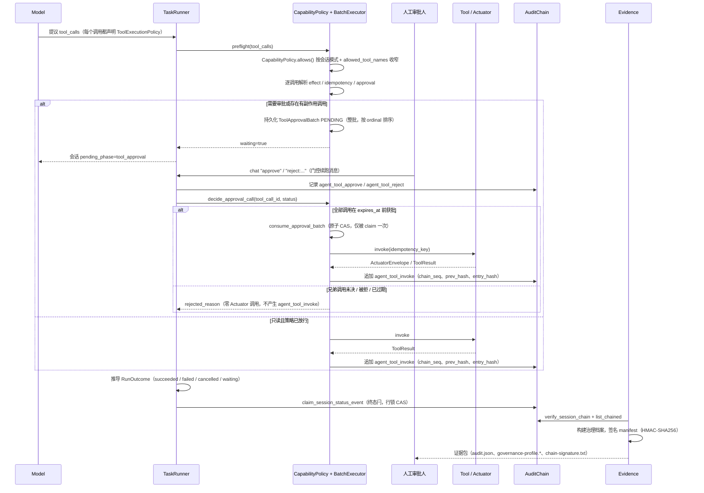

[English](governance-plane.md)

# 治理平面：从工具调用到签名证据

OpenCitadel 把每一次 Agent 工具调用——浏览器、Shell、文件、MCP、A2A，或一次 Ops Patrol 修复——都当作受治理动作，而不是模型可以随手触发、无人过问的函数调用。本文档是把分散在各处的机制串成一条主线的叙述：每个工具上的可声明效果契约、调用在真正执行前被收窄的三个独立位置、整批预检与审批门控、可靠落定的终态闩、以及最终交给审计人员的签名证据包。它与 [检查点与 HITL](checkpoints-and-hitl.zh-CN.md)（门控状态机）、[安全模型](security-model.zh-CN.md)（信任边界）、[管理、审计与合规](admin-auditor-compliance.zh-CN.md)（谁能看到什么）以及 [Ops Patrol](ops-patrol.zh-CN.md)（当前唯一触达真实基础设施的受治理写路径）互为补充。

## 端到端流程

图中每一跳都是真实代码路径，不是理想化描述：普通文件写入与针对 Ops Actuator 的 `patrol_execute_remediation` 走的是同一套 `ToolBatchExecutor` 机制——该路径的契约测试见 [Ops Patrol 架构](ops-patrol.zh-CN.md#safety-invariants)。`agent_tool_invoke` 只会在执行路径上被追加——停在 `pending`、被 `rejected` 或 `expired` 的批次从不会走到 `_execute_call`，也就不会产生这条审计；人的决定本身是另一条独立的审计事实（`agent_tool_approve`/`agent_tool_reject`），在决定到达的那一刻就会写入，无论后续执行是否成功。下面五节按图从左到右依次展开：工具如何声明自身、这份声明在哪些位置被核验、高风险调用如何等待人来决定、结果如何被恰好落定一次、以及整条故事最终如何变成审计人员可离线验证的签名。

## 效果契约：`ToolExecutionPolicy`

每个已注册的工具方法都携带一个 `ToolExecutionPolicy`（`api/app/domain/models/tool_policy.py`），是工具作者无法跳过的五字段声明：

| 字段 | 取值 | 含义 |
|------|------|------|
| `capability` | `message` / `knowledge_read` / `code_read` / `integration_read` / `web_read` / `generation` / `execution` / `unknown` | 这次调用属于哪一类动作 |
| `effect` | `read_only` / `workspace_write` / `external_write` / `interactive` | 调用成功后的影响半径 |
| `idempotency` | `safe` / `idempotent_with_key` / `non_idempotent` / `unknown` | 重试是否可以安全地重复该调用 |
| `approval` | `never` / `policy` / `always` | 执行前是否必须有人做决定 |
| `concurrency_group` | 自由字符串，默认 `none` | 串行化车道（如 `filesystem`、`browser`、`shell`、`integration`） |

没有显式声明策略的工具并不会默认放行：`BaseTool.get_tool_descriptor` 会回退到 `CONSERVATIVE_TOOL_POLICY`——`capability=unknown`、`effect=interactive`、`idempotency=unknown`、`approval=always`——未声明的效果会失败关闭到「问人」，而不是悄悄执行。

## 三层收窄：装配、曝光、执行

`CapabilityPolicy`（`api/app/domain/services/tools/capability_policy.py`）在三个相互独立的位置被应用，任何单一层出现 Bug 或缓存陈旧都不足以单独放过一次调用：

1. **装配** —— `TaskRunnerFactory` 在任何工具对象存在之前，通过 `SessionFlowResolver.resolve(...)` 与 `CapabilityPolicy.for_mode(mode, allowed_tool_names=...)` 构建会话的 `CapabilityPolicy`；`subagent_factory.py` 则通过 `CapabilityPolicy.for_child()` 为被委派的子 Agent 派生一个严格更窄的子策略。例如一个 Ops Patrol 会话在装配时只绑定唯一一个 Collector 工具，其余全部省略。
2. **曝光** —— `BaseTool.get_tool_descriptors()` 与 `MCPTool.schemas_for()` 通过 `policy.allows(...)` / `policy.allows_integration(...)` 过滤交给模型的 Schema 列表；策略拒绝的工具永远不会作为可调用函数出现在模型的工具列表里。
3. **执行** —— `ToolBatchExecutor._resolve_tool_and_policy()` 在 `preflight()` 中真正解析调用的那一刻，再次核验 `allows`/`allows_integration`，与模型当初看到的 Schema 无关。即便某次调用不知怎么走到了这一步，被拒绝时仍会在此处抛出 `CapabilityDeniedError`。

`Ask` 模式在此之上还叠加第四重约束：`CapabilityPolicy.allows()` 只放行落在一小组只读能力白名单内的 `read_only` 效果，`for_child()` 也拒绝向 Ask 子 Agent 授予任何父策略未显式点名的工具。

## 整批预检与审批

`ToolBatchExecutor.preflight()`（`api/app/domain/services/agents/tool_batch_executor.py`）会规范化一轮模型输出中的每个调用、解析其策略，并按 `ApprovalMode` 逐调用判定 `requires_approval`。只要有任意调用需要审批或带有非 `read_only` 的效果，**整批**——而不只是有风险的那几个——都会作为一个 `ToolApprovalBatch`（`api/app/domain/models/tool_approval.py`）持久化，每个调用的状态被置为 `approved`（策略预批准）或 `pending`：

| 批次/调用状态 | 达成条件 | 对执行的影响 |
|----------------|----------|----------------|
| `pending` | 仍有调用等待决定 | `resume()` 拒绝整批（`approval_pending`） |
| `approved` | 全部调用在 `expires_at` 前都被决定为 `approved` | `resume()` 进入 `consume_approval_batch` |
| `rejected` | 任意一个调用被决定为 `rejected` | 整批拒绝（`approval_rejected`），零调用执行 |
| `expired` | `expires_at` 到达时仍处于 `pending` | 整批拒绝（`approval_expired`） |
| `consumed` | `consume_approval_batch` 已 claim | 恰好执行一次；同一 `batch_id` 的第二次 `resume()` 直接短路（`approval_consumed`） |

人的决定本身以一条普通的 chat 续跑消息（`"approve"` / `"approve_same"` / `"reject:<feedback>"`）到达——走的是与任何其他回复相同的 `POST /sessions/{id}/chat` 端点，不存在单独的「仅审批」传输通道。`session_routes.chat()` 会在消息被派发给 Worker *之前*，通过 `_record_gate_audit_if_needed` 记下 `agent_tool_approve`/`agent_tool_reject` 审计条目；随后 Worker 侧的 Flow（`react.py`）解析同一条消息，逐个 pending 调用调用 `decide_approval_call()`，最后调用 `resume()`。`resume()` 只有在整批全部为 `approved` 时才会继续：任何一个 `pending` 或 `rejected` 的兄弟调用都会阻塞整批执行；`consume_approval_batch` 通过对 `execution_claimed` 的原子 CAS 恰好 claim 一次，因此重试的 resume、重复的决定消息，或恢复后的 Worker，都不可能对同一个已批准批次执行两次。

对于策略为 `idempotent_with_key` 且 Schema/签名接受 `idempotency_key` 参数的调用，`_execute_call` 会从 `(session_id, tool_call_id, args_hash)` 派生一个稳定 Key 并注入调用参数——这正是 Ops Actuator 的 `restart_workload` / `scale_workload` / `rollback_workload` 依赖的同一契约，使重复调用返回 `action_outcome=skipped_idempotent` 而不是二次变更。`non_idempotent` 与 `unknown` 只有一次尝试机会；只有 `idempotent_with_key` 且 Schema 受支持的调用才会重试，且一旦调用离开沙箱得到明确结果就绝不重试——重试只覆盖超时等*瞬时*投递失败。

## 终态与对账

`Flow`/`TaskRunner` 从不从生成器耗尽推断成功——它显式返回一个 `RunOutcome`（`api/app/domain/models/run_outcome.py`）：`succeeded` / `failed` / `cancelled` / `waiting`，各自携带结构化 `error`（`message`，可选 `code`/`details`）与 `usage` 计数 Map。`DbSessionRepository.claim_session_status_event()`（`api/app/infrastructure/repositories/db_session_repository.py`）把会话的行锁终态闩、`run_epoch_id`/`run_epoch_seq` 转换与追加式 `session_events` 记录合并为一个事务提交：

- 只有当 `session.current_run_epoch_id` 不同且新序号严格更大时，`running` 事件才推进 epoch；
- 终态事件（`waiting`/`completed`/`cancelled`/`failed`）每个 epoch 只被接受一次——同一 epoch 的第二个写入者会被静默拒绝（`return False`），而不是被二次应用；
- `agent_task_runner.py` 中的 `_finalize_run_outcome` 会读回真正赢得竞争的终态，并把*那个*结果返回给调用方，因此在 CAS 中落败的 Worker 汇报的仍是持久化的权威结果，而不是自己本地的结果。

这正是两个 Worker 在崩溃后、重投递或 DLQ 重放中竞争同一个已恢复任务时，也永远不会为同一个 run epoch 落定两个不同结局的原因。

## 档案与证据

`GovernanceProfileService.build_profile()`（`api/app/application/services/governance_profile_service.py`）是对上述链路已经写下的数据做的只读聚合：它通过 `AuditService.verify_session_chain` 校验会话的哈希链审计日志，并把审批、Gate 命中、检查点与策略拒绝投影为一份面向审计人员的文档——不新建表，不产生新写入。策略拒绝即该会话所有 `agent_tool_denied` 审计行：前一节三层收窄（`assembly`/`exposure`/`execution`）中任意一层的能力策略拒绝，每条携带 `tool`、`layer` 与脱敏后的 `reason`。`EvidenceService.build_session_evidence_package()`（`api/app/application/services/evidence_service.py`）把该档案、完整审计报告、检查点、交付物与浏览器截图打包为一个 ZIP：

| 包内文件 | 内容 |
|----------|------|
| `audit.json` / `audit-report.md` | 完整会话审计轨迹，每条记录附带 `chain_seq`/`prev_hash`/`entry_hash` |
| `governance-profile.json` / `.md` | 上述档案，经过与 Patrol 报告相同的两层 `redact_value` + `scrub_secret_patterns` 脱敏 |
| `checkpoints.json`、`reconciliation/*`、`screenshots/*` | 检查点索引、会话交付物，以及 `browser_screenshot` 工具的输出 |
| `evidence-summary.pdf` | 一页 HTML 渲染的摘要（会话、Scope、链校验状态、调用/治理动作计数）——若 PDF 渲染器不可用则省略，并把 manifest 的 `pdf` 字段标记为 `"skipped"` |
| `manifest.json` | 各文件的 SHA-256 哈希，以及会话/Scope 元信息 |
| `chain-signature.txt` | `HMAC-SHA256(AUDIT_SIGNING_KEY, manifest.json bytes)`——使用唯一的当前签名密钥，并附带其 `AUDIT_SIGNING_KEY_ID` 标签，使密钥轮换前签发的证据包仍可用对应的历史密钥独立验证 |

由于签名覆盖的是 `manifest.json` 里的文件哈希表而非 ZIP 本身的字节，证据包在被重新压缩或部分解压后依然可验证。

## 可观测性

上述流程的每一步都会同时递增 `api/app/infrastructure/observability/governance_metrics.py` 中的一个 Prometheus 计数器/直方图，由执行该步骤的进程（API 或 Worker）记录：

| 指标 | 类型 | 标签 | 记录时机 |
|------|------|------|----------|
| `governance_approval_batches_total` | Counter | `outcome`（`approved`/`rejected`/`expired`/`consumed`） | `ToolApprovalBatch` 到达终态 |
| `governance_approval_decision_seconds` | Histogram | — | 从批次创建到决策的耗时 |
| `governance_gate_hits_total` | Counter | `gate` | 工具调用被 HITL 门控策略标记 |
| `governance_policy_denials_total` | Counter | `layer`（`assembly`/`exposure`/`execution`）、`tool` | `CapabilityPolicy` 在三层收窄中任意一层拒绝调用 |
| `governance_tool_executions_total` | Counter | `tool`、`status`（`ok`/`error`/`denied`） | 受治理的工具调用执行尝试完成 |
| `governance_tool_execution_seconds` | Histogram | `tool` | 受治理工具调用的执行耗时 |
| `governance_remediation_transitions_total` | Counter | `to_status` | Ops Patrol 修复状态发生迁移 |
| `governance_audit_chain_verifications_total` | Counter | `result`（`intact`/`broken`） | 一次审计哈希链校验完成 |

从 `/api/metrics`（API 进程，Bearer token 鉴权）与 Worker 独立的仅内网 metrics 端口抓取——各自的鉴权/网络语义详见[安全模型 § 可观测性](security-model.zh-CN.md#可观测性)。每次能力策略拒绝在计数器之外还会留下一条 `agent_tool_denied` 审计行（见上文[档案与证据](#档案与证据)），因此一次拒绝既能在 Prometheus 中即时可见，也能在证据链中被持久地归因到具体会话。

## 相关文档

- [检查点与 HITL](checkpoints-and-hitl.zh-CN.md) —— 门控阶段、`ToolApprovalBatch` 状态机、浏览器接管
- [安全模型](security-model.zh-CN.md) —— 信任边界、沙箱隔离、请求时序中的治理跳转
- [管理、审计与合规](admin-auditor-compliance.zh-CN.md) —— 谁能读取治理档案或下载证据
- [Ops Patrol 架构](ops-patrol.zh-CN.md) —— Collector/Actuator 双 MCP 平面与修复安全不变量
