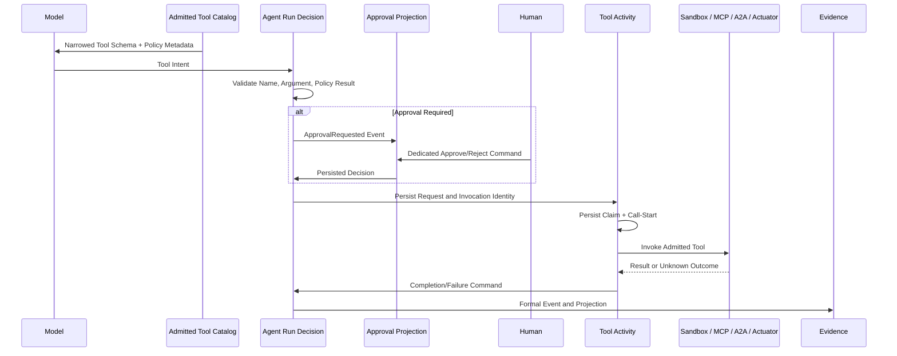

# 治理平面

[English](governance-plane.md)

治理是 Run/Activity 协议的一部分。模型可以提出 Tool Call，但不能自行暴露、批准或执行能力。

## 端到端路径

## 能力收窄

一个可调用工具必须通过全部边界：

1. 平台注册与明确 `ToolExecutionPolicy`；
2. 认证 Role、OwnerScope 与 Operator Domain；
3. Run Family/Mode；
4. 已选 Skill `allowed_tools` 与 MCP/A2A Server Ref；
5. Model 调用前的 Exposure Filter；
6. Activity 执行时再次 Lookup 与 Policy Validation。

缺失 Policy 默认采用 `capability=unknown`、`effect=interactive`、
`idempotency=unknown`、`approval=always`。Skill 只能收窄已有权限。

## Effect 与审批契约

Policy 声明 Capability、Effect（`read_only`、`workspace_write`、`external_write`、
`interactive`）、Idempotency、Approval Mode 与 Concurrency Group。Model-call Activity 把
服务端得出的 `requires_approval` 与 Risk Summary 写入持久 Model Result；纯 Agent Decision
验证这些字段后才能请求 Tool Activity。

Approval 是带稳定 Run/Approval/Subject Activity 身份的正式 Event 与 Projection。Decision
Endpoint 记录 Actor、Status、Time 与 Feedback。Reject、Expiry、Cancellation、重复 Decision、
错误 Owner 的 Decision 都不会调用 Provider。

## Invocation 安全

每个 Tool Request 都有唯一 Activity/Invocation Identity。两次有意的同参调用不会合并为一个
Invocation。Claim Generation 隔离过期 Worker。外部 Effect 不确定的调用在 Crash 后不会盲目
重试，而进入显式 Unknown-Outcome Resolution。

Argument 与大 Result 使用 Object Reference/Digest。Public Event 只包含有界脱敏 Summary。
Workspace Write 位于 Session Sandbox；External Write 在 Provider 支持时仍使用其 Idempotency Key。

## 证据

正式 Run、Approval 与 Activity Projection 构成 Governance Profile。独立 Audit Hash Chain
记录 User/Admin Action 与 Policy Denial。Evidence Export 确定、脱敏、有 Manifest 且签名。
Pending 或 Rejected Approval 不会显示成成功 Tool Execution。

参见[执行内核](execution-kernel.zh-CN.md)、[安全模型](security-model.zh-CN.md)、
[管理员与合规](admin-auditor-compliance.zh-CN.md)和[Ops Patrol](ops-patrol.zh-CN.md)。
