[English](integrations-a2a-service-keys.md) · [简体中文](integrations-a2a-service-keys.zh-CN.md)

# A2A & Service API Keys

Outbound A2A (call remote agents) and inbound A2A (OpenCitadel as a remote agent), plus Service API Key authentication.

## Outbound A2A (Agent calls remote agents)

Configure remote A2A servers in `api/config.yaml` → `a2a_config.a2a_servers` or via **Settings → Integrations** (modal tab).

| Field | Description |
|-------|-------------|
| `id` | Server reference ID |
| `base_url` | Remote agent base URL |
| `enabled` | Whether the server is active |

Skills can restrict which A2A servers are available via `a2a_server_refs`. The Agent uses the `a2a` tool at runtime; Worker maintains an outbound connection pool with stale release.

Remote agent discovery uses `GET {base_url}/.well-known/agent-card.json`.

```mermaid
flowchart TB
  subgraph outbound ["Outbound A2A"]
    Agent["AgentTaskRunner"] --> A2ATool["a2a tool"]
    A2ATool --> Pool["Worker connection pool"]
    Pool --> Remote["Remote agent base_url"]
  end
  subgraph inbound ["Inbound A2A"]
    External["External caller"] -->|"X-Api-Key"| A2AEndpoint["POST /api/a2a"]
    A2AEndpoint --> Session["Create/run session"]
  end
  subgraph keys ["Service API Keys"]
    User["User"] --> CreateKey["POST /api/service-keys"]
    CreateKey --> Hash["SHA-256 hash in DB"]
  end
```



## Inbound A2A (OpenCitadel as remote agent)

When `feature_flags.enable_agent_features=true`, OpenCitadel exposes:

| Method | Path | Auth | Description |
|--------|------|------|-------------|
| GET | `/.well-known/agent-card.json` | Public | Agent card for discovery |
| POST | `/api/a2a` | `X-Api-Key` | JSON-RPC (`message/send`, `message/stream`) |

Inbound calls authenticate via **Service API Key** (`require_service_api_key`). The principal inherits the key owner's `global_role` and user id.

## Service API Keys

Long-lived keys for automation and inbound A2A. Managed per user:

| Method | Path | Description |
|--------|------|-------------|
| GET | `/api/service-keys` | List keys (hash only, no plaintext) |
| POST | `/api/service-keys` | Create key — **plaintext returned once** |
| DELETE | `/api/service-keys/{id}` | Revoke key |

Usage:

```http
X-Api-Key: <plaintext-key>
```

Keys are stored as SHA-256 hashes. Revoked keys fail authentication immediately.

**Scope note**: Service API Key principals have empty `team_roles`; team-scoped resources require JWT session auth with `X-Workspace-Id`.

## MCP vs A2A

| Protocol | Direction | Configuration | Tool name |
|----------|-----------|---------------|-----------|
| MCP | Outbound tools | `mcp_config.mcpServers` | `mcp` |
| A2A outbound | Outbound delegation | `a2a_config.a2a_servers` | `a2a` |
| A2A inbound | External callers → OpenCitadel | `feature_flags.enable_agent_features` | `/api/a2a` |

See [Tutorial 3: MCP integrations](../tutorials/03-mcp-integrations.md) for MCP setup.

## Related documentation

- [Security model](security-model.md) — Service API Key storage
- [Config source governance](config-source-governance.md) — AppConfig seed for MCP/A2A
